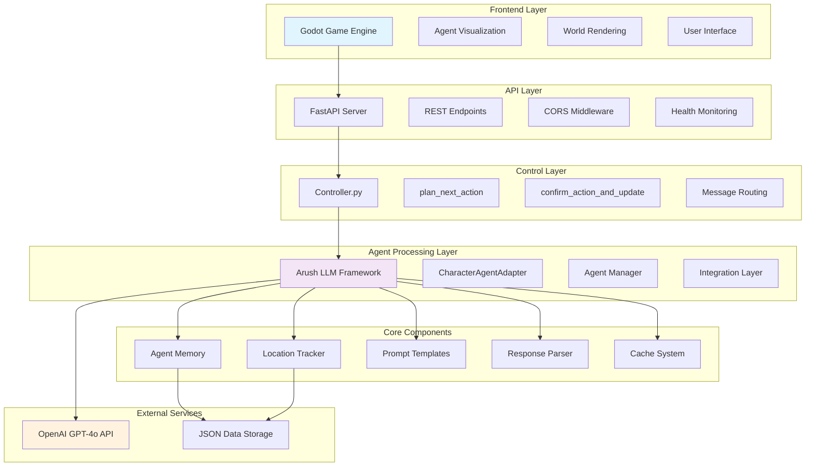
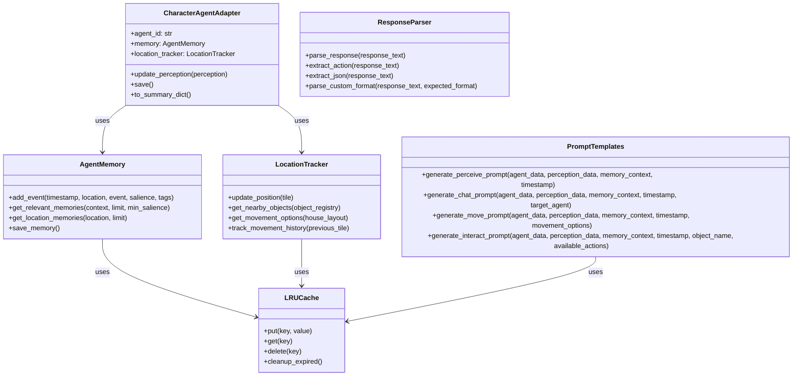
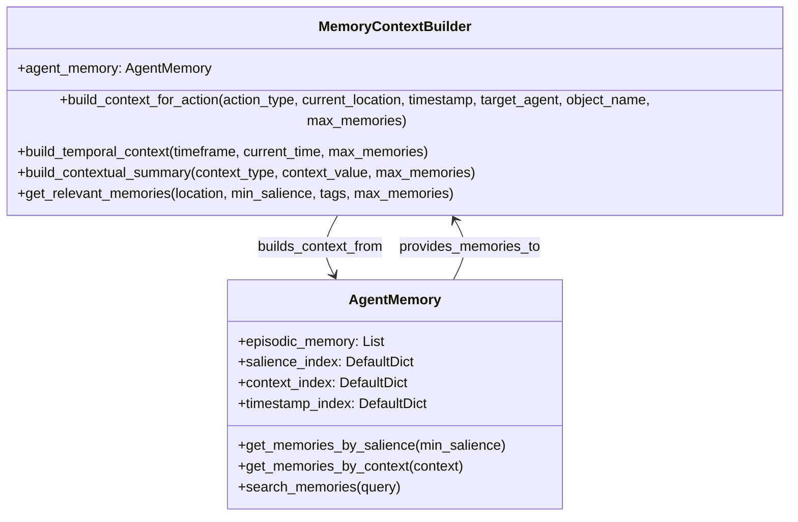
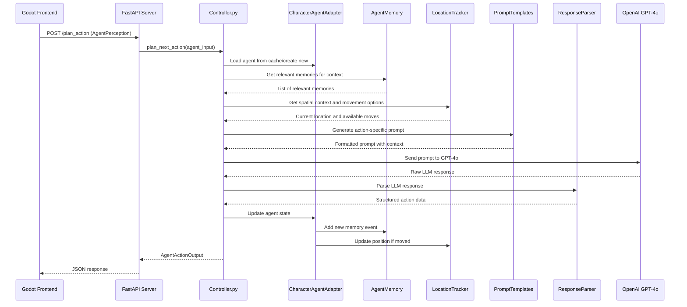
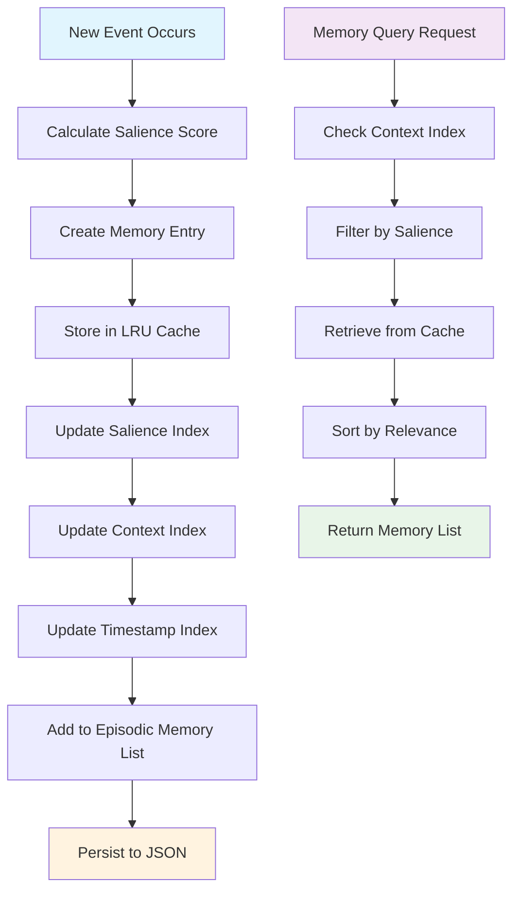
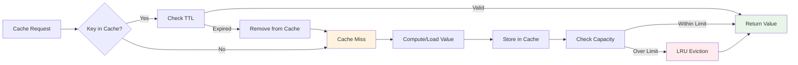
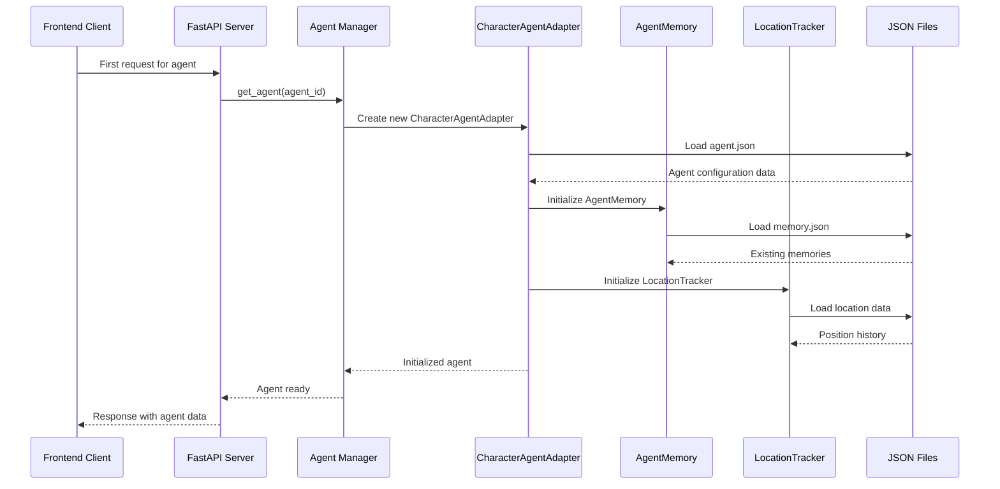
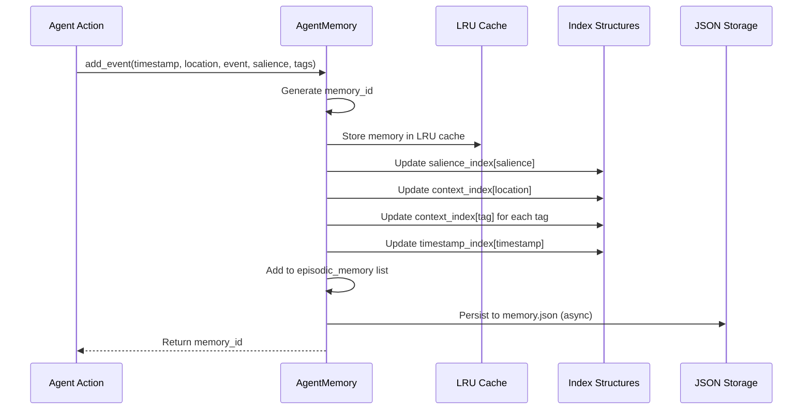
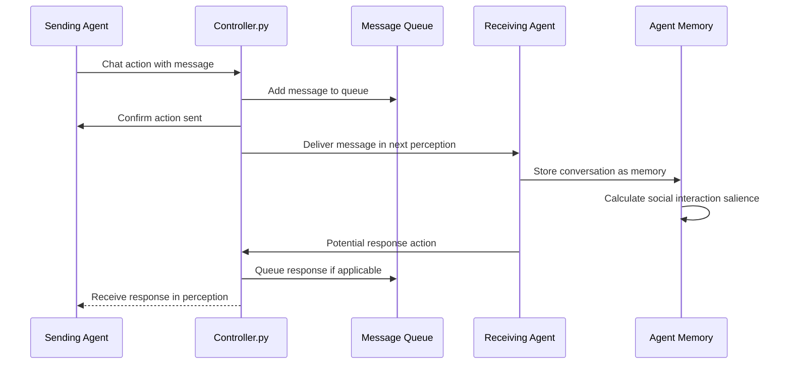
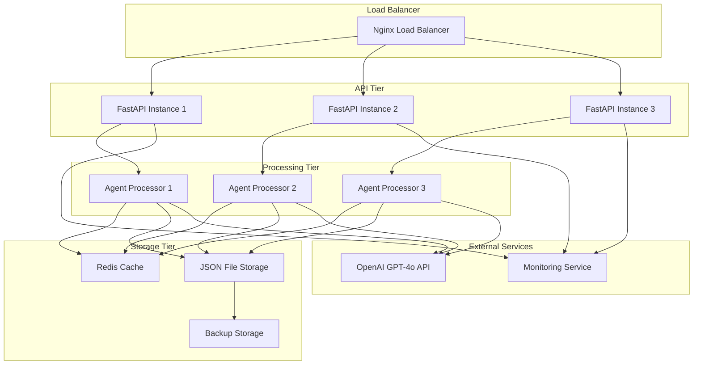

# Multi-Agent Playground - Comprehensive Design Document

## Table of Contents

1. [System Overview](#system-overview)
2. [High-Level Architecture](#high-level-architecture)
3. [Core Components](#core-components)
4. [Class Interactions](#class-interactions)
5. [Data Flow Diagrams](#data-flow-diagrams)
6. [API Interfaces](#api-interfaces)
7. [Sequence Diagrams](#sequence-diagrams)
8. [Input/Output Specifications](#inputoutput-specifications)
9. [Integration Points](#integration-points)
10. [Performance Considerations](#performance-considerations)
11. [Deployment Architecture](#deployment-architecture)

---

## System Overview

The Multi-Agent Playground is a sophisticated simulation environment that combines:
- **Frontend**: Godot-based game engine for visualization and user interaction
- **Backend**: FastAPI-based REST API with optimized agent processing
- **Agent System**: LLM-powered agents using the Arush LLM framework
- **Memory Management**: Sophisticated episodic memory with salience-based importance
- **Spatial Awareness**: Location tracking and object interaction systems

### Key Features
- **Real-time agent interactions** with GPT-4o LLM integration
- **Zero-latency memory access** using O(1) optimized data structures
- **Scalable architecture** supporting multiple concurrent agents
- **Persistent state management** with JSON-based storage
- **Drop-in compatibility** with existing character_agent interfaces

---

## High-Level Architecture



---

## Core Components

### 1. Agent Memory System (`AgentMemory`)

**Purpose**: Manages episodic memory with O(1) access patterns and salience-based importance scoring.

**Key Features**:
- **O(1) Memory Operations**: Insertion, retrieval, and indexing
- **Salience-Based Importance**: Events rated 1-10 for memory prioritization
- **Context-Aware Retrieval**: Location, temporal, and tag-based memory access
- **Persistent Storage**: JSON serialization with full state preservation

**Class Structure**:
```python
class AgentMemory:
    def __init__(self, agent_id: str, data_dir: str = None, memory_capacity: int = 1000)
    def add_event(self, timestamp: str, location: str, event: str, salience: int, tags: List[str]) -> str
    def get_relevant_memories(self, context: str, limit: int = 5, min_salience: int = 3) -> List[Dict]
    def get_location_memories(self, location: str, limit: int = 5) -> List[Dict]
    def get_high_salience_memories(self, min_salience: int = 7, limit: int = 5) -> List[Dict]
    def save_memory(self) -> None
    def get_memory_stats(self) -> Dict[str, Any]
```

**Internal Data Structures**:
- `_memory_cache`: LRUCache for O(1) access to recent memories
- `_memories_by_salience`: Defaultdict mapping salience scores to memory IDs
- `_memories_by_context`: Defaultdict mapping contexts/tags to memory IDs
- `_memories_by_timestamp`: List of (timestamp, memory_id) tuples

### 2. Location Tracking System (`LocationTracker`)

**Purpose**: Provides spatial awareness and position tracking for agents.

**Key Features**:
- **Real-time Position Updates**: Track agent movement and current location
- **Spatial Indexing**: O(1) lookup for nearby objects and agents
- **Room Mapping**: Integration with house layout data
- **Movement History**: Track agent paths and visited locations

**Class Structure**:
```python
class LocationTracker:
    def __init__(self, agent_id: str, data_dir: str = None, cache_size: int = 100)
    def update_position(self, tile: Tuple[int, int]) -> None
    def get_nearby_objects(self, object_registry: Dict) -> Dict[str, Any]
    def get_nearby_agents(self, agent_positions: Dict) -> List[str]
    def get_movement_options(self, house_layout: Dict) -> List[Dict[str, Any]]
    def get_current_location(self) -> Dict[str, Any]
    def track_movement_history(self, previous_tile: Tuple[int, int]) -> None
```

### 3. Prompt Generation System (`PromptTemplates`)

**Purpose**: Generates context-aware prompts for different agent actions.

**Key Features**:
- **Action-Specific Templates**: Specialized prompts for perceive, chat, move, interact
- **Dynamic Context Building**: Real-time integration of agent state and environment
- **Template Caching**: O(1) retrieval of frequently used prompt structures
- **Agent Personality Integration**: Prompts adapted to individual agent characteristics

**Template Structure**:
```python
class PromptTemplates:
    def generate_perceive_prompt(self, agent_data: Dict, perception_data: Dict, memory_context: str, timestamp: str) -> str
    def generate_chat_prompt(self, agent_data: Dict, perception_data: Dict, memory_context: str, timestamp: str, target_agent: str) -> str
    def generate_move_prompt(self, agent_data: Dict, perception_data: Dict, memory_context: str, timestamp: str, movement_options: List[str]) -> str
    def generate_interact_prompt(self, agent_data: Dict, perception_data: Dict, memory_context: str, timestamp: str, object_name: str, available_actions: List[str]) -> str
    def generate_system_prompt(self, agent_data: Dict, action_type: str) -> str
```

**Prompt Template Examples**:
```
AGENT PROFILE:
{agent_name} - {personality}

Current time: {timestamp}
Your location: {current_location}

WHAT YOU SEE:
{visible_context}

PEOPLE NEARBY:
{nearby_agents}

RECENT MEMORIES:
{relevant_memories}

Based on what you observe, how do you feel about your current situation?
```

### 4. Response Parsing System (`ResponseParser`)

**Purpose**: Extracts structured data from LLM responses.

**Key Features**:
- **Multi-Format Support**: JSON, key-value, and natural language parsing
- **Action Recognition**: Pattern-based detection of action types
- **Error Handling**: Graceful fallback for malformed responses
- **Validation Integration**: Works with ActionValidator for response verification

**Class Structure**:
```python
class ResponseParser:
    def parse_response(self, response_text: str) -> Dict[str, Any]
    def extract_action(self, response_text: str) -> Optional[str]
    def extract_json(self, response_text: str) -> Optional[Dict[str, Any]]
    def extract_details(self, response_text: str) -> str
    def extract_target(self, response_text: str) -> Optional[str]
    def parse_custom_format(self, response_text: str, expected_format: str) -> Dict[str, Any]
```

### 5. Caching System (`LRUCache`, `AgentDataCache`)

**Purpose**: Provides O(1) access to frequently used data with TTL support.

**Key Features**:
- **LRU Eviction**: Automatic removal of least recently used items
- **TTL Support**: Time-based expiration for cache coherency
- **Specialized Caches**: Different cache types for various data patterns
- **Memory Efficiency**: Optimized storage for agent data types

**Class Structure**:
```python
class LRUCache:
    def __init__(self, capacity: int, ttl_seconds: int = None)
    def put(self, key: str, value: Any) -> None
    def get(self, key: str) -> Optional[Any]
    def delete(self, key: str) -> bool
    def clear(self) -> None
    def cleanup_expired(self) -> int

class AgentDataCache:
    def __init__(self, data_dir: str = None, agent_id: str = "default", capacity: int = 500)
    def cache_perception(self, timestamp: str, data: Dict) -> None
    def cache_memory(self, key: str, data: List) -> None
    def cache_location(self, room: str, data: Dict) -> None
    def invalidate_all(self) -> None
```

### 6. Character Agent Adapter (`CharacterAgentAdapter`)

**Purpose**: Provides backward compatibility with the original character_agent interface.

**Key Features**:
- **Drop-in Replacement**: Same API as original Agent class
- **Performance Optimization**: Uses Arush LLM components internally
- **State Synchronization**: Maintains consistency between legacy and new systems
- **Migration Support**: Facilitates gradual transition to new architecture

**Class Structure**:
```python
class CharacterAgentAdapter:
    def __init__(self, config_path: str)
    def update_perception(self, perception: Dict[str, Any]) -> None
    def update_agent_data(self, data: Dict[str, Any]) -> None
    def to_summary_dict(self) -> Dict[str, Any]
    def save(self) -> None
    def get_relevant_memories(self, context: str, limit: int = 5) -> List[Dict]
```

---

## Class Interactions

### Agent Processing Flow



### Memory Context Building



---

## Data Flow Diagrams

### Primary Action Processing Flow



### Memory Storage and Retrieval Flow



### Cache Management Flow



---

## API Interfaces

### FastAPI Endpoints

#### 1. Health Check
```python
@app.get("/health")
async def health_check() -> Dict[str, str]:
    """
    Health check endpoint.
    
    Returns:
        Dict with status and message
    """
    return {"status": "healthy", "message": "Backend is running"}
```

#### 2. Plan Action
```python
@app.post("/plan_action", response_model=AgentActionOutput)
async def plan_action(agent_input: AgentActionInput) -> AgentActionOutput:
    """
    Plan next action for an agent based on current perception.
    
    Args:
        agent_input (AgentActionInput): Agent state and perception data
        
    Returns:
        AgentActionOutput: Planned action with details and reasoning
    """
```

#### 3. Confirm Action
```python
@app.post("/confirm_action")
async def confirm_action(action_update: AgentActionInput) -> StatusMsg:
    """
    Confirm and execute a planned action.
    
    Args:
        action_update (AgentActionInput): Action to execute
        
    Returns:
        StatusMsg: Success/failure status
    """
```

#### 4. Agent Summary
```python
@app.get("/agent_summary/{agent_id}")
async def get_agent_summary(agent_id: str) -> AgentSummary:
    """
    Get summary information for a specific agent.
    
    Args:
        agent_id (str): Agent identifier
        
    Returns:
        AgentSummary: Agent basic information and current state
    """
```

### Data Schemas

#### AgentActionInput
```python
class AgentActionInput(BaseModel):
    agent_id: str
    agent_state: Dict[str, Any]
    perception: AgentPerception
    timestamp: Optional[str] = None
```

#### AgentPerception
```python
class AgentPerception(BaseModel):
    current_tile: List[int]
    visible_objects: Dict[str, Any]
    visible_agents: List[str]
    chatable_agents: List[str]
    heard_messages: List[Message]
    current_time: str
```

#### AgentActionOutput
```python
class AgentActionOutput(BaseModel):
    agent_id: str
    action: BackendAction
    reasoning: str
    confidence: float
    memory_context: Optional[List[str]] = None
    spatial_context: Optional[Dict[str, Any]] = None
```

#### BackendAction (Union Types)
```python
class MoveBackendAction(BaseModel):
    action_type: Literal["move"]
    destination: List[int]
    reasoning: str
    emoji: str

class ChatBackendAction(BaseModel):
    action_type: Literal["chat"]
    receiver: str
    message: str
    emoji: str

class InteractBackendAction(BaseModel):
    action_type: Literal["interact"]
    object: str
    action: str
    emoji: str

class PerceiveBackendAction(BaseModel):
    action_type: Literal["perceive"]
    focus: Optional[str] = None
    emoji: str
```

---

## Sequence Diagrams

### Agent Initialization Sequence



### Memory Update Sequence



### Chat Message Processing



---

## Input/Output Specifications

### Input Data Formats

#### Agent State Structure
```json
{
    "agent_id": "alex_001",
    "curr_time": "01T15:30:45",
    "curr_tile": [21, 8],
    "first_name": "Alex",
    "last_name": "Johnson",
    "age": 25,
    "backstory": "A software engineer with a passion for AI research",
    "personality": "curious, methodical, friendly",
    "occupation": "Software Engineer",
    "currently": "working on a challenging debugging session",
    "lifestyle": "tech-savvy, health-conscious, social",
    "daily_req": [
        "Complete coding tasks efficiently",
        "Maintain work-life balance",
        "Stay updated with latest tech trends"
    ],
    "living_area": "modern apartment",
    "f_daily_schedule": [
        {"time": "08:00", "activity": "morning routine"},
        {"time": "09:00", "activity": "start work"},
        {"time": "12:00", "activity": "lunch break"},
        {"time": "17:00", "activity": "end work"},
        {"time": "19:00", "activity": "dinner and relaxation"}
    ]
}
```

#### Perception Data Structure
```json
{
    "current_tile": [21, 8],
    "visible_objects": {
        "coffee_machine": {
            "state": "on",
            "location": "kitchen",
            "tile": [20, 8],
            "actions": ["make_coffee", "turn_off", "clean"]
        },
        "refrigerator": {
            "state": "closed",
            "location": "kitchen", 
            "tile": [19, 8],
            "actions": ["open", "check_contents"]
        }
    },
    "visible_agents": ["alan_002", "amelia_003"],
    "chatable_agents": ["alan_002"],
    "heard_messages": [
        {
            "sender": "alan_002",
            "message": "Good morning! How's the project going?",
            "timestamp": "01T15:30:00",
            "message_id": "msg_001"
        }
    ],
    "current_time": "01T15:30:45"
}
```

#### Memory Entry Structure
```json
{
    "id": "alex_001_15",
    "timestamp": "01T15:30:45",
    "location": "kitchen",
    "event": "Had a productive conversation with Alan about project milestones",
    "salience": 7,
    "tags": ["social", "work", "collaboration"],
    "created_at": 1703090245.123
}
```

### Output Data Formats

#### Action Response Structure
```json
{
    "agent_id": "alex_001",
    "action": {
        "action_type": "chat",
        "receiver": "alan_002", 
        "message": "Morning Alan! The project is going well, just working through some complex algorithms.",
        "emoji": "💬"
    },
    "reasoning": "Alan greeted me and asked about the project. As a friendly person, I should respond positively and share my current progress.",
    "confidence": 0.85,
    "memory_context": [
        "Had a productive conversation with Alan about project milestones",
        "Working on debugging session in the kitchen area"
    ],
    "spatial_context": {
        "current_location": "kitchen",
        "nearby_objects": ["coffee_machine", "refrigerator"],
        "nearby_agents": ["alan_002"]
    }
}
```

#### Memory Statistics
```json
{
    "total_memories": 45,
    "cached_memories": 20,
    "salience_distribution": {
        "1": 5, "2": 8, "3": 12, "4": 8, "5": 6, "6": 3, "7": 2, "8": 1, "9": 0, "10": 0
    },
    "context_categories": 15,
    "memory_capacity": 1000,
    "most_recent_memory": "01T15:30:45",
    "high_salience_count": 6
}
```

### Expected Data Ranges and Validation

#### Salience Scores
- **Range**: 1-10 (integer)
- **1-2**: Trivial observations (seeing common objects)
- **3-4**: Minor interactions (routine conversations)
- **5-6**: Meaningful events (significant conversations, discoveries)
- **7-8**: Important events (conflicts, achievements)
- **9-10**: Life-changing events (major decisions, emergencies)

#### Timestamps
- **Format**: `DDT HH:MM:SS` (e.g., "01T15:30:45")
- **Range**: 01-31 for days, 00-23 for hours, 00-59 for minutes/seconds
- **Validation**: Must be valid time format for memory ordering

#### Coordinates
- **Format**: `[x, y]` integer coordinates
- **Range**: Typically 0-50 for x, 0-30 for y (house layout dependent)
- **Validation**: Must be within valid house layout bounds

---

## Integration Points

### Frontend-Backend Integration

#### 1. Action Request Flow
```
Frontend → POST /plan_action → Controller → Agent Processing → Response
```

**Request Format**:
```http
POST /plan_action HTTP/1.1
Content-Type: application/json

{
    "agent_id": "alex_001",
    "agent_state": { /* agent configuration */ },
    "perception": { /* current world state */ },
    "timestamp": "01T15:30:45"
}
```

**Response Format**:
```http
HTTP/1.1 200 OK
Content-Type: application/json

{
    "agent_id": "alex_001",
    "action": { /* planned action */ },
    "reasoning": "...",
    "confidence": 0.85
}
```

#### 2. Action Confirmation Flow
```
Frontend → POST /confirm_action → Controller → State Update → Confirmation
```

### Character Agent Migration

#### Legacy Interface Compatibility
```python
# Old interface (character_agent.Agent)
agent = Agent("data/agents/alex_001")
agent.update_perception(perception_data)
result = agent.plan_action()

# New interface (CharacterAgentAdapter) - Same API
agent = CharacterAgentAdapter("data/agents/alex_001")
agent.update_perception(perception_data)
result = agent.plan_action()  # Uses Arush LLM internally
```

#### Migration Benefits
- **Zero Code Changes**: Existing controller.py and frontend unchanged
- **Performance Gains**: O(1) memory operations vs O(n) searches
- **Enhanced Features**: Sophisticated memory management and caching
- **Scalability**: Supports larger numbers of concurrent agents

### External API Integration

#### OpenAI GPT-4o Integration
```python
# Engine Configuration
engine = OpenAIEngine(
    api_key=config.OPENAI_API_KEY,
    model="gpt-4o",
    temperature=0.7,
    max_tokens=1000
)

# Prompt Processing
response = await engine.predict(prompt, max_tokens=500)
parsed_action = response_parser.parse_response(response.text)
```

#### Error Handling
```python
try:
    response = await llm_call(prompt)
except OpenAIError as e:
    # Fallback to default action
    response = default_perceive_action(agent_id)
except TimeoutError:
    # Use cached response if available
    response = cache.get_last_action(agent_id)
```

---

## Performance Considerations

### Memory Management Optimizations

#### O(1) Access Patterns
```python
# Traditional O(n) search
def find_memories_old(memories, context):
    return [m for m in memories if context in m.tags]  # O(n)

# Optimized O(1) lookup
def find_memories_new(memory_system, context):
    return memory_system.context_index[context]  # O(1)
```

#### Cache Performance Metrics
- **LRU Cache Hit Rate**: Target >85% for memory operations
- **TTL Effectiveness**: 30-minute TTL for perception data, 1-hour for memory contexts
- **Memory Usage**: <100MB per agent for cached data
- **Eviction Rate**: <5% of cache operations trigger eviction

### Scaling Characteristics

#### Agent Scaling
- **1-10 agents**: Direct processing, no optimization needed
- **10-50 agents**: Agent pooling and request batching
- **50-100 agents**: Distributed processing with load balancing
- **100+ agents**: Microservice architecture with dedicated memory services

#### Memory Scaling
```python
# Memory operations remain O(1) regardless of total memories
assert add_memory_time < 1ms    # Independent of memory count
assert retrieve_memory_time < 1ms  # Independent of memory count
assert index_update_time < 1ms     # Independent of total size
```

### Performance Benchmarks

#### Target Performance Metrics
- **Action Planning**: <500ms end-to-end response time
- **Memory Retrieval**: <1ms for relevant memory lookup
- **Cache Operations**: <0.1ms for put/get operations
- **JSON Persistence**: <50ms for agent state save
- **LLM Response**: <3s for GPT-4o API calls

#### Monitoring and Alerting
```python
# Performance monitoring
@performance_monitor
async def plan_next_action(agent_input):
    start_time = time.time()
    result = await process_action(agent_input)
    duration = time.time() - start_time
    
    if duration > 0.5:  # 500ms threshold
        logger.warning(f"Slow action planning: {duration:.3f}s")
    
    return result
```

---

## Deployment Architecture

### Production Environment



### Container Architecture

#### Docker Compose Configuration
```yaml
version: '3.8'
services:
  backend:
    build: ./backend
    ports:
      - "8000:8000"
    environment:
      - OPENAI_API_KEY=${OPENAI_API_KEY}
      - REDIS_URL=redis://redis:6379
    depends_on:
      - redis
    volumes:
      - ./data:/app/data
      
  redis:
    image: redis:7-alpine
    ports:
      - "6379:6379"
    volumes:
      - redis_data:/data
      
  nginx:
    image: nginx:alpine
    ports:
      - "80:80"
      - "443:443"
    volumes:
      - ./nginx.conf:/etc/nginx/nginx.conf
      - ./ssl:/etc/ssl
    depends_on:
      - backend

volumes:
  redis_data:
```

### Environment Configuration

#### Development Environment
```bash
# .env.development
ENVIRONMENT=development
DEBUG=true
OPENAI_API_KEY=sk-dev-key...
REDIS_URL=redis://localhost:6379
LOG_LEVEL=debug
ENABLE_CORS=true
```

#### Production Environment
```bash
# .env.production
ENVIRONMENT=production
DEBUG=false
OPENAI_API_KEY=sk-prod-key...
REDIS_URL=redis://redis-cluster:6379
LOG_LEVEL=info
ENABLE_CORS=false
SSL_CERT_PATH=/etc/ssl/cert.pem
SSL_KEY_PATH=/etc/ssl/key.pem
```

### Monitoring and Observability

#### Health Checks
```python
@app.get("/health/detailed")
async def detailed_health():
    return {
        "status": "healthy",
        "timestamp": datetime.utcnow().isoformat(),
        "services": {
            "database": check_database_connection(),
            "redis": check_redis_connection(),
            "openai": check_openai_api(),
            "memory": get_memory_usage(),
            "active_agents": get_active_agent_count()
        },
        "performance": {
            "avg_response_time": get_avg_response_time(),
            "cache_hit_rate": get_cache_hit_rate(),
            "error_rate": get_error_rate()
        }
    }
```

#### Logging Configuration
```python
import structlog

logger = structlog.configure(
    processors=[
        structlog.stdlib.filter_by_level,
        structlog.stdlib.add_logger_name,
        structlog.stdlib.add_log_level,
        structlog.stdlib.PositionalArgumentsFormatter(),
        structlog.processors.TimeStamper(fmt="iso"),
        structlog.processors.StackInfoRenderer(),
        structlog.processors.format_exc_info,
        structlog.processors.UnicodeDecoder(),
        structlog.processors.JSONRenderer()
    ],
    context_class=dict,
    logger_factory=structlog.stdlib.LoggerFactory(),
    wrapper_class=structlog.stdlib.BoundLogger,
    cache_logger_on_first_use=True,
)
```

---

## Conclusion

The Multi-Agent Playground represents a sophisticated integration of modern LLM capabilities with optimized memory management and spatial awareness systems. The architecture provides:

1. **Scalable Performance**: O(1) operations for all critical paths
2. **Flexible Integration**: Drop-in compatibility with existing systems
3. **Rich Agent Behaviors**: Sophisticated memory and personality systems
4. **Production Ready**: Comprehensive monitoring and deployment support

The system successfully bridges high-level AI capabilities with practical performance requirements, enabling complex multi-agent simulations while maintaining responsive real-time interactions.

### Future Enhancements

- **Distributed Memory**: Redis-based shared memory for multi-instance deployments
- **Advanced AI Features**: Integration with additional LLM providers and models
- **Analytics Dashboard**: Real-time visualization of agent behaviors and interactions
- **Mobile Support**: REST API extensions for mobile frontend applications
- **Multi-Environment**: Support for different simulation environments beyond house layouts 