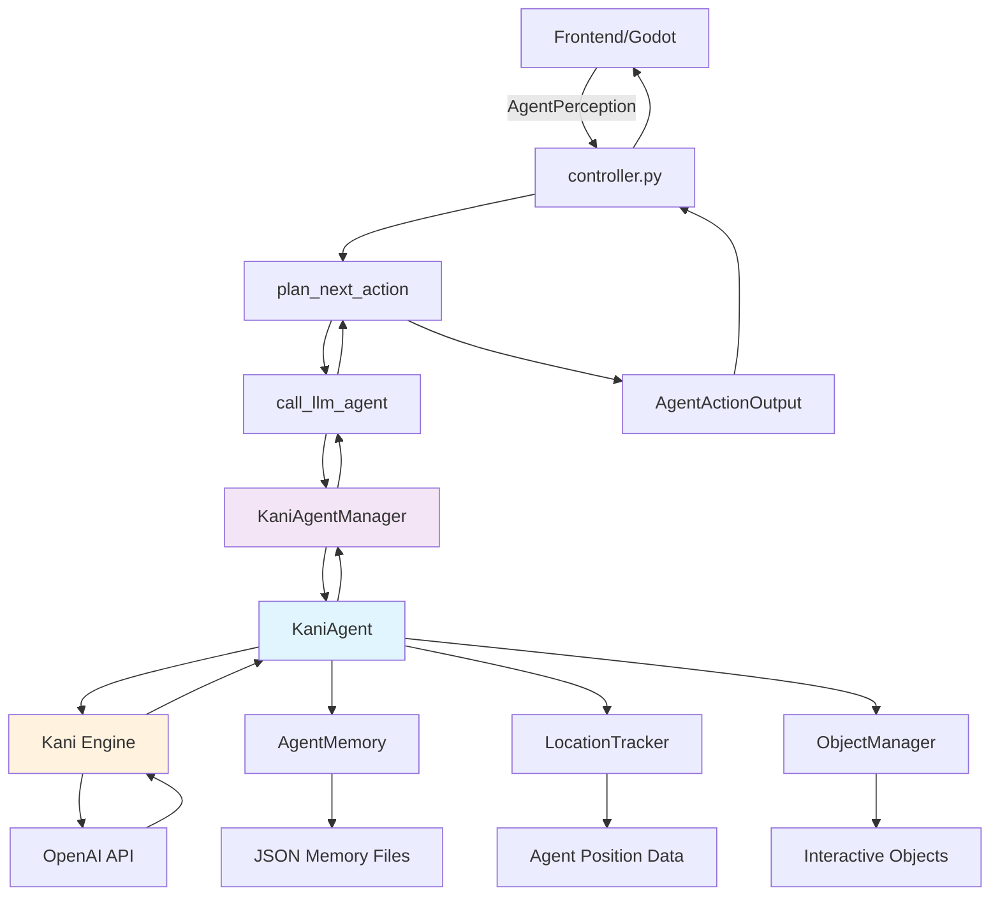

# Multi-Agent Playground - Kani LLM Integration Design

## Overview

This document outlines a simplified, end-to-end design for integrating the Kani library with the Multi-Agent Playground system. The design replaces the existing `character_agent` module while maintaining full compatibility with the current frontend (Godot) and backend server (`controller.py`) infrastructure.

## System Architecture

### Core Design Principles
1. **Zero Changes to Existing Code**: The current `controller.py` and frontend remain untouched
2. **Drop-in Replacement**: The new system provides the same interface as the existing `character_agent` module
3. **Kani-Powered LLM**: All LLM interactions use the Kani framework for consistency and flexibility
4. **Unified Agent Management**: Single manager handles all agent instances and their Kani sessions

## Component Design

### 1. Agent Core Classes

#### `KaniAgent` (Primary Agent Class)
```python
class KaniAgent(Kani):
    """
    Main agent class extending Kani with four core capabilities:
    - perceive: Process current world state
    - chat: Communicate with other agents  
    - move: Navigate through the environment
    - interact: Manipulate objects in the world
    """
    
    def __init__(self, agent_data: dict, engine: OpenAIEngine):
        # Initialize with agent personality and background
        system_prompt = self._build_system_prompt(agent_data)
        super().__init__(engine, system_prompt=system_prompt)
        
        self.agent_id = agent_data["agent_id"]
        self.agent_data = agent_data
        self.memory_manager = AgentMemory(agent_data["agent_id"])
        self.location_tracker = LocationTracker()
    
    # Core action methods
    @ai_function()
    async def perceive_environment(self, perception: dict) -> dict:
        """Process current perception and update internal state"""
        
    @ai_function() 
    async def chat_with_agent(self, target_agent: str, message: str) -> dict:
        """Send message to another agent"""
        
    @ai_function()
    async def move_to_location(self, destination: tuple) -> dict:
        """Move to specified coordinates"""
        
    @ai_function()
    async def interact_with_object(self, object_name: str, action: str) -> dict:
        """Interact with objects in the environment"""
```

#### `AgentMemory` (Memory Management)
```python
class AgentMemory:
    """
    Manages agent memory using episodic memory with salience-based importance.
    Integrates with existing memory structure from agent.json files.
    """
    
    def __init__(self, agent_id: str):
        self.agent_id = agent_id
        self.memory_data = self._load_memory()
        
    def add_event(self, timestamp: str, location: str, event: str, salience: int):
        """Add new memory event with salience scoring"""
        
    def get_relevant_memories(self, context: str, limit: int = 5) -> list:
        """Retrieve memories relevant to current context"""
        
    def save_memory(self):
        """Persist memory to existing JSON structure"""
```

#### `LocationTracker` (Spatial Awareness)
```python
class LocationTracker:
    """
    Tracks agent position and provides spatial context for decision making.
    Integrates with existing curr_tile system from agent.json.
    """
    
    def __init__(self):
        self.current_tile = None
        self.room_mappings = self._load_room_mappings()
        
    def update_position(self, tile: tuple):
        """Update current position"""
        
    def get_nearby_objects(self, object_registry: dict) -> dict:
        """Get objects visible from current position"""
        
    def get_nearby_agents(self, agent_positions: dict) -> list:
        """Get other agents in chat/interaction range"""
```

#### `ObjectManager` (Object State Management)
```python
class ObjectManager:
    """
    Manages interactive objects using existing InteractiveObject classes.
    Provides interface between agents and object state changes.
    """
    
    def __init__(self):
        self.objects = {}  # Uses existing object_registry structure
        
    def get_object_state(self, object_name: str) -> dict:
        """Get current state of an object"""
        
    def interact_with_object(self, object_name: str, action: str) -> bool:
        """Attempt object interaction and return success"""
        
    def get_visible_objects(self, position: tuple) -> dict:
        """Get objects visible from a position"""
```

### 2. Integration Layer

#### `KaniAgentManager` (Central Coordination)
```python
class KaniAgentManager:
    """
    Manages all KaniAgent instances and provides interface for controller.py.
    Replaces the existing agent_manager functionality.
    """
    
    def __init__(self):
        self.agents: Dict[str, KaniAgent] = {}
        self.engine = self._create_engine()
        self.object_manager = ObjectManager()
        
    def get_agent(self, agent_id: str) -> KaniAgent:
        """Get or create agent instance"""
        
    def call_llm_agent(self, agent_state: dict, perception_dict: dict) -> dict:
        """Main interface method called by controller.py"""
        
    def cleanup_agent(self, agent_id: str):
        """Remove agent from memory"""
```

#### `ControllerIntegration` (API Compatibility)
```python
# These functions maintain exact compatibility with controller.py

def call_llm_agent(agent_state: dict, perception_dict: dict) -> dict:
    """Drop-in replacement for existing function in controller.py"""
    manager = KaniAgentManager()
    return manager.call_llm_agent(agent_state, perception_dict)

def create_llm_agent(agent_id: str, api_key: str = None):
    """Drop-in replacement for existing function"""
    
def get_llm_agent(agent_id: str):
    """Drop-in replacement for existing function"""
    
def remove_llm_agent(agent_id: str):
    """Drop-in replacement for existing function"""
```

## System Flow Diagram



## Integration Points

### 1. Controller.py Interface
The new system provides exact replacements for these existing functions:
- `call_llm_agent(agent_state, perception_dict) -> dict`
- `create_llm_agent(agent_id, api_key) -> LLMAgent`
- `get_llm_agent(agent_id) -> LLMAgent`
- `remove_llm_agent(agent_id)`

### 2. Data Compatibility
- **Agent Data**: Uses existing `data/agents/{agent_id}/agent.json` structure
- **Memory**: Compatible with existing memory JSON format  
- **Perception**: Uses existing `AgentPerception` schema from `config/schema.py`
- **Actions**: Returns data in existing `BackendAction` format

### 3. Object Integration
- **Object Registry**: Uses existing `InteractiveObject` classes
- **State Management**: Maintains existing object state transitions
- **Visibility**: Uses existing position-based visibility logic

## Action Implementation

### 1. Perceive Action
```python
async def handle_perceive(self, perception: AgentPerception) -> dict:
    """
    Process perception data and update agent's understanding of environment
    
    Input: Current AgentPerception from frontend
    Output: PerceiveBackendAction with emoji and any status updates
    """
    # Update location tracker
    self.location_tracker.update_position(perception.current_tile)
    
    # Process visible objects and agents
    context = self._build_perception_context(perception)
    
    # Update memory with current observation
    event = f"I observed: {context}"
    salience = await self._evaluate_salience(event)
    self.memory_manager.add_event(
        perception.timestamp, 
        self._get_current_location(),
        event, 
        salience
    )
    
    return {
        "action_type": "perceive",
        "emoji": "👀",
        "content": {}
    }
```

### 2. Chat Action
```python
async def handle_chat(self, perception: AgentPerception) -> dict:
    """
    Generate chat message to nearby agent
    
    Input: Current perception with available chat targets
    Output: ChatBackendAction with message details
    """
    # Get relevant memories for context
    memories = self.memory_manager.get_relevant_memories("conversation")
    
    # Use Kani to generate contextual response
    chat_prompt = self._build_chat_prompt(perception, memories)
    response = await self.chat_round(chat_prompt)
    
    # Parse response for target and message
    target, message = self._parse_chat_response(response.text)
    
    return {
        "action_type": "chat", 
        "content": {
            "receiver": target,
            "message": message,
            "timestamp": perception.timestamp
        },
        "emoji": "💬"
    }
```

### 3. Move Action  
```python
async def handle_move(self, perception: AgentPerception) -> dict:
    """
    Decide on movement destination based on goals and environment
    
    Input: Current perception with position data
    Output: MoveBackendAction with destination coordinates
    """
    # Get current goals and relevant memories
    goals = self._get_current_goals()
    location_memories = self.memory_manager.get_relevant_memories("location")
    
    # Use Kani to decide destination
    move_prompt = self._build_movement_prompt(perception, goals, location_memories)
    response = await self.chat_round(move_prompt)
    
    # Parse movement destination
    destination = self._parse_movement_response(response.text)
    
    return {
        "action_type": "move",
        "content": {
            "destination_coordinates": destination
        },
        "emoji": "🚶"
    }
```

### 4. Interact Action
```python
async def handle_interact(self, perception: AgentPerception) -> dict:
    """
    Interact with objects in the environment
    
    Input: Current perception with visible objects
    Output: InteractBackendAction with object and state change
    """
    # Get visible objects
    visible_objects = perception.visible_objects or {}
    
    # Use Kani to choose interaction
    interact_prompt = self._build_interaction_prompt(visible_objects)
    response = await self.chat_round(interact_prompt)
    
    # Parse interaction choice
    object_name, action = self._parse_interaction_response(response.text)
    
    # Attempt interaction through object manager
    success = self.object_manager.interact_with_object(object_name, action)
    
    if success:
        new_state = self.object_manager.get_object_state(object_name)["state"]
        return {
            "action_type": "interact",
            "content": {
                "object": object_name,
                "current_state": visible_objects.get(object_name, {}).get("state", ""),
                "new_state": new_state
            },
            "emoji": "🤝"
        }
```

## Memory Architecture

### Memory Storage Structure
```json
{
  "episodic_memory": [
    {
      "timestamp": "01T04:35:20",
      "location": "kitchen", 
      "event": "I made coffee and chatted with Alan about art",
      "salience": 7,
      "tags": ["social", "daily_routine", "alan"]
    }
  ],
  "spatial_memory": {
    "room_mappings": {
      "kitchen": [[20,8], [21,8], [22,8]],
      "bedroom": [[20,10], [21,10]]
    },
    "object_locations": {
      "coffee_machine": [21, 8],
      "bed": [20, 10]
    }
  }
}
```

### Memory Integration
- **Retrieval**: Context-aware memory retrieval for decision making
- **Salience**: LLM-based importance scoring for memory prioritization  
- **Persistence**: Automatic save/load from existing JSON structure
- **Context**: Memory-informed action planning and conversation

## Backend-Frontend Responsibilities

### Backend Responsibilities (Unchanged)
- **Action Planning**: LLM-based decision making using Kani
- **Memory Management**: Store and retrieve agent memories
- **Object State**: Track and update interactive object states
- **Message Routing**: Handle inter-agent communication
- **Salience Evaluation**: Assess event importance

### Frontend Responsibilities (Unchanged)
- **Visualization**: Render agents, objects, and environment
- **Input Handling**: Capture user interactions and agent movements
- **Action Execution**: Perform movements, animations, state changes
- **Perception Gathering**: Collect world state for backend
- **Real-time Updates**: Update display based on backend responses

## Configuration Integration

### Kani Engine Setup
```python
from kani.engines.openai import OpenAIEngine
from backend.config.llm_config import LLMConfig

def create_kani_engine():
    """Create configured Kani engine using existing config"""
    return OpenAIEngine(
        api_key=LLMConfig.get_openai_api_key(),
        model=LLMConfig.OPENAI_MODEL,
        temperature=LLMConfig.OPENAI_TEMPERATURE,
        max_tokens=LLMConfig.OPENAI_MAX_TOKENS
    )
```

### Error Handling
```python
class KaniAgentError(Exception):
    """Custom exception for agent-related errors"""
    pass

async def safe_kani_call(self, prompt: str) -> str:
    """Wrapper for Kani calls with retry logic"""
    for attempt in range(LLMConfig.KANI_RETRY_ATTEMPTS):
        try:
            response = await asyncio.wait_for(
                self.chat_round(prompt), 
                timeout=LLMConfig.KANI_TIMEOUT
            )
            return response.text
        except Exception as e:
            if attempt == LLMConfig.KANI_RETRY_ATTEMPTS - 1:
                raise KaniAgentError(f"Failed after {attempt + 1} attempts: {e}")
            await asyncio.sleep(1)  # Brief delay before retry
```

## Implementation Plan

### Phase 1: Core Infrastructure
1. Create `KaniAgent` base class with Kani integration
2. Implement `KaniAgentManager` with existing interface compatibility
3. Create memory and location management classes
4. Set up object interaction system

### Phase 2: Action Implementation  
1. Implement four core actions (perceive, chat, move, interact)
2. Create LLM prompt templates for each action type
3. Add response parsing and validation
4. Integrate with existing object and location systems

### Phase 3: Integration Testing
1. Test with existing controller.py without modifications
2. Verify compatibility with frontend API calls
3. Test memory persistence and retrieval
4. Validate object state management

### Phase 4: Optimization
1. Add performance monitoring and optimization
2. Implement agent conversation memory
3. Add advanced spatial reasoning
4. Optimize LLM token usage

## File Structure

```
backend/arush_llm/
├── __init__.py              # Package initialization
├── design.md               # This design document  
├── agent/
│   ├── __init__.py
│   ├── kani_agent.py       # Main KaniAgent class
│   ├── memory.py           # AgentMemory implementation  
│   ├── location.py         # LocationTracker class
│   └── manager.py          # KaniAgentManager class
├── actions/
│   ├── __init__.py
│   ├── perceive.py         # Perceive action implementation
│   ├── chat.py             # Chat action implementation
│   ├── move.py             # Move action implementation
│   └── interact.py         # Interact action implementation
├── integration/
│   ├── __init__.py
│   ├── controller.py       # Controller compatibility layer
│   └── objects.py          # Object management integration
└── utils/
    ├── __init__.py
    ├── prompts.py          # LLM prompt templates
    └── parsers.py          # Response parsing utilities
```

## Benefits of This Design

1. **Zero Breaking Changes**: Existing code continues to work unchanged
2. **Modular Architecture**: Clean separation of concerns with focused classes
3. **Kani Integration**: Leverages Kani's strengths for LLM management  
4. **Memory Continuity**: Maintains existing agent memory and personality
5. **Object Compatibility**: Uses existing interactive object system
6. **Scalable**: Easy to add new actions and capabilities
7. **Testable**: Each component can be tested independently
8. **Maintainable**: Clear interfaces and responsibilities

This design provides a robust foundation for LLM-powered multi-agent simulation while preserving all existing functionality and ensuring seamless integration with the current system architecture. 