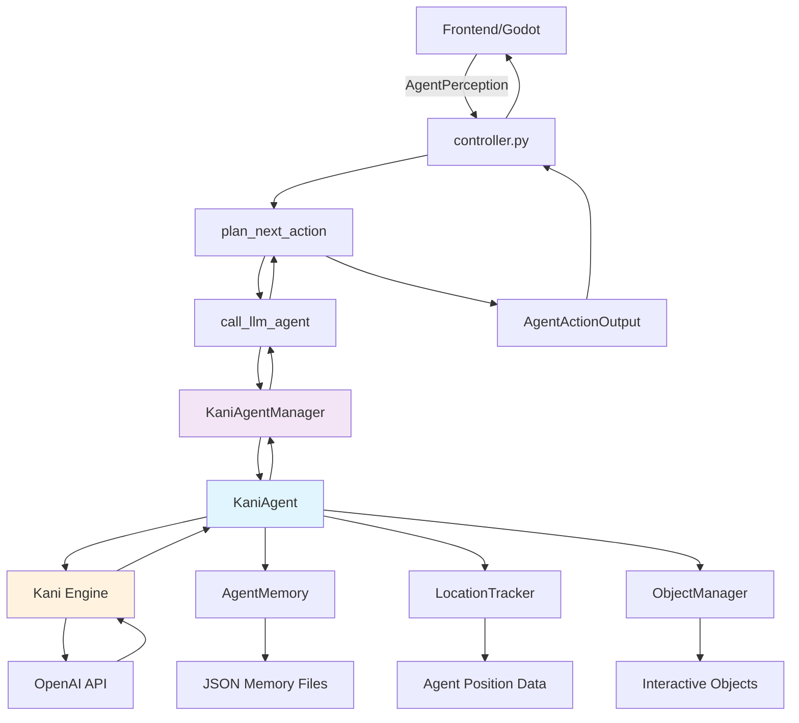

# System Flow Diagram

This file contains the Mermaid diagram code for the Multi-Agent Playground Kani Integration system flow.

## Mermaid Diagram Code

## Component Descriptions

- **Frontend/Godot**: Game engine handling visualization and user interaction
- **controller.py**: Main API controller managing request/response flow
- **plan_next_action**: Core function that orchestrates action planning
- **call_llm_agent**: Interface function connecting to the agent system
- **KaniAgentManager**: Central manager for all Kani agent instances
- **KaniAgent**: Individual agent powered by Kani framework
- **Kani Engine**: Kani's LLM interface engine
- **OpenAI API**: External LLM service for decision making
- **AgentMemory**: Memory management with episodic storage
- **LocationTracker**: Spatial awareness and position tracking
- **ObjectManager**: Interactive object state management
- **JSON Memory Files**: Persistent memory storage
- **Agent Position Data**: Current location and movement data
- **Interactive Objects**: Environment objects that agents can manipulate
- **AgentActionOutput**: Structured response sent back to frontend

## Data Flow

1. **Perception Input**: Frontend sends current world state to controller
2. **Action Planning**: Controller initiates LLM-based decision making
3. **Agent Processing**: Kani agent processes perception and generates action
4. **Memory Integration**: Agent updates memory and spatial awareness
5. **Object Interaction**: Agent may interact with environment objects
6. **Action Output**: Structured action response sent back to frontend
7. **Frontend Update**: Game state updated based on agent decision

## Key Integration Points

- **Zero Changes**: Existing controller.py interface maintained
- **Drop-in Replacement**: New system replaces character_agent module
- **Data Compatibility**: Uses existing JSON structures and schemas
- **Memory Continuity**: Preserves agent memory and personality data 