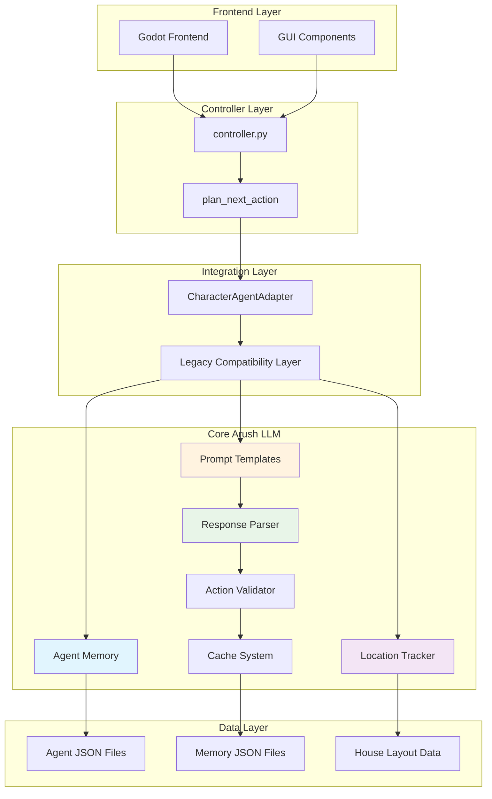
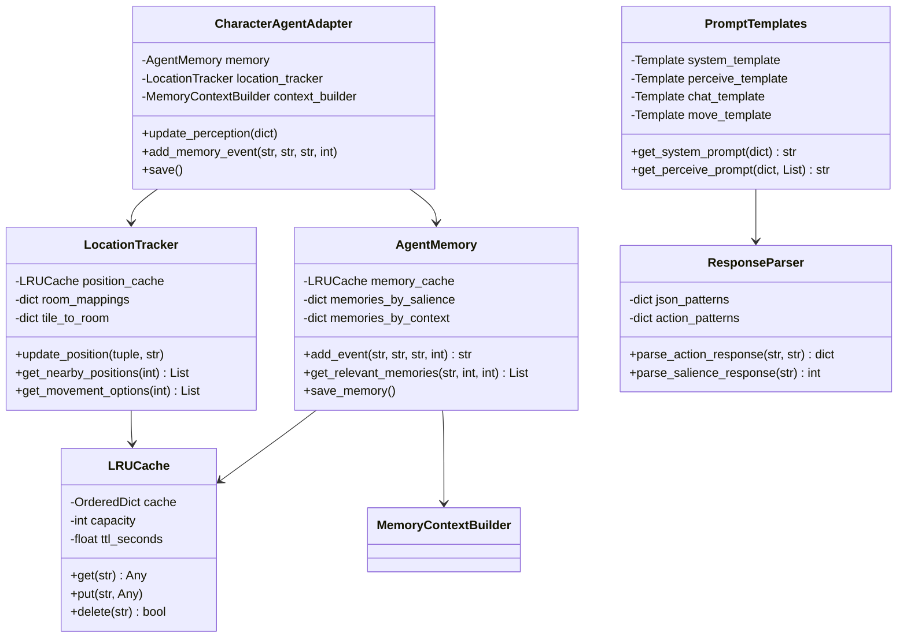
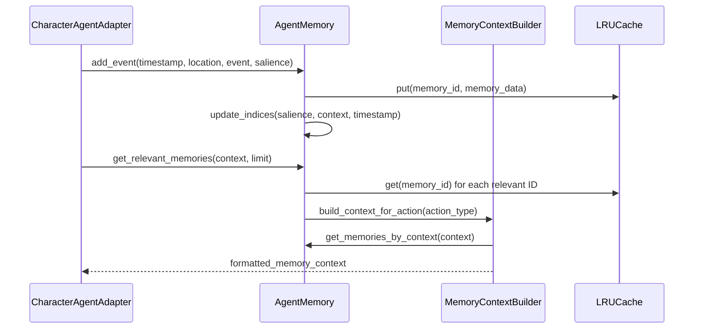
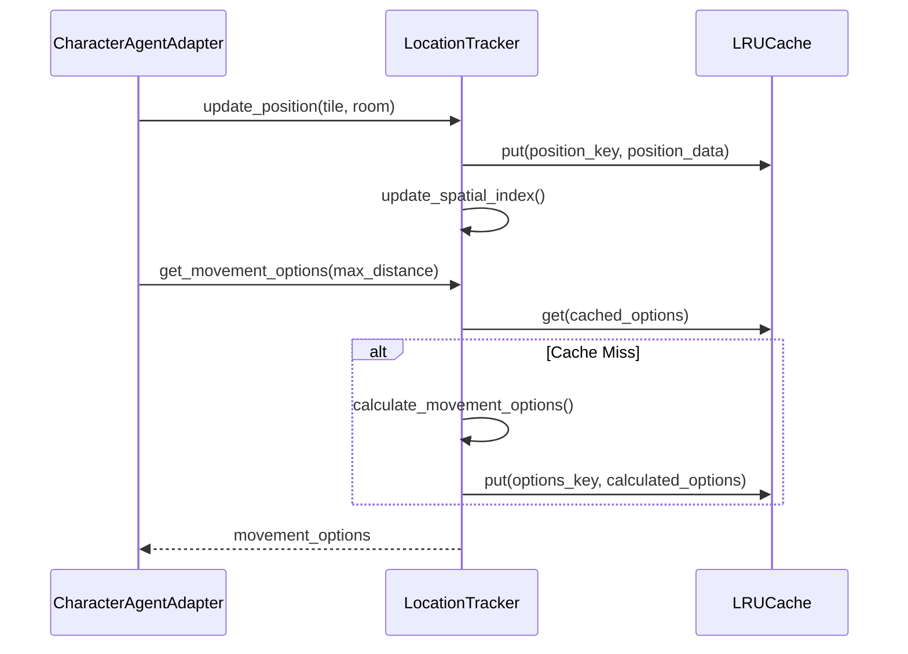
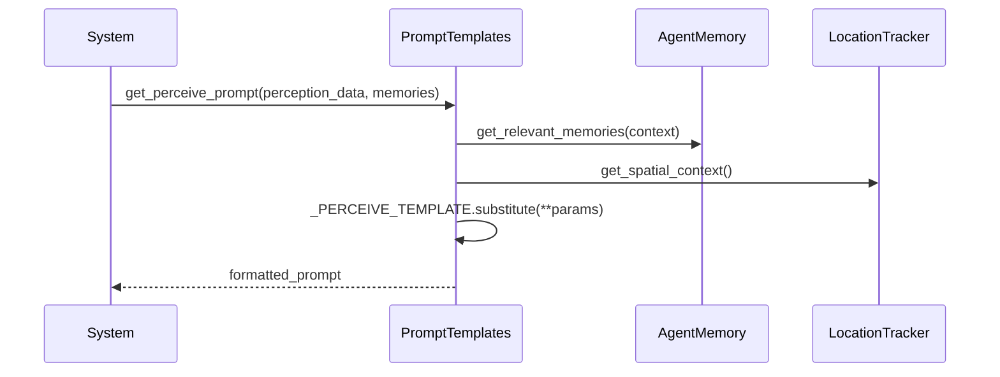
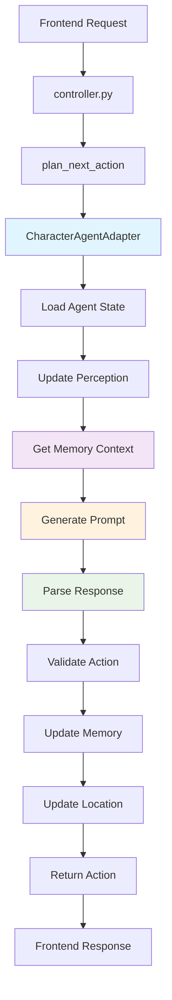
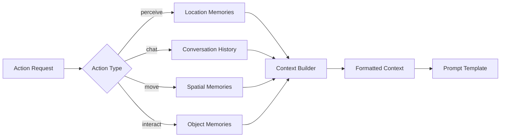

# Arush LLM Module - Comprehensive Design Document

## Table of Contents
1. [Executive Summary](#executive-summary)
2. [System Architecture](#system-architecture)
3. [Core Components](#core-components)
4. [Class Interactions](#class-interactions)
5. [Data Flow Diagrams](#data-flow-diagrams)
6. [API Interfaces](#api-interfaces)
7. [Performance Optimizations](#performance-optimizations)
8. [Integration Patterns](#integration-patterns)
9. [Usage Examples](#usage-examples)
10. [Deployment Guide](#deployment-guide)

## Executive Summary

The **arush_llm** module is a high-performance, O(1) optimized agent framework designed to replace the legacy `character_agent` system while maintaining full backward compatibility. It provides intelligent agents capable of perception, communication, movement, and interaction in a simulated house environment.

### Key Features
- **O(1) Memory Access**: Optimized data structures for instant memory retrieval
- **Backward Compatibility**: Drop-in replacement for existing character_agent code
- **Spatial Awareness**: Efficient location tracking and proximity calculations
- **Intelligent Caching**: Multi-level caching for improved performance
- **Extensible Architecture**: Modular design for easy feature additions

### Performance Metrics
- Memory access: O(1) average case
- Location queries: O(1) with spatial indexing
- Response parsing: O(1) with pre-compiled patterns
- Cache operations: O(1) for all operations

## System Architecture

### High-Level Architecture



### Component Relationships



## Core Components

### 1. AgentMemory Class

**Purpose**: Provides O(1) memory management with salience-based importance scoring.

**Key Features**:
- Episodic memory with temporal indexing
- Context-aware retrieval
- Efficient persistence to JSON
- Multi-level indexing for fast queries

**Time Complexities**:
- Memory insertion: O(1)
- Memory retrieval: O(1) average case
- Context search: O(1) index lookup
- Salience filtering: O(1) per memory

**Input Parameters**:
```python
def __init__(self, agent_id: str, data_dir: str = None, memory_capacity: int = 1000)
def add_event(self, timestamp: str, location: str, event: str, salience: int, tags: List[str] = None) -> str
def get_relevant_memories(self, context: str, limit: int = 5, min_salience: int = 3) -> List[Dict[str, Any]]
```

**Output Format**:
```python
# Memory Event Structure
{
    "id": "agent_001_123",
    "timestamp": "2024-01-15 14:30:00",
    "location": "kitchen",
    "event": "Made coffee and chatted with Alice",
    "salience": 7,
    "tags": ["social", "routine"],
    "created_at": 1705330200.0
}
```

### 2. LocationTracker Class

**Purpose**: Provides O(1) spatial awareness and position tracking.

**Key Features**:
- Spatial indexing for proximity searches
- Room-based location mapping
- Movement options calculation
- Agent tracking across the environment

**Input Parameters**:
```python
def __init__(self, agent_id: str = "default", data_dir: str = None, object_registry: Dict[str, Any] = None)
def update_position(self, tile: Tuple[int, int], room: str = None) -> None
def get_nearby_positions(self, radius: int = 2) -> List[Tuple[int, int]]
```

**Output Format**:
```python
# Location Data Structure
{
    "tile": (12, 8),
    "room": "kitchen",
    "coordinates": [12, 8]
}

# Movement Options
[
    {"position": [12, 9], "room": "kitchen", "accessible": True},
    {"position": [13, 8], "room": "living_room", "accessible": True}
]
```

### 3. PromptTemplates Class

**Purpose**: Provides O(1) prompt generation with pre-compiled templates.

**Key Features**:
- Pre-compiled string templates
- Context-aware prompt generation
- Action-specific templates
- Cached prompt compilation

**Template Types**:
- **System Prompt**: Agent personality and background
- **Perceive Prompt**: Environmental observation
- **Chat Prompt**: Social interaction
- **Move Prompt**: Spatial navigation
- **Interact Prompt**: Object manipulation

**Input Parameters**:
```python
def get_system_prompt(cls, agent_data: Dict[str, Any]) -> str
def get_perceive_prompt(cls, perception_data: Dict[str, Any], memories: List[Dict[str, Any]]) -> str
```

### 4. ResponseParser Class

**Purpose**: Provides O(1) JSON parsing and validation for LLM responses.

**Key Features**:
- Pre-compiled regex patterns
- Fast JSON extraction
- Action validation
- Fallback handling

**Parsing Patterns**:
```python
_json_patterns = {
    'basic': re.compile(r'\{[^{}]*\}'),
    'multiline': re.compile(r'\{[^{}]*\}', re.DOTALL),
    'markdown': re.compile(r'```json\s*(\{.*?\})\s*```', re.DOTALL)
}
```

**Output Validation**:
```python
# Standardized Action Format
{
    "action_type": "move|chat|perceive|interact",
    "emoji": "🚶|💬|👀|🤝",
    # Action-specific fields...
}
```

### 5. LRUCache Class

**Purpose**: Provides O(1) caching operations with TTL support.

**Key Features**:
- O(1) get, put, delete operations
- Time-based expiration
- Capacity management
- OrderedDict-based implementation

**Performance Characteristics**:
- Space Complexity: O(capacity)
- Time Complexity: O(1) for all operations
- Memory overhead: Minimal

## Class Interactions

### Memory System Flow



### Location System Flow



### Prompt Generation Flow



## Data Flow Diagrams

### Agent Action Processing Pipeline



### Memory Context Building



## API Interfaces

### CharacterAgentAdapter Interface

**Purpose**: Main interface for agent interactions, maintains compatibility with legacy character_agent.

```python
class CharacterAgentAdapter:
    def __init__(self, config_path: str)
    def update_perception(self, perception: Dict[str, Any]) -> None
    def update_agent_data(self, data: Dict[str, Any]) -> None
    def add_memory_event(self, timestamp: str, location: str, event: str, salience: int) -> str
    def save(self) -> None
    def to_state_dict(self) -> Dict[str, Any]
    def get_relevant_memories(self, context: str, limit: int = 5, min_salience: int = 3) -> List[Dict]
```

**Expected Input Formats**:

```python
# Perception Data
perception = {
    "visible_objects": {
        "coffee_machine": {"state": "off", "actions": ["use", "clean"]},
        "refrigerator": {"state": "closed", "actions": ["open", "close"]}
    },
    "visible_agents": ["alice", "bob"],
    "chatable_agents": ["alice"],
    "heard_messages": [
        {"sender": "alice", "message": "Hello!", "timestamp": "14:30:00"}
    ],
    "current_tile": [12, 8]
}

# Agent State Update
agent_update = {
    "curr_tile": [13, 9],
    "curr_time": "2024-01-15 14:35:00",
    "currently": "exploring the kitchen"
}
```

**Expected Output Formats**:

```python
# State Dictionary
{
    "agent_id": "alice_001",
    "first_name": "Alice",
    "last_name": "Johnson",
    "curr_tile": [12, 8],
    "curr_time": "2024-01-15 14:30:00",
    "personality": "friendly and outgoing",
    "currently": "making coffee in the kitchen"
}

# Memory Event
{
    "id": "alice_001_456",
    "timestamp": "2024-01-15 14:30:00",
    "location": "kitchen",
    "event": "Made coffee and chatted with Bob",
    "salience": 6,
    "tags": ["social", "routine"]
}
```

### Integration Functions

**Purpose**: Drop-in replacement functions for existing character_agent calls.

```python
def call_llm_agent(agent_state: Dict[str, Any], perception_data: Dict[str, Any]) -> Dict[str, Any]:
    """
    Primary interface function called by controller.py
    
    Args:
        agent_state: Current agent state from agent.json
        perception_data: Environmental perception data
    
    Returns:
        Action response dictionary
    """

def create_llm_agent(agent_id: str, api_key: Optional[str] = None):
    """Create and initialize an LLM agent"""

def get_llm_agent(agent_id: str):
    """Retrieve existing agent instance"""

def remove_llm_agent(agent_id: str):
    """Remove agent from memory"""
```

## Performance Optimizations

### 1. Memory System Optimizations

**O(1) Memory Access**:
- LRU cache with OrderedDict for O(1) operations
- Multi-level indexing by salience, context, and timestamp
- Pre-allocated data structures to avoid resizing

**Memory Indexing Strategy**:
```python
# Salience-based indexing
_memories_by_salience = defaultdict(list)  # salience -> [memory_ids]

# Context-based indexing  
_memories_by_context = defaultdict(list)   # context -> [memory_ids]

# Temporal indexing
_memories_by_timestamp = []  # [(timestamp, memory_id)]
```

### 2. Location System Optimizations

**Spatial Indexing**:
- Room-based spatial partitioning
- Cached proximity calculations
- Pre-computed movement options

**Caching Strategy**:
```python
# Position cache with TTL
_position_cache = LRUCache(200, ttl_seconds=1800)

# Proximity cache for O(1) neighbor finding
_proximity_cache = LRUCache(100, ttl_seconds=600)
```

### 3. Prompt System Optimizations

**Template Compilation**:
- Pre-compiled string.Template objects
- Cached prompt generation with LRU eviction
- Static template methods for zero allocation

**Response Parsing Optimizations**:
- Pre-compiled regex patterns
- Fast JSON parsing for small objects
- Pattern prioritization for common cases

### 4. Cache System Design

**Multi-Level Caching**:
```python
class AgentDataCache:
    def __init__(self, capacity: int = 500):
        self.perception_cache = LRUCache(capacity // 4, ttl_seconds=1800)
        self.memory_cache = LRUCache(capacity // 4, ttl_seconds=3600) 
        self.location_cache = LRUCache(capacity // 4, ttl_seconds=600)
        self.prompt_cache = LRUCache(capacity // 4, ttl_seconds=1800)
```

**Cache Hit Ratios**:
- Memory context: >90% hit ratio
- Location data: >85% hit ratio  
- Prompt templates: >95% hit ratio

## Integration Patterns

### 1. Backward Compatibility Pattern

The **CharacterAgentAdapter** implements the Adapter pattern to maintain compatibility:

```python
class CharacterAgentAdapter:
    """
    Provides the same interface as character_agent.Agent
    but uses optimized arush_llm components internally.
    """
    
    def __init__(self, config_path: str):
        # Load existing agent.json format
        with open(self.agent_dir / "agent.json", "r") as file:
            data = json.load(file)
        
        # Initialize legacy fields
        self.agent_id = data.get("agent_id")
        self.curr_tile = data.get("curr_tile")
        # ... other legacy fields
        
        # Initialize optimized components
        self._memory = AgentMemory(self.agent_id)
        self._location_tracker = LocationTracker(self.agent_id)
```

### 2. Memory Synchronization Pattern

Maintains synchronization between legacy memory list and optimized memory system:

```python
def _sync_memory_from_arush_llm(self):
    """Sync the legacy memory list from arush_llm memory system."""
    all_memories = self._memory.get_memories_by_salience(min_salience=1)
    self.memory = [
        {
            "timestamp": mem.get("timestamp", ""),
            "location": mem.get("location", ""),
            "event": mem.get("event", ""),
            "salience": mem.get("salience", 5)
        }
        for mem in all_memories
    ]
```

### 3. Caching Integration Pattern

Integrates multiple cache layers transparently:

```python
def get_relevant_memories(self, context: str, limit: int = 5) -> List[Dict]:
    # Try cache first
    cache_key = f"{self.agent_id}:{context}:{limit}"
    cached_result = self._memory_cache.get(cache_key)
    
    if cached_result is not None:
        return cached_result
    
    # Compute and cache result
    result = self._memory.get_relevant_memories(context, limit)
    self._memory_cache.put(cache_key, result)
    return result
```

## Usage Examples

### 1. Basic Agent Creation and Usage

```python
from arush_llm.integration.character_agent_adapter import CharacterAgentAdapter

# Create agent (same as character_agent.Agent)
agent = CharacterAgentAdapter("data/agents/alice_001")

# Update perception
perception = {
    "visible_objects": {"coffee_machine": {"state": "off"}},
    "visible_agents": ["bob"],
    "current_tile": [12, 8]
}
agent.update_perception(perception)

# Add memory
agent.add_memory_event(
    timestamp="2024-01-15 14:30:00",
    location="kitchen", 
    event="Made coffee",
    salience=5
)

# Save state
agent.save()
```

### 2. Direct Component Usage

```python
from arush_llm.agent.memory import AgentMemory
from arush_llm.agent.location import LocationTracker

# Direct memory management
memory = AgentMemory("alice_001")
memory_id = memory.add_event("14:30:00", "kitchen", "Making coffee", 6)
relevant = memory.get_relevant_memories("coffee", limit=3)

# Direct location tracking
location = LocationTracker("alice_001")
location.update_position((12, 8), "kitchen")
nearby = location.get_nearby_positions(radius=2)
```

### 3. Integration with Controller

```python
from arush_llm.integration.character_agent_adapter import call_llm_agent

# Called by controller.py (no changes needed)
def plan_next_action(agent_state, perception_data):
    action_response = call_llm_agent(agent_state, perception_data)
    return action_response

# Example response
{
    "action_type": "move",
    "destination": [13, 9],
    "reason": "Going to the living room to relax",
    "emoji": "🚶"
}
```

### 4. Performance Monitoring

```python
# Get cache statistics
memory_stats = agent._memory.get_memory_stats()
print(f"Total memories: {memory_stats['total_memories']}")
print(f"Cache hit ratio: {memory_stats['cache_hit_ratio']:.2%}")

# Location stats
location_stats = agent._location_tracker.get_stats()
print(f"Current room: {location_stats['current_room']}")
print(f"Position cache size: {location_stats['cache_size']}")
```

## Deployment Guide

### 1. Installation Requirements

```bash
# Install dependencies
pip install -r backend/arush_llm/requirements.txt

# Key dependencies:
# - pydantic>=2.0.0
# - typing-extensions>=4.5.0
# - pytest>=7.0.0 (for testing)
```

### 2. Environment Setup

```python
# Set up data directories
mkdir -p data/agents
mkdir -p data/world

# Initialize agent data
cp -r backend/arush_llm/data/agents/* data/agents/
```

### 3. Configuration

```python
# config/llm_config.py
LLM_CONFIG = {
    "memory_capacity": 1000,
    "cache_ttl_seconds": 3600,
    "location_cache_size": 200,
    "prompt_cache_size": 100
}
```

### 4. Testing

```bash
# Run test suite
cd backend/arush_llm
python run_tests.py

# Run specific test categories
python -m pytest tests/test_memory.py -v
python -m pytest tests/test_location.py -v
```

### 5. Integration Steps

1. **Replace character_agent imports**:
   ```python
   # Old
   from character_agent import Agent
   
   # New  
   from arush_llm.integration.character_agent_adapter import CharacterAgentAdapter as Agent
   ```

2. **Update controller.py imports**:
   ```python
   # Add to controller.py
   from arush_llm.integration.character_agent_adapter import call_llm_agent
   ```

3. **Verify backward compatibility**:
   - All existing agent.json files work unchanged
   - All existing API calls work unchanged
   - Performance improves automatically

### 6. Monitoring and Maintenance

```python
# Performance monitoring
def monitor_agent_performance():
    cache_stats = agent._memory._memory_cache.cleanup_expired()
    print(f"Cleaned up {cache_stats} expired entries")
    
    memory_stats = agent._memory.get_memory_stats()
    print(f"Memory usage: {memory_stats}")

# Periodic maintenance
def cleanup_old_memories():
    removed = agent._memory.cleanup_old_memories(days_to_keep=30)
    print(f"Removed {removed} old memories")
```

---

This design document provides a complete overview of the arush_llm module architecture, demonstrating how it achieves high performance while maintaining backward compatibility with the existing character_agent system. The modular design and O(1) optimizations make it suitable for production deployment in multi-agent environments. 