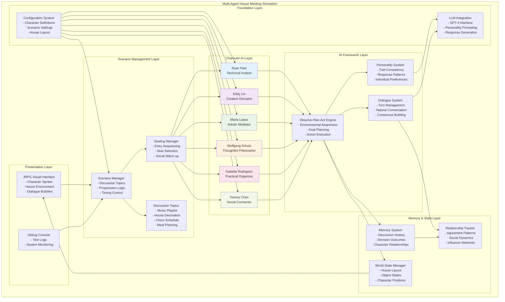
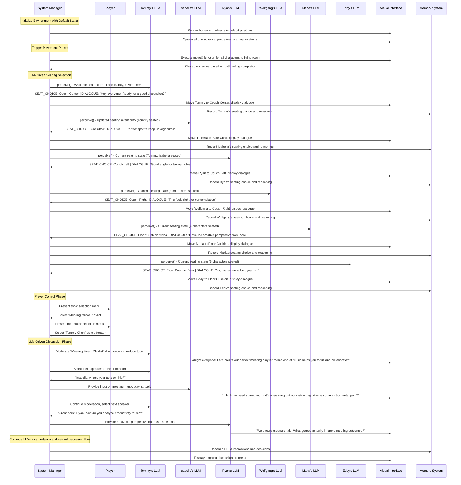
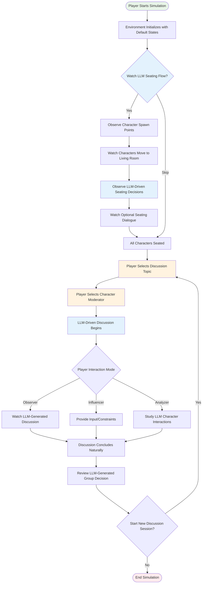

# Multi-Agent JRPG Simulation Playground Design Document

## Executive Summary

This document outlines an extensible multi-agent JRPG simulation playground inspired by Stanford's LLM-as-agent research. The system creates a charming 2D JRPG-style environment where AI-powered characters live together in a shared house, making collaborative decisions through natural discussions. Characters use Observe–Plan–Act loops to navigate their environment and interact through realistic dialogue while maintaining unique personalities and individual perspectives.

The simulation focuses on emergent storytelling through authentic character interactions rather than scripted events, creating a living world where players can observe and occasionally influence the natural evolution of group dynamics and decision-making processes.

## Key Project Objective

**Multi-Agent JRPG Simulation Playground**: Create a flexible, extensible platform for AI-powered character simulations in a charming JRPG setting. The system demonstrates how autonomous agents with distinct personalities can collaborate, debate, and reach consensus on everyday decisions while maintaining believable character consistency and social dynamics.

### Core Vision

- **AI-Powered Housemates**: Six distinct characters with LLM-driven personalities living together and making collaborative decisions
- **JRPG Aesthetics**: Cute 2D visual style with classic JRPG elements and cozy house environment
- **Natural Dialogue**: Characters engage in realistic discussions, debates, and consensus-building
- **Emergent Decision-Making**: Group choices emerge from character interactions rather than predetermined outcomes
- **Extensible Scenarios**: Support for multiple discussion topics and decision contexts

### Design Principles

- **Autonomous Agency**: Each character operates independently with personal goals, opinions, and decision-making processes
- **Collaborative Intelligence**: Characters must work together to reach group consensus while maintaining individual perspectives
- **Personality Consistency**: Each character maintains believable, consistent behavior patterns across all scenarios
- **Natural Progression**: Discussions flow organically without forced narrative beats or artificial constraints
- **Emergent Storytelling**: Narrative emerges from authentic character interactions rather than scripted events

### Core Principles

- **Observe–Plan–Act Loops**: Characters continuously perceive their environment, consider their options, and take meaningful actions
- **Memory-Driven Interactions**: Characters remember past discussions and build upon previous decisions
- **Social Dynamics**: Relationships evolve based on agreement, disagreement, and collaborative experiences
- **Extensible Architecture**: Easy addition of new discussion topics, characters, and house environments

## Storyline: The House Meeting Chronicles

### Setting & Context

Six diverse housemates share a comfortable multi-room house and hold regular meetings to make collaborative decisions about their shared living space and group activities. Each character brings unique perspectives, expertise, and personality traits that influence group discussions and decision-making processes.

### Core Characters

**Ryan Park** - The Technical Analyst
- Methodical remote worker who values efficiency and data-driven decisions
- Provides logical analysis and practical considerations
- Often asks "What are the metrics?" and "How do we measure success?"
◊
**Eddy Lin** - The Creative Disruptor  
- Young music student who pushes for innovative and artistic solutions
- Brings energy and unconventional ideas to discussions
- Frequently says "yo" and suggests creative alternatives

**Maria Lopez** - The Artistic Mediator
- Visual artist who finds creative compromises between opposing viewpoints
- Excellent at synthesizing different perspectives into unified solutions
- Focuses on aesthetic and emotional considerations

**Wolfgang Schulz** - The Thoughtful Philosopher
- Graduate student who considers deeper implications and long-term consequences
- Provides historical context and theoretical frameworks
- Often asks "But what does this mean for our community?"

**Isabella Rodriguez** - The Practical Organizer
- Takes charge of implementation and ensures decisions actually happen
- Focuses on logistics, timelines, and resource management
- Keeps discussions on track and actionable

**Tommy Chen** - The Social Connector
- Ensures everyone feels heard and included in decision-making
- Facilitates communication between different personality types
- Focuses on group harmony and consensus-building

### LLM-Driven Seating Flow System

The seating system uses individual character LLMs to make dynamic seating decisions based on real-time room assessment and personality-driven reasoning.

#### Environment Initialization

**Default State Setup:**
- All objects render in predefined default states (couch empty, coffee table clear, lamp on, etc.)
- Characters spawn at predefined starting locations throughout the house
- Living room displays all available seating options in their default arrangement
- No predetermined seating assignments or scripted behaviors

**Predefined Starting Positions:**
- **Tommy Chen**: Kitchen area (social hub origin)
- **Isabella Rodriguez**: Home office (organized workspace)
- **Ryan Park**: Study area (analytical environment)
- **Wolfgang Schulz**: Reading nook (contemplative space)
- **Maria Lopez**: Art corner (creative workspace)
- **Eddy Lin**: Music room (energetic environment)

#### Living Room Seating Options

**Available Seating (Predefined Layout):**
- **Couch Left**: Single seat on left side of 3-seat sofa
- **Couch Center**: Middle seat of 3-seat sofa (prime social position)
- **Couch Right**: Single seat on right side of 3-seat sofa
- **Side Chair**: Individual comfortable chair angled toward couch
- **Floor Cushion Alpha**: Casual seating near coffee table
- **Floor Cushion Beta**: Alternative casual seating position
- **Standing Area Bookshelf**: Near bookshelf for mobile positioning
- **Standing Area Lamp**: Near lamp for dynamic participation

#### LLM-Driven Seating Selection Process

**Phase 1: Movement to Living Room**
- System triggers `move()` function for each character to navigate to living room
- Characters arrive in natural staggered timing based on starting distance
- No predetermined arrival order - purely based on pathfinding completion

**Phase 2: Dynamic Seating Assessment**
Each character upon arrival:

1. **Perceive Environment**: System calls `perceive()` function providing:
   - Complete list of available seating options
   - Current occupancy status (which seats taken by whom)
   - Spatial relationships between occupied and available seats
   - Environmental factors (lighting, room temperature, etc.)

2. **LLM Seating Decision**: System sends structured prompt to character's individual LLM:
   ```
   SEATING SELECTION REQUEST
   Available Options: [List of open seats]
   Currently Occupied: [Character name] at [seat position]
   Your Personality: [Character traits and preferences]
   Relationship Context: [Brief history with present characters]
   
   Please select ONE available seat and provide brief reasoning.
   You may also include a greeting or comment about the seating arrangement.
   Format: SEAT_CHOICE: [option] | DIALOGUE: [optional comment]
   ```

3. **LLM Response Processing**: Character LLM returns:
   - Selected seating position from available options
   - Optional dialogue (greeting, seating comment, agenda question)
   - Brief reasoning for seat selection (logged for memory)

**Phase 3: Seating Execution and Social Interaction**
- System executes character movement to selected seat
- Characters may use `interact()` function to adjust seating comfort (cushions, lighting, etc.)
- Any LLM-generated dialogue displays as character settles in via `chat()` function
- Character's seating choice, `interact()` actions, and reasoning recorded in Three-Tier Memory System
- Process repeats for next arriving character with updated room state accessible through `perceive()`

### Player-Controlled Discussion System

Once all characters are seated, the system transitions to player-controlled discussion management with predefined topics and moderator selection.

#### Player Topic Selection

**Available Discussion Topics (Predefined):**

**Topic 1: Meeting Music Playlist**
- Create collaborative background music for weekly house meetings
- Focus: Creative collaboration and preference negotiation

**Topic 2: House Decoration Decisions**
- Choose artwork and decorations for shared living spaces
- Focus: Aesthetic preferences and personal taste integration

**Topic 3: Chore Schedule System**
- Design fair and efficient household chore distribution
- Focus: Practical problem-solving and fairness considerations

**Topic 4: Shared Meal Planning**
- Establish weekly meal planning and cooking responsibilities
- Focus: Compromise and accommodation in group living

**Topic 5: Study Space Organization**
- Organize shared work areas for different work styles
- Focus: Individual needs integration into group solutions

**Topic 6: Guest Policy Guidelines**
- Create house rules for overnight guests and gatherings
- Focus: Boundary-setting and community standards

**Topic 7: Utility Budget Allocation**
- Allocate utility budget between comfort and savings
- Focus: Practical financial decision-making

#### Player Moderator Selection

**Available Moderators (Any Character):**
- **Tommy Chen**: Natural facilitator, ensures inclusive participation
- **Isabella Rodriguez**: Organized approach, keeps discussion on track
- **Ryan Park**: Analytical moderation, focuses on data and outcomes
- **Wolfgang Schulz**: Thoughtful facilitation, explores deeper implications
- **Maria Lopez**: Creative moderation, finds artistic compromise solutions
- **Eddy Lin**: Energetic facilitation, brings dynamic discussion flow

#### LLM-Driven Discussion Flow

**Phase 1: Topic Introduction**
- Selected moderator receives LLM prompt with topic details and facilitation role
- Moderator uses individual `chat()` function to announce topic to group
- System sends LLM prompt: "As moderator, introduce the [topic] discussion to the group. Explain the goal and invite initial thoughts."
- Moderator's LLM response processed through `chat()` function to address all characters

**Phase 2: Structured Input Rotation**
- Moderator LLM selects characters in rotation for input
- Each character receives LLM prompt through individual `chat()` interface with:
  - Current discussion topic and context
  - Previous character contributions (from `perceive()` function)
  - Their personality and relevant experiences
  - Request for specific input on the topic
- Characters respond using individual `chat()` function to communicate with group

**Phase 3: Natural Discussion Evolution (Advanced Implementation)**
- Characters use `perceive()` to observe ongoing discussion and other characters' responses
- Each character's individual LLM processes discussion context and generates responses
- Characters use `chat()` function to respond to each other organically based on LLM reasoning
- Moderator uses `chat()` function to ask follow-up questions and guide toward consensus
- Discussion flow emerges naturally from individual character LLM `chat()` interactions
- System tracks discussion progress through `perceive()` and memory integration

### Narrative Flow

Each simulation session follows a dynamic, LLM-driven pattern with minimal predescription:

**Environment Setup Phase:**
1. **System Initialization**: Environment renders with all objects in default states
2. **Character Spawning**: Characters appear at predefined starting locations throughout house
3. **Movement Trigger**: System initiates `move()` function for all characters to living room

**LLM-Driven Seating Phase:**
4. **Dynamic Arrival**: Characters arrive based on pathfinding completion (natural staggered timing)
5. **Perception Assessment**: Each character uses `perceive()` to assess available seating and occupancy
6. **LLM Seating Decision**: Individual character LLMs select seats and generate optional dialogue
7. **Social Interaction**: Characters settle in with LLM-generated greetings or comments

**Player Control Phase:**
8. **Topic Selection**: Player chooses discussion topic from predefined list
9. **Moderator Selection**: Player selects which character will moderate the discussion
10. **Discussion Initialization**: Selected moderator LLM introduces topic to group

**LLM-Driven Discussion Phase:**
11. **Structured Input**: Moderator LLM manages rotation, each character LLM provides topic input
12. **Dynamic Interaction**: Characters respond to each other using individual LLMs (Phase III)
13. **Consensus Evolution**: Discussion flows naturally based on LLM responses and personality interactions
14. **Decision Emergence**: Group reaches conclusion through organic LLM-driven dialogue

### Player Interaction

Players can:
- **Control Topic Selection**: Choose from seven predefined discussion topics after seating completion
- **Control Moderator Selection**: Select any character to moderate the discussion using their individual LLM
- **Observe LLM Interactions**: Watch natural character LLM-driven interactions and decision-making processes
- **Influence Discussions**: Occasionally introduce new information or constraints during natural discussion flow
- **Learn Character Dynamics**: Understand how different personality types approach collaboration through LLM responses
- **Experiment with Combinations**: Try different topic and moderator combinations to see how character LLMs adapt

## System Architecture Overview

### High-Level Program Flow

The Multi-Agent JRPG Simulation operates as a continuous cycle where autonomous characters observe their environment, plan their actions, and execute decisions while maintaining consistent personalities and building relationships over time.

**Core Operation Loop:**
1. **Environment Initialization**: Load house environment with objects in default states
2. **Character Spawning**: Characters appear at predefined starting locations
3. **Movement Phase**: System triggers `move()` function for all characters to living room
4. **LLM Seating Selection**: Characters use `perceive()` and individual LLMs to select seats dynamically
5. **Player Topic Selection**: Player chooses discussion topic from predefined list
6. **Player Moderator Selection**: Player selects character to moderate discussion
7. **LLM Discussion Management**: Moderator and character LLMs drive natural dialogue
8. **Memory Integration**: Characters remember discussion outcomes through LLM interactions
9. **Session Completion**: System ready for new topic selection or session end

### High-Level Module Architecture

**Scenario Management Module**
- Loads and manages different discussion topics
- Controls scenario progression and timing
- Handles scenario-specific rules and constraints

**Seating Management System**
- Orchestrates character entry and seating flow
- Manages spawn points and movement pathfinding
- Handles personality-driven seating selection logic
- Coordinates pre-discussion social interactions

**Character AI Framework**
- Implements Observe-Plan-Act loops for each character
- Maintains personality consistency across scenarios
- Manages individual character goals and motivations

**Dialogue System**
- Facilitates natural conversation flow between characters
- Handles turn-taking and discussion moderation
- Generates personality-appropriate dialogue responses

**Memory & Relationship System**
- Stores character memories of past discussions
- Tracks relationship changes based on interactions
- Provides context for future decision-making

**World State Manager**
- Maintains current house environment and object states
- Handles character positioning and movement
- Manages shared resources and house status

**Visual Interface System**
- Renders 2D JRPG-style house environment
- Displays character sprites with appropriate animations
- Shows dialogue bubbles and visual feedback

## Modular System Architecture

### Architecture Diagram



### Module Descriptions

**Scenario Management Layer**
- Controls the flow of different discussion topics based on player selection
- Manages timing and progression between LLM-driven discussion phases
- Handles topic-specific rules and consensus detection
- Coordinates character participation through individual LLM interfaces

**Character AI Layer**
- Implements six distinct AI characters with individual LLM interfaces
- Each character operates independently using `chat()`, `perceive()`, `move()`, and `interact()` functions
- Maintains consistent LLM-driven behavior patterns across all scenarios
- Handles individual character goals and motivations through personality-aware LLM prompting

**AI Framework Layer**
- Provides core LLM integration functionality for all characters
- Manages personality-driven decision making through individual character LLMs
- Facilitates natural dialogue through `chat()` function integration
- Implements consensus-building through LLM analysis and discussion tracking

**Memory & State Layer**
- Implements Three-Tier Memory Architecture: Scratch, Associative (CLIN), and Spatial Memory
- Stores character memories from LLM interactions, `chat()` and `interact()` function decisions
- Tracks discussion history and LLM-generated outcomes across all memory tiers
- Maintains current world state accessible through `perceive()` function
- Provides contextual memory retrieval for future LLM prompting and character interactions

**Foundation Layer**
- Integrates with LLM services for individual character natural language processing
- Manages configuration files and character personality definitions for LLM prompting
- Provides core utilities and shared functionality for LLM response processing

## Module Interface Specifications

### Frontend ↔ Application Layer Interface

**Visual Rendering System:**
- **Real-time LLM Response Display**: Shows character `chat()` function outputs with personality-appropriate styling
- **Seating Visualization**: Displays LLM-driven seating decisions and optional dialogue in real-time
- **Player Control Interface**: Topic selection menu and moderator selection interface
- **Discussion Flow Visualization**: Shows LLM conversation flow, turn-taking, and consensus building progress

**User Input Processing:**
- **Topic Selection Protocol**: Player choice triggers system topic loading and moderator selection interface
- **Moderator Selection Protocol**: Player choice activates selected character's moderator LLM prompting
- **Observation Controls**: Player can skip seating flow or watch detailed LLM decision-making process

### Application ↔ AI Agent Layer Interface

**Character Communication Protocols:**
- **LLM Seating Requests**: System sends `perceive()` data and seating options to individual character LLMs
- **Discussion Management**: Moderator LLM receives topic context and manages character input rotation
- **Character Input Processing**: Each character LLM receives discussion prompts through `chat()` interface
- **Response Integration**: Character LLM outputs processed through `chat()` function for group communication

**Function Integration:**
- **Movement Coordination**: System triggers `move()` function for all characters to living room
- **Perception Updates**: Characters receive room state through `perceive()` function for decision-making
- **Dialogue Management**: All character communication routed through individual `chat()` functions
- **Object Interaction**: Characters use `interact()` function to adjust seating, lighting, and environmental comfort
- **Memory Recording**: LLM interactions, `chat()`, and `interact()` decisions stored through Three-Tier Memory System integration

### AI Agent ↔ Infrastructure Layer Interface

**LLM Integration Protocols:**
- **Individual Character LLMs**: Each character maintains separate LLM instance with personality-specific prompting
- **Seating Decision Processing**: Character LLMs receive structured prompts with room state and personality context
- **Discussion Response Generation**: Character LLMs generate topic-appropriate responses based on personality and discussion history
- **Moderator Intelligence**: Selected character's LLM receives enhanced prompting for discussion facilitation

**Memory System Integration:**
- **Three-Tier Memory Architecture**: LLM decisions stored across Scratch, Associative (CLIN), and Spatial Memory tiers
- **Scratch Memory Integration**: Current discussion context, active speaker tracking, and immediate action planning from `chat()` and `interact()` functions
- **Associative Memory (CLIN)**: Character relationships, discussion patterns, and preference associations from LLM interactions
- **Spatial Memory**: Object locations & states, seating selection memory, and environmental context from `perceive()` and `interact()` functions
- **Cross-Tier Context Retrieval**: Past LLM interactions provide contextual memory for current decision-making across all memory tiers

### Cross-Layer Data Flow

**Configuration Propagation:**
- **Character Personality Loading**: Individual LLM personality definitions loaded at system initialization
- **Topic Configuration**: Discussion topic details and prompting templates loaded based on player selection
- **Seating Layout Configuration**: Living room layout and seating options loaded for `perceive()` function data

**State Synchronization:**
- **Real-time Room State**: `perceive()` function provides current seating occupancy to character LLMs
- **Discussion Progress Tracking**: System monitors LLM conversation flow and consensus building
- **Memory State Updates**: Character LLM interactions continuously update memory and relationship systems

## Three-Tier Memory Architecture

### Memory System Integration Overview

The memory system implements a sophisticated three-tier architecture that captures different types of character experiences and contextual information from LLM interactions and function usage.

```mermaid
graph TB
    subgraph "Three-Tier Memory Architecture"
        subgraph "Scratch Memory (Working Memory)"
            SM1[Current Discussion Context<br/>- Active topic tracking<br/>- Speaker turn management<br/>- Immediate responses]
            SM2[Active Speaker Tracking<br/>- Current moderator<br/>- Speaking order<br/>- Turn transitions]
            SM3[Immediate Action Planning<br/>- Next chat() response<br/>- Pending interact() actions<br/>- Real-time decisions]
        end
        
        subgraph "Associative Memory (CLIN)"
            AM1[Character Relationships<br/>- Agreement patterns<br/>- Collaboration history<br/>- Social dynamics]
            AM2[Discussion Patterns<br/>- Topic preferences<br/>- Argument styles<br/>- Consensus methods]
            AM3[Preference Associations<br/>- Seating preferences<br/>- Discussion topics<br/>- Decision patterns]
        end
        
        subgraph "Spatial Memory"
            SPM1[Object Locations & States<br/>- Furniture positions<br/>- Object interactions<br/>- Environmental changes]
            SPM2[Seating Selection Memory<br/>- Previous choices<br/>- Comfort preferences<br/>- Social positioning]
            SPM3[Environmental Context<br/>- Room layouts<br/>- Lighting conditions<br/>- Spatial relationships]
        end
    end
    
    subgraph "Function Integration"
        CHAT[chat() Function<br/>- Dialogue generation<br/>- Response processing<br/>- Communication logs]
        PERCEIVE[perceive() Function<br/>- Environment scanning<br/>- State assessment<br/>- Context gathering]
        INTERACT[interact() Function<br/>- Object manipulation<br/>- State changes<br/>- Action execution]
        MOVE[move() Function<br/>- Navigation<br/>- Position updates<br/>- Movement tracking]
    end
    
    CHAT --> SM1
    CHAT --> AM1
    CHAT --> AM2
    
    PERCEIVE --> SM1
    PERCEIVE --> SPM1
    PERCEIVE --> SPM3
    
    INTERACT --> SM3
    INTERACT --> SPM1
    INTERACT --> AM3
    
    MOVE --> SPM1
    MOVE --> SPM2
    
    SM1 --> AM1
    AM1 --> SPM2
    SPM1 --> SM1
    
    style SM1 fill:#e3f2fd
    style AM1 fill:#f3e5f5
    style SPM1 fill:#e8f5e8
```

### Memory Tier Specifications

**Scratch Memory (Working Memory)**
- **Current Discussion Context**: Tracks active topic, recent `chat()` exchanges, and ongoing conversation flow
- **Active Speaker Tracking**: Manages moderator identity, speaking rotation, and turn-taking from `chat()` function usage
- **Immediate Action Planning**: Stores pending `chat()` responses, planned `interact()` actions, and real-time decision-making

**Associative Memory (CLIN)**
- **Character Relationships**: Records agreement patterns, collaboration history, and social dynamics from `chat()` interactions
- **Discussion Patterns**: Analyzes topic preferences, argument styles, and consensus-building methods across sessions
- **Preference Associations**: Links character choices in seating, topics, and decisions with personality traits and past `interact()` usage

**Spatial Memory**
- **Object Locations & States**: Maintains furniture positions, object interaction history, and environmental changes from `interact()` function
- **Seating Selection Memory**: Records previous seating choices, comfort preferences, and social positioning patterns
- **Environmental Context**: Stores room layouts, lighting conditions, and spatial relationships accessible through `perceive()` function

### Memory Integration with LLM Functions

**`chat()` Function Integration:**
- Scratch Memory: Immediate conversation context and response planning
- Associative Memory: Relationship building and discussion pattern recognition
- Cross-tier: Communication history influences future seating and interaction choices

**`perceive()` Function Integration:**
- Scratch Memory: Current environmental assessment and immediate context
- Spatial Memory: Environmental state updates and object location tracking
- Cross-tier: Perception data informs relationship and preference associations

**`interact()` Function Integration:**
- Scratch Memory: Immediate action planning and execution tracking
- Associative Memory: Preference pattern development from interaction choices
- Spatial Memory: Object state changes and interaction history recording

**`move()` Function Integration:**
- Spatial Memory: Position updates and movement pattern tracking
- Cross-tier: Movement choices reflect relationship preferences and environmental awareness

## Information Flow Diagram

```mermaid
flowchart TD
    START([Simulation Start]) --> INIT[Initialize Environment with Default States]
    INIT --> SPAWN_CHARS[Spawn Characters at Predefined Positions]
    SPAWN_CHARS --> TRIGGER_MOVE[Trigger move() Function for All Characters]
    
    TRIGGER_MOVE --> CHAR_ARRIVE[Characters Arrive at Living Room]
    CHAR_ARRIVE --> PERCEIVE_ROOM[Character perceive() - Assess Seating]
    PERCEIVE_ROOM --> LLM_SEAT_SELECT[Individual LLM Seating Selection]
    LLM_SEAT_SELECT --> EXECUTE_SEATING[Execute Seat Selection & Optional Dialogue]
    
    EXECUTE_SEATING --> ALL_SEATED{All Characters Seated?}
    ALL_SEATED -->|No| PERCEIVE_ROOM
    ALL_SEATED -->|Yes| PLAYER_TOPIC[Player Selects Discussion Topic]
    
    PLAYER_TOPIC --> PLAYER_MODERATOR[Player Selects Moderator Character]
    PLAYER_MODERATOR --> MODERATOR_LLM[Moderator LLM Introduces Topic]
    
    MODERATOR_LLM --> STRUCTURED_INPUT[Moderator Manages Character Input Rotation]
    STRUCTURED_INPUT --> CHAR_LLM_RESPONSE[Character LLMs Generate Responses]
    CHAR_LLM_RESPONSE --> UPDATE_MEMORY[Update Character Memories]
    
    UPDATE_MEMORY --> NATURAL_DISCUSSION{Phase III Natural Flow?}
    NATURAL_DISCUSSION -->|No| STRUCTURED_INPUT
    NATURAL_DISCUSSION -->|Yes| ORGANIC_DIALOGUE[LLM-Driven Organic Discussion]
    
    ORGANIC_DIALOGUE --> CHECK_CONSENSUS{Consensus Reached?}
    CHECK_CONSENSUS -->|No| ORGANIC_DIALOGUE
    CHECK_CONSENSUS -->|Yes| RECORD_DECISION[Record Group Decision]
    
    RECORD_DECISION --> NEW_SESSION{New Discussion Session?}
    NEW_SESSION -->|Yes| PLAYER_TOPIC
    NEW_SESSION -->|No| END([Simulation Complete])
    
    style START fill:#e8f5e8
    style END fill:#ffebee
    style PLAYER_TOPIC fill:#fff3e0
    style PLAYER_MODERATOR fill:#fff3e0
    style NEW_SESSION fill:#fff3e0
    style LLM_SEAT_SELECT fill:#e3f2fd
    style CHAR_LLM_RESPONSE fill:#e3f2fd
    style ORGANIC_DIALOGUE fill:#e3f2fd
```

## Sequence Diagram



## Player Interaction Flow with LLM-Driven System



## Core Classes and Components

### Character Classes

**BaseCharacter**
- Abstract foundation for all AI characters with individual LLM integration
- Manages core personality traits and behavioral patterns for LLM prompting
- Implements `chat()`, `perceive()`, `move()`, and `interact()` function interfaces
- Handles memory storage and retrieval from LLM interactions across Three-Tier Memory Architecture
- Maintains relationship data with other characters based on `chat()` and `interact()` function history

**RyanPark (Technical Analyst)**
- Individual LLM specializes in data-driven decision making through `chat()` responses
- Focuses on efficiency metrics and practical outcomes in seating and discussion choices
- Uses `perceive()` to analyze room state, `chat()` to ask analytical questions, and `interact()` to organize materials
- LLM prompting emphasizes structured approaches to problem-solving with systematic object interaction

**EddyLin (Creative Disruptor)**
- Individual LLM emphasizes innovative and artistic solutions through `chat()` interface
- Brings high energy and unconventional perspectives via LLM-generated responses
- Uses casual language patterns and creative metaphors in `chat()` communications, often `interact()` with objects creatively
- LLM prompting encourages challenging conventional thinking and suggesting alternatives through dynamic object interaction

**MariaLopez (Artistic Mediator)**
- Individual LLM excels at finding creative compromises through `chat()` interactions
- Uses `perceive()` to consider aesthetic and emotional aspects of decisions, `interact()` to adjust environmental aesthetics
- LLM synthesizes different perspectives into unified solutions via `chat()` responses
- Focuses on visual and artistic elements in seating selection and discussion contributions, often `interact()` with objects for aesthetic purposes

**WolfgangSchulz (Thoughtful Philosopher)**
- Individual LLM provides deep analysis and theoretical frameworks through `chat()` interface
- Uses `perceive()` to consider long-term implications and broader context
- LLM prompting draws on academic knowledge and historical precedents
- Generates probing questions about meaning and purpose via `chat()` function

**IsabellaRodriguez (Practical Organizer)**
- Individual LLM manages implementation details and logistics through `chat()` responses
- Uses `perceive()` to keep discussions focused and actionable, `interact()` to organize physical materials and resources
- LLM handles resource allocation and timeline management considerations
- Ensures LLM-generated decisions translate into concrete actions via `chat()` interface and systematic `interact()` usage

**TommyChen (Social Connector)**
- Individual LLM facilitates inclusive participation and group harmony through `chat()` function
- Uses `perceive()` to manage conversation flow and turn-taking as moderator
- LLM focuses on consensus-building and conflict resolution via `chat()` interactions
- Ensures all voices are heard in discussions through moderator LLM prompting

### System Classes

**ScenarioManager**
- Coordinates overall simulation flow and progression with LLM integration
- Loads and manages different discussion topics based on player selection
- Controls timing and phase transitions between seating and discussion
- Handles topic-specific rules and constraints for LLM prompting

**SeatingManager**
- Orchestrates character entry sequence and `move()` function room navigation
- Manages personality-driven seating selection through individual character LLMs
- Coordinates natural arrival timing based on pathfinding completion
- Handles LLM-generated pre-discussion social interactions through `chat()` function
- Maintains living room layout and seating availability for `perceive()` function data

**DialogueSystem**
- Manages LLM-driven turn-taking and conversation flow through `chat()` function integration
- Processes individual character LLM responses for natural dialogue generation
- Handles LLM-generated interruptions, agreements, and disagreements via `chat()` interface
- Facilitates consensus-building processes through moderator LLM management

**MemorySystem**
- Implements Three-Tier Memory Architecture: Scratch Memory (Working Memory), Associative Memory (CLIN), and Spatial Memory
- **Scratch Memory**: Stores current discussion context, active speaker tracking, immediate action planning from `chat()` and `interact()` functions
- **Associative Memory (CLIN)**: Manages character relationships, discussion patterns, and preference associations from LLM interactions
- **Spatial Memory**: Maintains object locations & states, seating selection memory, environmental context from `perceive()` and `interact()` functions
- Provides contextual retrieval across all memory tiers for current LLM prompting situations
- Tracks relationship changes over time based on `chat()` and `interact()` function history

**RelationshipTracker**
- Monitors character LLM interactions and agreement patterns from `chat()` history
- Tracks influence networks and social dynamics based on LLM response patterns
- Updates relationship strengths based on `chat()` collaboration and disagreement
- Provides social context for future LLM prompting and decision-making

**WorldStateManager**
- Maintains current house environment and layout accessible through `perceive()` function
- Handles character positioning and `move()` function movement coordination
- Manages object states and shared resources for `interact()` function usage
- Coordinates environmental changes visible through `perceive()` function

**PersonalityEngine**
- Implements consistent personality traits across scenarios for individual LLM prompting
- Generates character-appropriate LLM responses and behaviors through `chat()` function
- Maintains individual preferences and biases in LLM personality definitions
- Handles personality-driven decision making through tailored LLM prompts

**ConsensusBuilder**
- Analyzes group `chat()` discussions for emerging agreement through LLM processing
- Identifies areas of consensus and remaining disagreements from `chat()` interaction analysis
- Suggests compromise solutions based on character LLM positions and responses
- Determines when sufficient consensus has been reached through discussion monitoring

### Interface Classes

**JRPGVisualInterface**
- Renders 2D house environment with character sprites and LLM-driven animations
- Displays `chat()` function dialogue bubbles and visual feedback in real-time
- Handles character animations and environmental effects based on `move()` and `interact()` functions
- Provides visual representation of LLM discussion progress and seating selection

**DebugConsole**
- Provides text-based monitoring of LLM system state and character reasoning
- Displays character internal LLM thoughts and decision-making processes
- Shows memory retrieval and relationship updates from LLM interactions
- Enables developer debugging of LLM prompting and response processing

**ConfigurationManager**
- Loads character personality definitions for individual LLM prompting
- Manages discussion topic settings and house layout for `perceive()` function data
- Handles LLM system parameters and tuning options
- Provides runtime configuration updates for LLM integration

## Implementation Phases

### Minimum Viable Demo (Week 1) - LLM-Driven Seating Flow

**Core Functionality:**
- All six characters in living room environment with predefined objects in default states
- **Primary Focus**: Complete LLM-driven seating flow demonstration
- Characters spawn at predefined starting locations throughout house
- System triggers `move()` function for all characters to living room
- Each character uses `perceive()` and individual LLM to select seating dynamically
- LLM-generated optional dialogue during seating process

**Success Criteria:**
- Environment initializes with all objects in default states
- Characters successfully use `move()` function to navigate to living room
- Each character's LLM receives proper `perceive()` data and makes seating decisions
- Seating selections reflect personality traits through LLM reasoning
- Optional LLM-generated dialogue displays naturally during seating process
- System demonstrates real-time LLM integration for character decision-making

**Deliverables:**
- **Environment Initialization**: House with objects in predefined default states
- **Character Spawning**: Six predefined starting positions throughout house
- **Movement Integration**: Working `move()` function calls for all characters
- **LLM Seating System**: Individual LLM prompts and response processing
- **Perceive Integration**: Real-time room state assessment for each character
- **Visual Interface**: 2D living room showing LLM-driven seating selections
- **Demo Limitation**: Ends after all characters seated, before player topic selection

**Technical Scope:**
- Living room with 8 predefined seating options (couch positions, chairs, cushions, standing areas)
- Six character starting locations (kitchen, office, study, reading nook, art corner, music room)
- LLM prompt system for seating selection with personality and relationship context
- Response parsing system for seat choice and optional dialogue
- Memory system integration for recording LLM seating decisions and reasoning
- Visual feedback showing LLM decision-making process in real-time

### Phase I: Player-Controlled Discussion System (Week 2-3)

**Expanded Functionality:**
- Complete LLM-driven seating flow integrated with discussion system
- Player topic selection from all seven predefined discussion topics
- Player moderator selection with any character able to moderate
- LLM-driven topic introduction and structured input rotation
- Memory system integration with LLM interactions and decisions
- Enhanced visual interface showing player controls and LLM responses

**Success Criteria:**
- Player can seamlessly select topics and moderators after seating completion
- Selected moderator LLM effectively introduces topics and manages discussion flow
- Each character LLM provides topic-appropriate input based on personality
- System transitions smoothly between seating flow and discussion phases
- Memory system records all LLM interactions for future reference
- Visual interface clearly shows player control options and LLM-generated content

**Deliverables:**
- **Player Control Interface**: Topic and moderator selection menus
- **LLM Discussion Management**: Moderator prompts and character input rotation
- **Topic Integration**: All seven discussion topics with LLM prompt templates
- **Memory Enhancement**: LLM interaction recording and retrieval system
- **Visual Polish**: Enhanced interface showing player controls and LLM responses
- **System Integration**: Seamless flow from seating to player-controlled discussion

### Phase II: Natural Discussion Flow Implementation (Week 4-6)

**Complete Implementation:**
- **Phase III Natural Discussion**: Implementation of previously defined discussion flow using individual character `chat()` functions
- Characters use `perceive()` to observe ongoing discussion and respond organically through `chat()` interface
- Each character's individual LLM processes discussion context and generates natural responses
- Moderator uses `chat()` function to ask follow-up questions and guide toward consensus based on LLM analysis
- Discussion flow emerges naturally from individual character LLM `chat()` interactions
- Advanced LLM prompting with full discussion context and character relationship history accessible through memory system

**Previously Defined Discussion Flow Integration:**
- **Issue Introduction**: Moderator uses `chat()` to introduce house-related decision topic, may `interact()` with objects for demonstration
- **Initial Positions**: Characters express preferences through individual `chat()` functions based on LLM reasoning, `interact()` with relevant objects
- **Discussion Phase**: Characters use `perceive()` to observe others' responses, `chat()` to debate organically, and `interact()` to demonstrate points
- **Compromise Development**: Characters find middle ground through natural `chat()` interactions guided by LLMs, `interact()` to test solutions
- **Consensus Building**: Group works toward decision through organic LLM-driven `chat()` dialogue and collaborative `interact()` actions
- **Implementation Planning**: Characters discuss execution through continued `chat()` function usage and plan concrete `interact()` actions

**Success Criteria:**
- Characters engage in organic dialogue following previously defined discussion flow pattern
- Each character uses individual `chat()` interface for all communication during natural discussion
- Characters use `perceive()` function to observe and respond to ongoing discussion context
- Discussion flow feels natural with realistic interruptions, agreements, and disagreements through `chat()` interactions
- Moderator effectively manages conversation flow using `chat()` function for guidance and questions
- System tracks discussion progress through `perceive()` function monitoring and memory integration
- Characters reference previous discussions stored in memory system during current `chat()` interactions

**Deliverables:**
- **Natural Discussion Engine**: `chat()` function integration for organic conversation management
- **Perceive-Chat Integration**: Characters use `perceive()` to observe discussion and `chat()` to respond naturally
- **Discussion Flow Implementation**: Previously defined flow pattern using individual character LLM `chat()` interfaces
- **Advanced LLM Prompting**: Context-aware prompts using memory system data for character `chat()` responses
- **Consensus Detection**: System monitoring of `chat()` interactions to detect emerging agreement
- **Moderator Intelligence**: Enhanced moderator `chat()` capabilities for natural flow management
- **Memory Integration**: Full integration of `chat()` interactions with character memory and relationship systems
- **Polished Visual Interface**: Enhanced UI showing natural `chat()` discussion flow and consensus building

## Conclusion

The Multi-Agent JRPG Simulation Playground represents a unique approach to AI character simulation, focusing on collaborative decision-making and emergent social dynamics. By placing six distinct AI characters in a shared living situation, the system demonstrates how autonomous agents can work together while maintaining individual personalities and perspectives.

The house meeting concept provides a relatable and engaging context for exploring AI collaboration, while the JRPG visual style makes the experience accessible and entertaining. The modular architecture ensures the system can be extended with new characters, scenarios, and interaction patterns while maintaining consistent character behavior and believable social dynamics.

This implementation serves as both a research platform for studying multi-agent collaboration and an entertaining demonstration of AI-powered character simulation, showcasing the potential for AI agents to engage in meaningful, productive discussions that lead to genuine consensus and creative solutions. 