# Multi-Agent Playground - Comprehensive System Design Document

## Table of Contents

1. [System Overview](#system-overview)
2. [High-Level Architecture](#high-level-architecture)
3. [Core Components](#core-components)
4. [Class Interactions](#class-interactions)
5. [Data Flow Diagrams](#data-flow-diagrams)
6. [API Interfaces](#api-interfaces)
7. [Sequence Diagrams](#sequence-diagrams)
8. [Input/Output Specifications](#inputoutput-specifications)
9. [Module Interactions](#module-interactions)
10. [Performance Optimizations](#performance-optimizations)
11. [Frontend Integration](#frontend-integration)
12. [Deployment Architecture](#deployment-architecture)

---

## System Overview

The Multi-Agent Playground is a sophisticated simulation environment that enables real-time AI agent interactions within a house environment. The system combines:

- **Frontend**: Godot-based game engine for 2D visualization and user interaction
- **Backend**: FastAPI-based REST API with optimized agent processing using the Arush LLM framework
- **Agent System**: LLM-powered agents with GPT-4o integration
- **Memory Management**: Episodic memory with O(1) access patterns and salience-based importance
- **Spatial Awareness**: Location tracking and object interaction systems
- **Integration Layer**: Backward-compatible adapter pattern for seamless migration

### Key Features

- **Real-time agent interactions** with natural language processing
- **Zero-latency memory access** using optimized data structures
- **Scalable architecture** supporting multiple concurrent agents
- **Persistent state management** with JSON-based storage
- **Drop-in compatibility** with existing character_agent interfaces

---

## High-Level Architecture

```mermaid
graph TB
    subgraph "Frontend Layer - Godot Engine"
        A[Godot Game Engine]
        A1[Agent Visualization]
        A2[World Rendering]
        A3[User Interface]
        A4[HTTP Manager]
    end
    
    subgraph "API Layer - FastAPI"
        B[FastAPI Server]
        B1[/agent_act/plan Endpoint]
        B2[/agent_act/confirm Endpoint]
        B3[/agents/init Endpoint]
        B4[CORS Middleware]
    end
    
    subgraph "Control Layer"
        C[Controller.py]
        C1[plan_next_action]
        C2[confirm_action_and_update]
        C3[get_updated_perception_for_agent]
        C4[Message Queue Management]
    end
    
    subgraph "Agent Processing Layer - Arush LLM"
        D[CharacterAgentAdapter]
        D1[Agent Manager]
        D2[Integration Layer]
        D3[LLM Communication]
    end
    
    subgraph "Core Components"
        E[AgentMemory]
        F[LocationTracker]
        G[PromptTemplates]
        H[ResponseParser]
        I[Cache System]
        J[Action Validator]
    end
    
    subgraph "External Services"
        K[OpenAI GPT-4o API]
        L[JSON Data Storage]
        M[Object Registry]
    end
    
    A4 --> B1
    A4 --> B2
    A4 --> B3
    B1 --> C1
    B2 --> C2
    B3 --> C3
    C1 --> D
    C2 --> D
    D --> E
    D --> F
    D --> G
    D --> H
    D --> I
    D --> J
    D --> K
    E --> L
    F --> L
    G --> K
    M --> D
    
    style A fill:#e1f5fe
    style D fill:#f3e5f5
    style K fill:#fff3e0
    style L fill:#e8f5e8
```

---

## Core Components

### 1. Agent Memory System (`AgentMemory`)

**Purpose**: Manages episodic memory with O(1) access patterns and salience-based importance scoring.

**Key Features**:
- **O(1) Memory Operations**: Insertion, retrieval, and indexing using LRU caches
- **Salience-Based Importance**: Events rated 1-10 for memory prioritization
- **Context-Aware Retrieval**: Location, temporal, and tag-based memory access
- **Persistent Storage**: JSON serialization with full state preservation

**Class Structure**:
```python
class AgentMemory:
    def __init__(self, agent_id: str, data_dir: str = None, memory_capacity: int = 1000)
    def add_event(self, timestamp: str, location: str, event: str, salience: int, tags: List[str]) -> str
    def get_relevant_memories(self, context: str, limit: int = 5, min_salience: int = 3) -> List[Dict]
    def get_location_memories(self, location: str, limit: int = 5) -> List[Dict]
    def get_high_salience_memories(self, min_salience: int = 7, limit: int = 5) -> List[Dict]
    def save_memory(self) -> None
    def get_memory_stats(self) -> Dict[str, Any]
```

**Internal Data Structures**:
- `_memory_cache`: LRUCache for O(1) access to recent memories
- `_memories_by_salience`: Defaultdict mapping salience scores to memory IDs
- `_memories_by_context`: Defaultdict mapping contexts/tags to memory IDs
- `_memories_by_timestamp`: List of (timestamp, memory_id) tuples

### 2. Location Tracking System (`LocationTracker`)

**Purpose**: Provides spatial awareness and position tracking for agents with O(1) lookups.

**Key Features**:
- **Real-time Position Updates**: Track agent movement and current location
- **Spatial Indexing**: O(1) lookup for nearby objects and agents
- **Room Mapping**: Integration with house layout data
- **Movement History**: Track agent paths and visited locations

**Class Structure**:
```python
class LocationTracker:
    def __init__(self, agent_id: str, data_dir: str = None, cache_size: int = 200)
    def update_position(self, tile: Tuple[int, int], room: str = None) -> None
    def get_nearby_objects(self, radius: int = 2) -> List[Tuple[int, int]]
    def get_nearby_agents(self, agent_positions: Dict, radius: int = 3) -> List[str]
    def get_movement_options(self, max_distance: int = 3) -> List[Dict[str, Any]]
    def get_current_location(self) -> Dict[str, Any]
    def get_distance(self, other_tile: Tuple[int, int]) -> int
```

### 3. Prompt Generation System (`PromptTemplates`)

**Purpose**: Generates context-aware prompts for different agent actions with O(1) template access.

**Key Features**:
- **Action-Specific Templates**: Specialized prompts for perceive, chat, move, interact
- **Dynamic Context Building**: Real-time integration of agent state and environment
- **Template Caching**: LRU cache for frequently used prompt structures
- **Agent Personality Integration**: Prompts adapted to individual agent characteristics

**Template Categories**:
```python
class PromptTemplates:
    # Core action templates
    def get_system_prompt(cls, agent_data: Dict[str, Any]) -> str
    def get_perceive_prompt(cls, perception_data: Dict, memories: List[Dict]) -> str
    def get_chat_prompt(cls, perception_data: Dict, memories: List[Dict], conversation_history: List[Dict]) -> str
    def get_move_prompt(cls, perception_data: Dict, goals: List[str], memories: List[Dict]) -> str
    def get_interact_prompt(cls, perception_data: Dict, goals: List[str], memories: List[Dict]) -> str
    def get_salience_prompt(cls, agent_data: Dict, event_description: str) -> str
```

### 4. Response Parsing System (`ResponseParser`)

**Purpose**: Extracts structured data from LLM responses with O(1) parsing operations.

**Key Features**:
- **Multi-Format Support**: JSON, key-value, and natural language parsing
- **Action Recognition**: Pattern-based detection of action types
- **Error Handling**: Graceful fallback for malformed responses
- **Validation**: Ensures response format consistency

**Parsing Methods**:
```python
class ResponseParser:
    def parse_action_response(cls, response_text: str, expected_action: str = None) -> Dict[str, Any]
    def parse_salience_response(cls, response_text: str) -> int
    def _parse_perceive_response(cls, parsed: Dict[str, Any]) -> Dict[str, Any]
    def _parse_chat_response(cls, parsed: Dict[str, Any]) -> Dict[str, Any]
    def _parse_move_response(cls, parsed: Dict[str, Any]) -> Dict[str, Any]
    def _parse_interact_response(cls, parsed: Dict[str, Any]) -> Dict[str, Any]
```

### 5. Character Agent Adapter (`CharacterAgentAdapter`)

**Purpose**: Provides backward compatibility while using optimized Arush LLM components.

**Key Features**:
- **Legacy Interface Compatibility**: Maintains existing API surface
- **Internal Optimization**: Uses Arush LLM components for performance
- **State Synchronization**: Bidirectional sync between legacy and optimized systems
- **Memory Management**: Transparent integration with AgentMemory

**Interface Methods**:
```python
class CharacterAgentAdapter:
    def __init__(self, config_path: str)
    def update_perception(self, perception: Dict[str, Any])
    def update_agent_data(self, data: Dict[str, Any])
    def add_memory_event(self, timestamp: str, location: str, event: str, salience: int)
    def save(self)
    def save_memory(self)
    def get_relevant_memories(self, context: str, limit: int = 5, min_salience: int = 3)
```

---

## Class Interactions

### Agent Processing Flow

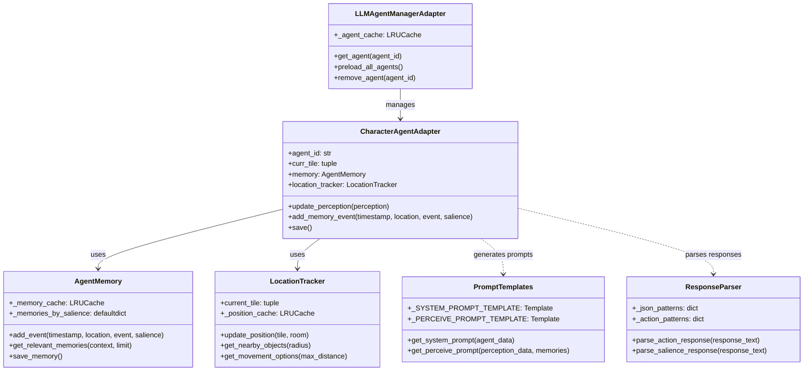

### Controller Integration Flow

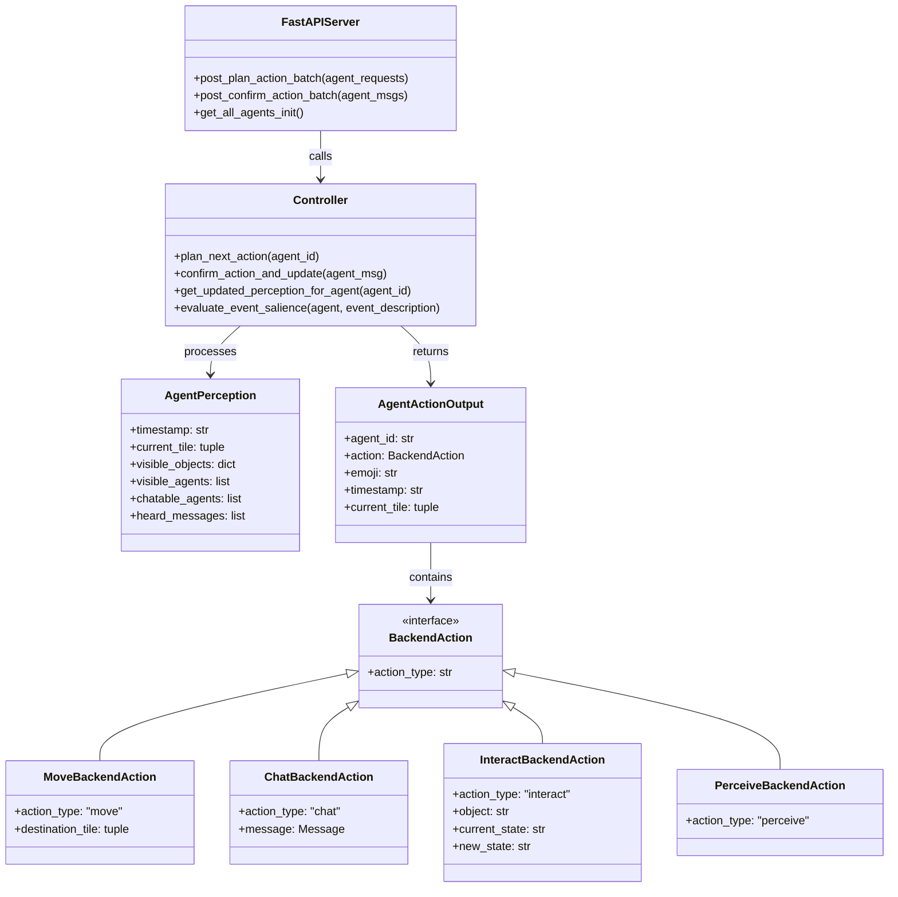

---

## Data Flow Diagrams

### Primary Action Flow

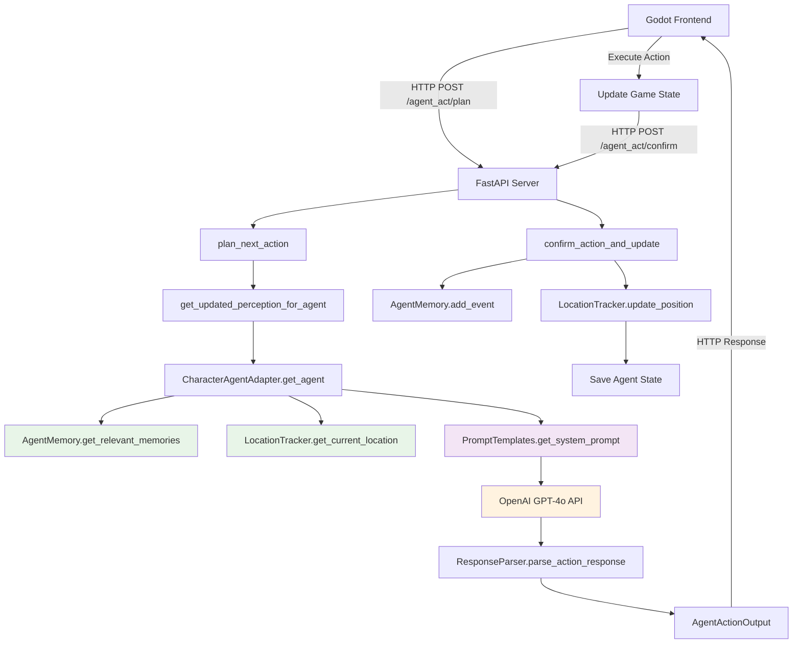

### Memory System Data Flow

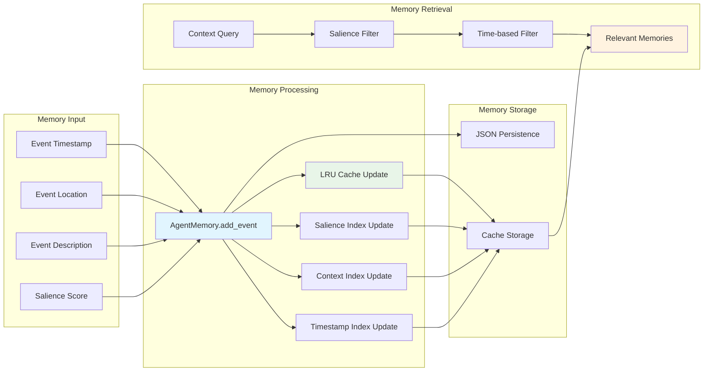

---

## API Interfaces

### FastAPI Endpoints

#### 1. Plan Action Endpoint
```http
POST /agent_act/plan
Content-Type: application/json

Request Body: List[AgentPlanRequest]
[
  {
    "agent_id": "alex_001",
    "perception": {
      "timestamp": "01T04:35:20",
      "current_tile": [12, 8],
      "visible_objects": {...},
      "visible_agents": ["alan_002"],
      "chatable_agents": ["alan_002"],
      "heard_messages": []
    }
  }
]

Response: List[PlanActionResponse]
[
  {
    "action": {
      "agent_id": "alex_001",
      "action": {
        "action_type": "chat",
        "message": {
          "sender": "alex_001",
          "receiver": "alan_002",
          "message": "Good morning!"
        }
      },
      "emoji": "💬",
      "timestamp": "01T04:35:20",
      "current_tile": [12, 8]
    },
    "perception": {...}
  }
]
```

#### 2. Confirm Action Endpoint
```http
POST /agent_act/confirm
Content-Type: application/json

Request Body: List[AgentActionInput]
[
  {
    "agent_id": "alex_001",
    "action": {
      "action_type": "chat",
      "forwarded": true
    },
    "in_progress": false,
    "perception": {
      "timestamp": "01T04:35:25",
      "current_tile": [12, 8],
      "visible_objects": {...},
      "visible_agents": ["alan_002"],
      "chatable_agents": ["alan_002"],
      "heard_messages": []
    }
  }
]

Response: List[StatusMsg]
[
  {
    "status": "ok"
  }
]
```

#### 3. Agent Initialization Endpoint
```http
GET /agents/init

Response: List[AgentSummary]
[
  {
    "agent_id": "alex_001",
    "first_name": "Alex",
    "last_name": "Smith",
    "curr_tile": [12, 8],
    "age": 29,
    "occupation": "artist",
    "currently": "focused on painting"
  }
]
```

### Internal Function Interfaces

#### Controller Functions
```python
def plan_next_action(agent_id: str) -> PlanActionResponse:
    """
    Plans the next action for an agent based on current perception.
    
    Args:
        agent_id: Unique agent identifier
        
    Returns:
        PlanActionResponse containing action and updated perception
    """

def confirm_action_and_update(agent_msg: AgentActionInput) -> None:
    """
    Confirms action execution and updates agent memory/state.
    
    Args:
        agent_msg: Input containing agent action and perception data
    """

def get_updated_perception_for_agent(agent_id: str) -> AgentPerception:
    """
    Retrieves current world perception for an agent.
    
    Args:
        agent_id: Unique agent identifier
        
    Returns:
        AgentPerception with current world state
    """
```

---

## Sequence Diagrams

### Agent Action Planning Sequence

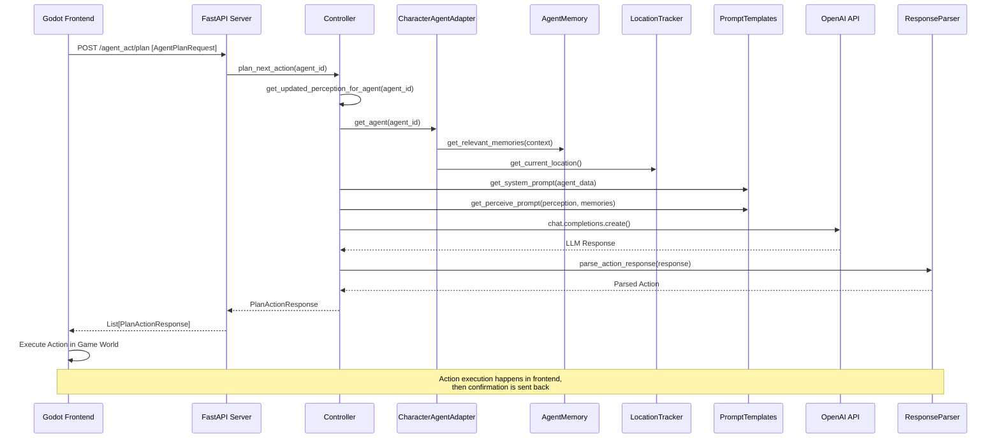

### Agent Action Confirmation Sequence

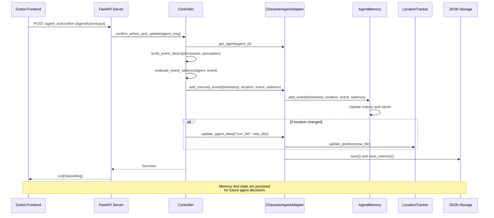

### Memory Retrieval Sequence

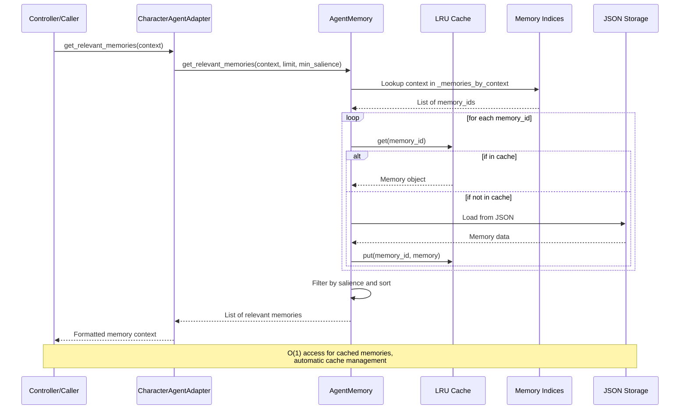

---

## Input/Output Specifications

### Agent Configuration Input (`agent.json`)

```json
{
  "agent_id": "alex_001",
  "first_name": "Alex",
  "last_name": "Smith",
  "age": 29,
  "curr_time": "2023-10-01T08:00:00Z",
  "curr_tile": [12, 8],
  "personality": "Creative and focused artist",
  "backstory": "Alex is a talented painter preparing for an upcoming gallery show",
  "occupation": "artist",
  "currently": "focused on painting",
  "lifestyle": "artist",
  "living_area": "downtown studio",
  "daily_req": [
    "Work on her paintings for her upcoming show",
    "Take a break to watch some TV",
    "Make lunch for herself"
  ],
  "f_daily_schedule": [
    ["sleeping", 360],
    ["morning routine", 20],
    ["painting", 240],
    ["lunch", 60]
  ]
}
```

### Memory Data Structure (`memory.json`)

```json
{
  "episodic_memory": [
    {
      "id": "alex_001_1",
      "timestamp": "01T04:35:20",
      "location": "bedroom",
      "event": "Woke up feeling refreshed and ready to paint",
      "salience": 6,
      "tags": ["morning", "emotion", "painting"],
      "created_at": 1699123520.123
    }
  ],
  "memory_metadata": {
    "total_memories": 1,
    "last_updated": "2023-10-01T08:00:00Z",
    "memory_capacity": 1000
  }
}
```

### Perception Input Format

```python
AgentPerception = {
    "timestamp": "01T04:35:20",          # Format: DDTHH:MM:SS
    "current_tile": [12, 8],             # [x, y] coordinates
    "visible_objects": {                 # Dict of object_name -> object_data
        "bed": {
            "room": "bedroom",
            "position": [21, 9],
            "state": "made"
        },
        "wardrobe": {
            "room": "bedroom", 
            "position": [20, 7],
            "state": "open"
        }
    },
    "visible_agents": ["alan_002"],      # List of agent_ids in sight
    "chatable_agents": ["alan_002"],     # List of agent_ids in chat range
    "heard_messages": [                  # List of Message objects
        {
            "sender": "alan_002",
            "receiver": "alex_001",
            "message": "Good morning!",
            "timestamp": "01T04:35:15",
            "conversation_id": "conv_123"
        }
    ]
}
```

### Action Output Format

```python
# Move Action
AgentActionOutput = {
    "agent_id": "alex_001",
    "action": {
        "action_type": "move",
        "destination_tile": [15, 10]
    },
    "emoji": "🚶",
    "timestamp": "01T04:35:20",
    "current_tile": [12, 8]
}

# Chat Action
AgentActionOutput = {
    "agent_id": "alex_001", 
    "action": {
        "action_type": "chat",
        "message": {
            "sender": "alex_001",
            "receiver": "alan_002",
            "message": "Good morning! How are you?",
            "timestamp": "01T04:35:20"
        }
    },
    "emoji": "💬",
    "timestamp": "01T04:35:20",
    "current_tile": [12, 8]
}

# Interact Action
AgentActionOutput = {
    "agent_id": "alex_001",
    "action": {
        "action_type": "interact",
        "object": "coffee_machine",
        "current_state": "off",
        "new_state": "brewing"
    },
    "emoji": "☕",
    "timestamp": "01T04:35:20", 
    "current_tile": [12, 8]
}

# Perceive Action
AgentActionOutput = {
    "agent_id": "alex_001",
    "action": {
        "action_type": "perceive"
    },
    "emoji": "👀",
    "timestamp": "01T04:35:20",
    "current_tile": [12, 8]
}
```

---

## Module Interactions

### Backend Module Dependencies

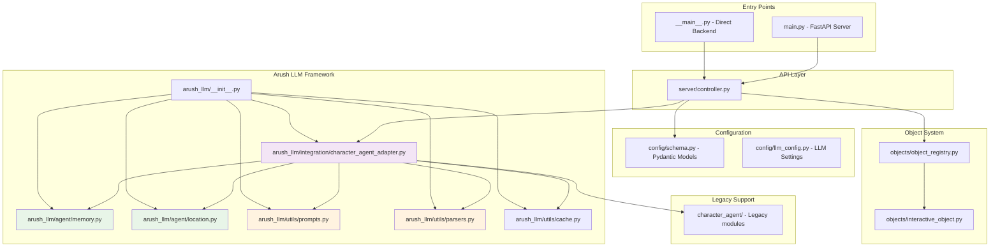

### Frontend Module Structure

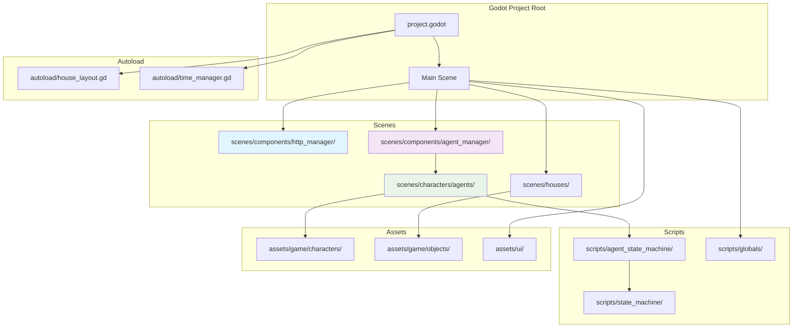

### Data Flow Between Modules

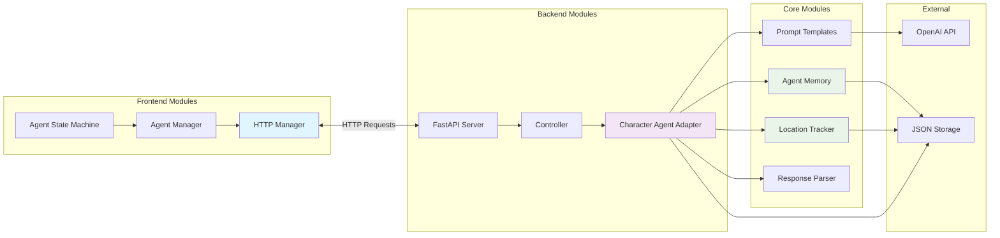

---

## Performance Optimizations

### Memory System Optimizations

1. **O(1) Access Patterns**
   - LRU Cache for frequently accessed memories
   - Hash-based indexing for salience and context lookups
   - Pre-compiled regex patterns for parsing

2. **Cache Strategy**
   ```python
   # Memory cache with TTL
   _memory_cache = LRUCache(1000, ttl_seconds=7200)  # 2 hours
   
   # Position cache for spatial queries
   _position_cache = LRUCache(200, ttl_seconds=1800)  # 30 minutes
   
   # Proximity cache for O(1) neighbor finding
   _proximity_cache = LRUCache(100, ttl_seconds=600)  # 10 minutes
   ```

3. **Index Management**
   ```python
   # Efficient multi-dimensional indexing
   _memories_by_salience = defaultdict(list)     # O(1) salience lookup
   _memories_by_context = defaultdict(list)      # O(1) context lookup
   _memories_by_timestamp = []                   # O(log n) temporal lookup
   ```

### Prompt Generation Optimizations

1. **Template Caching**
   ```python
   @lru_cache(maxsize=100)
   def _get_system_prompt_cached(cls, agent_key: tuple) -> str:
       # Cached system prompt generation
   ```

2. **Pre-compiled Templates**
   ```python
   _SYSTEM_PROMPT_TEMPLATE = string.Template("""System prompt...""")
   _PERCEIVE_PROMPT_TEMPLATE = string.Template("""Perceive prompt...""")
   ```

### Response Parsing Optimizations

1. **Pre-compiled Regex Patterns**
   ```python
   _json_patterns = {
       'basic': re.compile(r'\{[^{}]*\}'),
       'multiline': re.compile(r'\{[^{}]*\}', re.DOTALL),
       'markdown': re.compile(r'```json\s*(\{.*?\})\s*```', re.DOTALL)
   }
   ```

2. **Fast Action Detection**
   ```python
   _action_patterns = {
       'interact': re.compile(r'\b(?:interact|use|operate)\b', re.IGNORECASE),
       'move': re.compile(r'\b(?:move|go|walk)\b', re.IGNORECASE)
   }
   ```

### API Performance Optimizations

1. **Batch Processing**
   - Multiple agent requests processed in single API call
   - Concurrent agent processing where possible

2. **Connection Pooling**
   - Persistent HTTP connections
   - CORS optimization for frontend requests

---

## Frontend Integration

### Godot HTTP Manager

The frontend communicates with the backend through a dedicated HTTP manager that handles:

```gdscript
# HTTP Manager Core Functions
func _request_next_actions():
    # Builds batch request for all agents
    var request_body = []
    for agent_id in agent_ids:
        request_body.append({
            "agent_id": agent_id,
            "perception": agent_manager.get_agent_perception(agent_id)
        })

func _process_all_actions():
    # Processes backend responses and updates game state
    for action in _current_actions:
        _process_single_action(action)
    _send_pending_confirmations()

func _send_pending_confirmations():
    # Confirms action completion back to backend
    var confirm_bodies = []
    for action in _pending_confirmations:
        confirm_bodies.append({
            "agent_id": action.agent_id,
            "action": agent_manager.get_agent_frontend_action(action.agent_id),
            "in_progress": agent_manager.get_agent_in_progress(action.agent_id),
            "perception": agent_manager.get_agent_perception(action.agent_id)
        })
```

### Agent State Management

```gdscript
# Agent Manager Core Functions
func get_agent_perception(agent_id: String) -> Dictionary:
    # Builds perception data for backend
    return {
        "timestamp": TimeManager.get_formatted_time(),
        "current_tile": get_agent_tile(agent_id),
        "visible_objects": get_visible_objects(agent_id),
        "visible_agents": get_visible_agents(agent_id),
        "chatable_agents": get_chatable_agents(agent_id),
        "heard_messages": get_heard_messages(agent_id)
    }

func handle_move_action(agent_id: String, dest_tile: Vector2i):
    # Updates agent position and triggers movement animation
    
func handle_chat_action(agent_id: String, message: Dictionary):
    # Displays chat bubble and forwards message to receiver
    
func handle_interact_action(agent_id: String, object_name: String, current_state: String, new_state: String):
    # Updates object state and triggers interaction animation
```

### Real-time Polling System

```gdscript
# Polling Configuration
const POLL_INTERVAL = 5.0  # 5 seconds between backend requests
const BACKEND_URL = "http://localhost:8000"

# Polling Control
func _on_poll_timer_timeout():
    if not _is_processing_actions:
        _is_processing_actions = true
        _request_next_actions()

# Debug Controls
func _input(event):
    if event.is_action_pressed("pause_polling"):
        toggle_polling()
    if event.is_action_pressed("request_next_action"):
        forcibly_request_next_actions()
```

---

## Deployment Architecture

### Development Environment

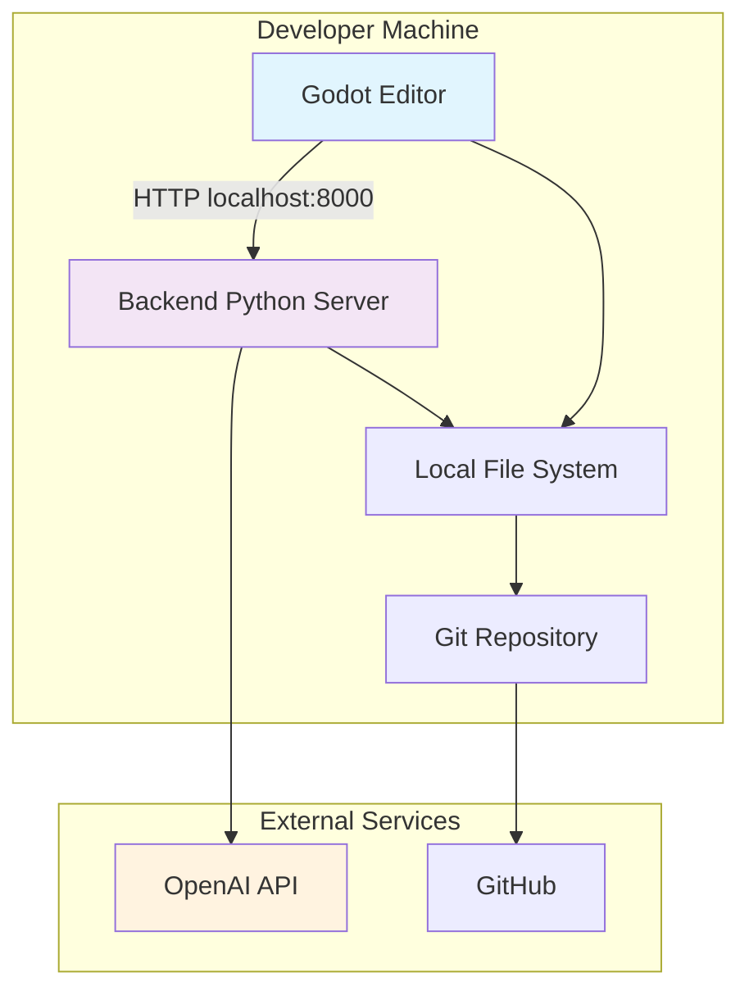

### Production Environment

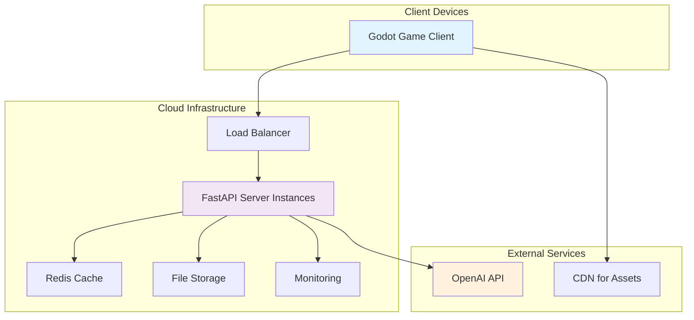

### Configuration Management

```python
# Environment-based configuration
class Settings:
    # API Configuration
    OPENAI_API_KEY: str = os.getenv("OPENAI_API_KEY")
    BACKEND_URL: str = os.getenv("BACKEND_URL", "http://localhost:8000")
    
    # Performance Settings
    MEMORY_CACHE_SIZE: int = int(os.getenv("MEMORY_CACHE_SIZE", "1000"))
    POSITION_CACHE_SIZE: int = int(os.getenv("POSITION_CACHE_SIZE", "200"))
    
    # Agent Settings
    DEFAULT_SALIENCE_THRESHOLD: int = int(os.getenv("DEFAULT_SALIENCE_THRESHOLD", "3"))
    MAX_MEMORY_LIMIT: int = int(os.getenv("MAX_MEMORY_LIMIT", "5"))
    
    # File Paths
    AGENTS_DATA_DIR: str = os.getenv("AGENTS_DATA_DIR", "data/agents")
    WORLD_DATA_DIR: str = os.getenv("WORLD_DATA_DIR", "data/world")
```

### Health Monitoring

```python
# Health check endpoint
@app.get("/health")
def health_check():
    return {
        "status": "healthy",
        "message": "Backend is running",
        "timestamp": datetime.now().isoformat(),
        "active_agents": agent_manager.get_active_agent_count(),
        "memory_usage": get_memory_stats(),
        "cache_stats": get_cache_stats()
    }
```

---

## Conclusion

The Multi-Agent Playground represents a sophisticated integration of modern AI capabilities with real-time simulation technology. The system's architecture prioritizes:

1. **Performance**: O(1) operations for critical paths
2. **Scalability**: Modular design supporting multiple agents
3. **Maintainability**: Clear separation of concerns and interfaces
4. **Compatibility**: Seamless migration from legacy systems
5. **Extensibility**: Plugin architecture for new capabilities

The design document serves as a comprehensive guide for understanding, maintaining, and extending the Multi-Agent Playground system, ensuring that future development can build upon this solid architectural foundation.