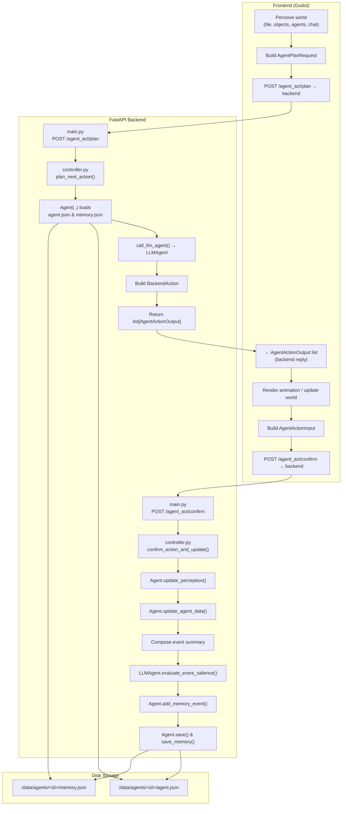

# Multi-Agent Playground - System Architecture

This document provides a comprehensive overview of the Multi-Agent Playground system architecture, including data flows, JSON formats, and key processing functions.

## System Overview

The Multi-Agent Playground consists of three main components:

1. **Frontend (Godot)** - Handles visualization, user interaction, and world simulation
2. **Backend (FastAPI)** - Processes agent decisions and manages state
3. **Storage (JSON files)** - Persists agent state and memory

## Architecture Diagram



## Data Flow Process

### 1. Action Planning Phase (Frontend → Backend)

1. **Frontend** perceives the world state (objects, agents, messages)
2. **Frontend** builds an `AgentPlanRequest` with current perception
3. **Frontend** sends POST request to `/agent_act/plan`
4. **Backend** loads agent state from JSON files
5. **Backend** calls LLM (via Kani) to decide next action
6. **Backend** returns `AgentActionOutput` with planned action
7. **Frontend** renders the planned action

### 2. Action Confirmation Phase (Frontend → Backend)

1. **Frontend** executes the action and observes results
2. **Frontend** builds `AgentActionInput` with action results
3. **Frontend** sends POST request to `/agent_act/confirm`
4. **Backend** updates agent perception and state
5. **Backend** evaluates event salience using LLM
6. **Backend** adds memory event and saves to disk

## JSON Data Formats

### Communication Formats (Frontend ↔ Backend)

#### AgentPlanRequest (Frontend → Backend)
```json
{
  "agent_id": "alex_001",
  "perception": {
    "timestamp": "01T04:35:20",
    "current_tile": [20, 8],
    "visible_objects": {
      "bed": {
        "room": "bedroom",
        "position": [21, 9],
        "state": "made"
      }
    },
    "visible_agents": ["alan_002"],
    "chatable_agents": ["alan_002"],
    "heard_messages": [
      {
        "sender": "alan_002",
        "receiver": "alex_001",
        "message": "Good morning!",
        "timestamp": "01T04:35:15"
      }
    ]
  }
}
```

#### AgentActionOutput (Backend → Frontend)
```json
{
  "agent_id": "alex_001",
  "action": {
    "action_type": "chat",
    "message": {
      "sender": "alex_001",
      "receiver": "alan_002",
      "message": "Good morning to you too!",
      "timestamp": "01T04:35:20"
    }
  },
  "emoji": "💬",
  "timestamp": "01T04:35:20",
  "current_tile": [20, 8]
}
```

#### AgentActionInput (Frontend → Backend)
```json
{
  "agent_id": "alex_001",
  "action": {
    "action_type": "chat",
    "forwarded": true
  },
  "in_progress": false,
  "perception": {
    "timestamp": "01T04:35:25",
    "current_tile": [20, 8],
    "visible_objects": {},
    "visible_agents": ["alan_002"],
    "chatable_agents": ["alan_002"],
    "heard_messages": []
  }
}
```

### Storage Formats (Disk Persistence)

#### agent.json
```json
{
  "agent_id": "alex_001",
  "vision_r": 4,
  "retention": 5,
  "curr_time": "01T04:35:20",
  "curr_tile": [22, 9],
  "daily_plan_req": "Finish painting, make lunch, call gallery",
  "name": "Alex",
  "first_name": "Alex",
  "last_name": "Smith",
  "age": 29,
  "innate": {
    "openness": 7,
    "conscientiousness": 6,
    "extraversion": 5
  },
  "learned": {
    "languages": ["English", "French"]
  },
  "currently": "I saw alan_002 and we had a friendly chat",
  "lifestyle": "artist",
  "living_area": "downtown studio",
  "daily_req": [
    "Work on her paintings for her upcoming show",
    "Take a break to watch some TV",
    "Make lunch for herself"
  ]
}
```

#### memory.json
```json
[
  {
    "timestamp": "2023-10-01T08:00:00Z",
    "location": "downtown studio:main:bedroom",
    "event": "wakes up and stretches",
    "salience": 6
  },
  {
    "timestamp": "2023-10-01T08:15:00Z",
    "location": "downtown studio:main:kitchen",
    "event": "has breakfast",
    "salience": 4
  },
  {
    "timestamp": "2023-10-01T09:00:00Z",
    "location": "downtown studio:main:artroom",
    "event": "working on her painting",
    "salience": 8
  }
]
```

## Action Types

### Backend Actions (Backend → Frontend)
- **MoveBackendAction**: Move to destination coordinates
- **ChatBackendAction**: Send message to another agent
- **InteractBackendAction**: Change object state
- **PerceiveBackendAction**: Observe surroundings

### Frontend Actions (Frontend → Backend)
- **MoveFrontendAction**: Report movement completion
- **ChatFrontendAction**: Report message forwarding status
- **InteractFrontendAction**: Report object state change
- **PerceiveFrontendAction**: Report observation results

## Key Processing Functions

### Backend Core Functions

#### `main.py`
- **POST `/agent_act/plan`** → `plan_next_action()`: Batch planning endpoint
- **POST `/agent_act/confirm`** → `confirm_action_and_update()`: Batch confirmation endpoint

#### `server/controller.py`
- **`plan_next_action(agent_id, perception)`**: 
  - Loads agent state
  - Calls LLM for action decision
  - Returns structured action output
  
- **`confirm_action_and_update(agent_msg)`**:
  - Updates agent perception and state
  - Evaluates event salience
  - Adds memory event
  - Persists changes to disk

#### `character_agent/agent.py`
- **`update_perception(perception)`**: Merge world perception into agent state
- **`update_agent_data(data)`**: Update core agent fields
- **`add_memory_event(timestamp, location, event, salience)`**: Add to memory
- **`save()`** / **`save_memory()`**: Persist to JSON files
- **`to_state_dict()`**: Serialize for LLM consumption

#### `character_agent/kani_implementation.py`
- **`call_llm_agent(state, perception)`**: Get next action from LLM
- **`LLMAgent.evaluate_event_salience(text)`**: Rate event importance (1-10)

## LLM Integration (Kani Framework)

The system uses the Kani framework for LLM interactions:

- **Model-agnostic**: Supports OpenAI, Anthropic, HuggingFace, etc.
- **Function calling**: Structured action generation
- **Memory management**: Automatic token management
- **Async design**: Parallel agent processing

The LLM agents make decisions based on:
- Current agent state and personality
- Visual perception of environment
- Memory of past events
- Daily goals and requirements

## Persistence Strategy

- **agent.json**: Core agent state (personality, current status, goals)
- **memory.json**: Event history with salience scoring
- **Atomic updates**: State changes are persisted immediately after confirmation
- **Memory pruning**: Low-salience events can be filtered based on retention settings

This architecture enables rich, persistent, multi-agent simulations where agents maintain memory, make contextual decisions, and interact naturally within the shared environment. 