# Extensible JRPG Philosophy Club Simulation Design Document

## Executive Summary

This document outlines a streamlined yet extensible multi-agent JRPG simulation where NPCs engage in a philosophy club presidential debate. The design prioritizes simplicity for immediate implementation while providing clear extension points for advanced features like CLIN/IPOCL memory systems, complex object interactions, and sophisticated narrative planning. The primary objective of this project is to showcase 

## High Level Approach

### Core Vision

Create a text-based simulation where AI agents debate philosophy club presidency, form opinions through interactions, and vote based on their experiences. The system emphasizes straightforward implementation with well-defined interfaces for future enhancement.

### Core Principles

- **Agentic Design**: Each NPC operates as an autonomous agent with individual goals, memories, and decision-making capabilities
- **Narrative Coherence**: Maintain logical causal progression and character believability throughout the simulation
- **Memory-Driven Interactions**: Agents form lasting impressions and adapt behavior based on accumulated experiences
- **Emergent Storytelling**: Allow natural story progression through agent interactions rather than scripted events


### Design Principles

- **Simplicity with Extensibility**: Start simple but architect for growth
- **Interface-Driven Design**: Abstract interfaces enable feature enhancement
- **Modular Components**: Each system can be independently upgraded
- **Clear Extension Points**: Defined pathways for adding complexity


## Extensible Architecture

```
┌─────────────────────────────────────────┐
│          Game State Manager             │
│     (Central Authority & Coordination)  │
└─────────────────────────────────────────┘
                    │
┌─────────────────────────────────────────┐
│        Extensible Agent System          │
│  (Pluggable Memory & Behavior Modules)  │
└─────────────────────────────────────────┘
                    │
┌─────────────────────────────────────────┐
│       Modular Memory Framework          │
│   (Simple → CLIN/IPOCL Enhancement)     │
└─────────────────────────────────────────┘
```


## Core Components with Extension Points

### Extensible Agent Architecture

```python
from abc import ABC, abstractmethod
from typing import Dict, List, Any, Optional

# Core interfaces for extensibility
class MemorySystem(ABC):
    """Abstract base for memory systems - can be simple or complex"""
    
    @abstractmethod
    def store_event(self, event: 'Event') -> None:
        pass
    
    @abstractmethod
    def retrieve_relevant(self, query: str, limit: int = 5) -> List['Event']:
        pass
    
    @abstractmethod
    def update_opinions(self, event: 'Event') -> None:
        pass

class PlanningSystem(ABC):
    """Abstract base for agent planning - simple reactions to IPOCL"""
    
    @abstractmethod
    def plan_action(self, goal: str, context: List['Event']) -> 'ActionPlan':
        pass
    
    @abstractmethod
    def update_intentions(self, new_info: 'Event') -> None:
        pass

class Agent:
    """Extensible agent with pluggable components"""
    
    def __init__(self, 
                 agent_id: str, 
                 name: str, 
                 personality: Dict[str, Any],
                 role: str,
                 memory_system: MemorySystem,
                 planning_system: PlanningSystem):
        self.agent_id = agent_id
        self.name = name
        self.personality = personality
        self.role = role  # "candidate", "member", "moderator"
        self.current_opinion = {}  # candidate -> preference score
        
        # Pluggable systems - can be upgraded independently
        self.memory = memory_system
        self.planner = planning_system
        self.kani = Kani(model="gpt-4.1")
        
        # Extensible state tracking
        self.current_location = None
        self.active_goals = []
        self.behavioral_state = {}
        
    def observe_event(self, event: 'Event'):
        """Process observed events through pluggable systems"""
        self.memory.store_event(event)
        self.memory.update_opinions(event)
        self.planner.update_intentions(event)
        
    def generate_response(self, prompt: str, context_type: str = "recent") -> str:
        """Generate response with extensible context retrieval"""
        context = self._get_context(context_type)
        personality_prompt = self._format_personality_context()
        
        full_prompt = f"""
        {personality_prompt}
        
        Recent Context:
        {self._format_context(context)}
        
        Current Situation: {prompt}
        
        Respond as {self.name}:
        """
        
        return self.kani.chat(full_prompt)
    
    def _get_context(self, context_type: str) -> List['Event']:
        """Extensible context retrieval"""
        if context_type == "recent":
            return self.memory.retrieve_relevant("recent events", 10)
        elif context_type == "relevant":
            return self.memory.retrieve_relevant(self.current_context, 5)
        elif context_type == "planning":
            # Future: IPOCL-based context
            return self.memory.retrieve_relevant("goals and plans", 7)
        else:
            return self.memory.retrieve_relevant("general", 5)
```


### Extensible Memory Systems

```python
# Phase I: Simple Memory Implementation
class SimpleMemorySystem(MemorySystem):
    """Basic memory for Phase I - can be enhanced later"""
    
    def __init__(self):
        self.events = []
        self.opinions = {}
        
    def store_event(self, event: Event) -> None:
        self.events.append(event)
        
    def retrieve_relevant(self, query: str, limit: int = 5) -> List[Event]:
        # Simple keyword-based retrieval
        recent_events = self.events[-20:]  # Recent bias
        relevant = [e for e in recent_events 
                   if any(word in e.content.lower() 
                         for word in query.lower().split())]
        return relevant[:limit]
        
    def update_opinions(self, event: Event) -> None:
        if event.type == "SPEECH" and event.speaker_id:
            sentiment = self._simple_sentiment_analysis(event.content)
            self.opinions[event.speaker_id] = self.opinions.get(event.speaker_id, 0) + sentiment * 0.1

# Phase II: Enhanced Memory with Extension Points
class CLINMemorySystem(MemorySystem):
    """Advanced memory system for Phase II+"""
    
    def __init__(self):
        self.episodic_memory = []
        self.causal_network = {}  # For CLIN implementation
        self.semantic_store = {}  # For vector embeddings
        self.reflection_summaries = []
        
    def store_event(self, event: Event) -> None:
        # Enhanced storage with causal linking
        self.episodic_memory.append(event)
        self._update_causal_links(event)
        self._update_semantic_index(event)
        
    def retrieve_relevant(self, query: str, limit: int = 5) -> List[Event]:
        # CLIN-based retrieval with causal reasoning
        causal_relevant = self._find_causally_related(query)
        semantic_relevant = self._semantic_search(query)
        combined = self._merge_and_rank(causal_relevant, semantic_relevant)
        return combined[:limit]
        
    def _update_causal_links(self, event: Event):
        """Future: Implement CLIN causal link network"""
        pass
        
    def _semantic_search(self, query: str) -> List[Event]:
        """Future: Vector-based semantic search"""
        pass

# Phase II+: IPOCL Planning System
class IPOCLPlanningSystem(PlanningSystem):
    """Advanced planning for believable character behavior"""
    
    def __init__(self, agent_personality: Dict[str, Any]):
        self.personality = agent_personality
        self.intention_hierarchy = []
        self.partial_order_plans = []
        
    def plan_action(self, goal: str, context: List[Event]) -> ActionPlan:
        # IPOCL-based planning with character consistency
        plan = self._generate_character_consistent_plan(goal, context)
        return plan
        
    def _generate_character_consistent_plan(self, goal: str, context: List[Event]):
        """Future: Full IPOCL implementation with character modeling"""
        pass
```


### Generic Object System

```python
class GameObject(ABC):
    """Abstract base for all interactive objects"""
    
    def __init__(self, object_id: str, name: str, location: str, object_type: str):
        self.object_id = object_id
        self.name = name
        self.location = location
        self.object_type = object_type
        self.properties = {}
        self.state = {}
        self.interaction_history = []
        
    @abstractmethod
    def get_available_actions(self, agent_id: str) -> List[str]:
        """Return actions this agent can perform on this object"""
        pass
    
    @abstractmethod
    def execute_action(self, agent_id: str, action: str, parameters: Dict = None) -> 'ActionResult':
        """Execute an action and return result"""
        pass
    
    def get_description(self, agent_perspective: str = "default") -> str:
        """Get object description from agent's perspective"""
        return f"{self.name}: {self.properties.get('description', 'A mysterious object')}"
    
    def add_interaction(self, agent_id: str, action: str, result: str):
        """Track interactions for future AI enhancement"""
        self.interaction_history.append({
            'timestamp': datetime.now(),
            'agent_id': agent_id,
            'action': action,
            'result': result
        })

# Specific object implementations
class Microphone(GameObject):
    """Microphone for debate management"""
    
    def __init__(self, location: str):
        super().__init__("microphone", "Debate Microphone", location, "communication_device")
        self.state = {
            "is_active": False,
            "current_speaker": None,
            "volume_level": 5,
            "battery_level": 100
        }
        self.properties = {
            "description": "A professional microphone for debate speeches",
            "max_users": 1,
            "requires_permission": True
        }
    
    def get_available_actions(self, agent_id: str) -> List[str]:
        actions = ["examine", "request_speaking_turn"]
        if self.state["current_speaker"] == agent_id:
            actions.extend(["speak", "release_microphone", "adjust_volume"])
        return actions
    
    def execute_action(self, agent_id: str, action: str, parameters: Dict = None) -> ActionResult:
        if action == "request_speaking_turn":
            return self._handle_speaking_request(agent_id)
        elif action == "speak":
            return self._handle_speech(agent_id, parameters.get("content", ""))
        elif action == "release_microphone":
            return self._handle_release(agent_id)
        else:
            return ActionResult(False, f"Unknown action: {action}")
    
    def _handle_speaking_request(self, agent_id: str) -> ActionResult:
        if not self.state["is_active"] or self.state["current_speaker"] is None:
            self.state["is_active"] = True
            self.state["current_speaker"] = agent_id
            self.add_interaction(agent_id, "request_speaking_turn", "granted")
            return ActionResult(True, f"{agent_id} now has the microphone")
        else:
            return ActionResult(False, f"Microphone busy with {self.state['current_speaker']}")

class Podium(GameObject):
    """Podium for formal presentations"""
    
    def __init__(self, location: str, podium_id: str):
        super().__init__(podium_id, f"Podium {podium_id[-1]}", location, "furniture")
        self.state = {
            "occupied": False,
            "current_occupant": None,
            "height_adjustment": 3
        }
    
    def get_available_actions(self, agent_id: str) -> List[str]:
        if not self.state["occupied"]:
            return ["approach", "examine", "stand_at"]
        elif self.state["current_occupant"] == agent_id:
            return ["step_away", "adjust_height", "gesture"]
        else:
            return ["examine", "wait_for_turn"]

class Whiteboard(GameObject):
    """Interactive whiteboard for presentations"""
    
    def __init__(self, location: str):
        super().__init__("whiteboard", "Philosophy Whiteboard", location, "presentation_tool")
        self.state = {
            "content": [],
            "marker_color": "black",
            "is_clean": True
        }
    
    def get_available_actions(self, agent_id: str) -> List[str]:
        return ["examine", "write", "erase", "point_to", "change_marker_color"]

# Future extensible objects
class VotingBox(GameObject):
    """Secure voting system - for Phase II+"""
    pass

class LibraryAccess(GameObject):
    """Access to philosophy resources - for enhanced versions"""
    pass
```


### Extensible Location System

```python
class Location:
    """Generic location with extensible object management"""
    
    def __init__(self, location_id: str, name: str, description: str, location_type: str = "room"):
        self.location_id = location_id
        self.name = name
        self.description = description
        self.location_type = location_type
        self.objects = {}  # object_id -> GameObject
        self.agents = {}   # agent_id -> Agent
        self.connections = {}  # direction -> Location (for future expansion)
        self.environmental_properties = {}
        
    def add_object(self, obj: GameObject):
        """Add an interactive object to this location"""
        self.objects[obj.object_id] = obj
        obj.location = self.location_id
        
    def remove_object(self, object_id: str):
        """Remove object from location"""
        if object_id in self.objects:
            del self.objects[object_id]
    
    def add_agent(self, agent: Agent):
        """Add agent to location"""
        self.agents[agent.agent_id] = agent
        agent.current_location = self.location_id
        
    def remove_agent(self, agent_id: str):
        """Remove agent from location"""
        if agent_id in self.agents:
            del self.agents[agent_id]
    
    def get_available_interactions(self, agent_id: str) -> Dict[str, List[str]]:
        """Get all possible interactions for an agent in this location"""
        interactions = {}
        for obj_id, obj in self.objects.items():
            interactions[obj_id] = obj.get_available_actions(agent_id)
        return interactions
    
    def get_location_description(self, agent_id: str) -> str:
        """Generate dynamic location description"""
        base_desc = self.description
        
        # Add object descriptions
        if self.objects:
            object_descs = []
            for obj in self.objects.values():
                object_descs.append(obj.get_description())
            base_desc += f"\n\nObjects present: {', '.join(object_descs)}"
        
        # Add other agents
        other_agents = [name for aid, name in self.agents.items() if aid != agent_id]
        if other_agents:
            base_desc += f"\n\nOther people present: {', '.join(other_agents)}"
            
        return base_desc

# Specific location implementations
class DebateHall(Location):
    """Formal debate location with specialized setup"""
    
    def __init__(self):
        super().__init__("debate_hall", "Philosophy Club Debate Hall", 
                        "A formal hall with podiums, seating, and presentation equipment")
        
        # Add standard debate objects
        self.add_object(Microphone("debate_hall"))
        self.add_object(Podium("debate_hall", "podium_1"))
        self.add_object(Podium("debate_hall", "podium_2"))
        self.add_object(Whiteboard("debate_hall"))
        
        self.environmental_properties = {
            "acoustics": "excellent",
            "lighting": "bright",
            "seating_capacity": 50,
            "formality_level": "high"
        }

class ClubRoom(Location):
    """Casual discussion space"""
    
    def __init__(self):
        super().__init__("club_room", "Philosophy Club Lounge", 
                        "A comfortable room with sofas and coffee tables for informal discussion")
        self.environmental_properties = {
            "atmosphere": "relaxed",
            "noise_level": "low",
            "formality_level": "casual"
        }
```


### Extensible Simulation Controller

```python
class PhilosophyClubSimulation:
    """Main simulation with extensible phase system"""
    
    def __init__(self, config: SimulationConfig):
        self.config = config
        self.agents = {}
        self.locations = {}
        self.current_phase = "SETUP"
        self.phase_manager = PhaseManager()
        self.event_system = EventSystem()
        
        # Extensible systems
        self.narrative_director = self._create_narrative_system()
        self.interaction_manager = InteractionManager()
        
    def initialize_simulation(self):
        """Set up agents and locations with extensible configuration"""
        
        # Create locations
        self.locations["debate_hall"] = DebateHall()
        self.locations["club_room"] = ClubRoom()
        
        # Create agents with pluggable memory systems
        for agent_config in self.config.agents:
            memory_system = self._create_memory_system(agent_config.memory_type)
            planning_system = self._create_planning_system(agent_config.planning_type)
            
            agent = Agent(
                agent_config.id,
                agent_config.name,
                agent_config.personality,
                agent_config.role,
                memory_system,
                planning_system
            )
            
            self.agents[agent.agent_id] = agent
            self.locations[agent_config.starting_location].add_agent(agent)
    
    def _create_memory_system(self, memory_type: str) -> MemorySystem:
        """Factory for memory systems - enables easy upgrades"""
        if memory_type == "simple":
            return SimpleMemorySystem()
        elif memory_type == "clin":
            return CLINMemorySystem()
        else:
            return SimpleMemorySystem()  # Default fallback
    
    def _create_planning_system(self, planning_type: str) -> PlanningSystem:
        """Factory for planning systems"""
        if planning_type == "reactive":
            return ReactivePlanningSystem()
        elif planning_type == "ipocl":
            return IPOCLPlanningSystem(agent_personality)
        else:
            return ReactivePlanningSystem()  # Default fallback
    
    def run_simulation(self):
        """Extensible simulation loop"""
        self.initialize_simulation()
        
        while not self.phase_manager.is_complete():
            current_phase = self.phase_manager.get_current_phase()
            self._execute_phase(current_phase)
            self.phase_manager.advance_phase()
    
    def _execute_phase(self, phase: SimulationPhase):
        """Extensible phase execution"""
        if phase.phase_type == "DEBATE":
            self._run_debate_phase(phase)
        elif phase.phase_type == "DISCUSSION":
            self._run_discussion_phase(phase)
        elif phase.phase_type == "VOTING":
            self._run_voting_phase(phase)
```


## System Architecture Diagrams

### Extensible System Architecture


### Memory System Evolution

```mermaid
graph LR
    subgraph "Phase I - Simple Memory"
        SM[Simple Memory<br/>- Event List<br/>- Basic Opinions<br/>- Keyword Search]
    end
    
    subgraph "Phase II - Enhanced Memory"
        EM[Enhanced Memory<br/>- Episodic Storage<br/>- Semantic Indexing<br/>- Opinion Weighting]
    end
    
    subgraph "Phase III - CLIN Memory"
        CLIN[CLIN Memory System<br/>- Causal Networks<br/>- Event Relationships<br/>- Reflection Summaries]
    end
    
    subgraph "Memory Interface"
        MI[Memory Interface<br/>- store_event()<br/>- retrieve_relevant()<br/>- update_opinions()]
    end
    
    SM --> MI
    EM --> MI
    CLIN --> MI
    
    SM -.-> EM
    EM -.-> CLIN
    
    style SM fill:#ffebee
    style EM fill:#fff3e0
    style CLIN fill:#e8f5e8
```


## Sequence Diagrams

### Extensible Agent Interaction

```mermaid
sequenceDiagram
    participant GSM as Game State Manager
    participant A1 as Agent 1 (Simple)
    participant A2 as Agent 2 (Enhanced)
    participant MS1 as Simple Memory
    participant MS2 as CLIN Memory
    participant OBJ as Microphone Object
    
    Note over GSM: Mixed agent types in same simulation
    
    GSM->>+A1: "Request to speak"
    A1->>+OBJ: execute_action("request_speaking_turn")
    OBJ->>OBJ: Check availability
    OBJ-->>-A1: ActionResult(success=True)
    A1->>+GSM: "Permission granted, delivering speech"
    
    GSM->>+A2: Broadcast speech event
    A2->>+MS2: store_event(speech_event)
    MS2->>MS2: Update causal network (CLIN)
    MS2->>MS2: Update semantic index
    MS2-->>-A2: Event stored with enhanced processing
    
    GSM->>+A1: Broadcast same speech event
    A1->>+MS1: store_event(speech_event)
    MS1->>MS1: Simple storage and opinion update
    MS1-->>-A1: Event stored with basic processing
    
    Note over A1,A2: Both agents process same event with different sophistication
    
    A2->>+MS2: retrieve_relevant("debate arguments")
    MS2->>MS2: CLIN-based causal search
    MS2-->>-A2: Causally related events
    
    A1->>+MS1: retrieve_relevant("recent events")
    MS1->>MS1: Simple keyword/recency search
    MS1-->>-A1: Recent matching events
    
    A2->>GSM: Generate sophisticated response
    A1->>GSM: Generate simple response
```




### Object System Extensibility


### Phase Transition and Extensibility


## Phase Implementation Plan

### Phase I: Foundation with Extension Points (Week 1-2)

**Core Implementation**:

- `GameObject` interface with `Microphone` implementation
- `MemorySystem` interface with `SimpleMemorySystem` implementation
- `Agent` class with pluggable memory and planning systems
- Basic `Location` system with object management
- Console interface for testing

**Extension Points Established**:

- Memory system factory pattern
- Planning system interface
- Object action framework
- Location connection system

**Success Criteria**:

- Single agent can interact with microphone object
- Memory stores and retrieves events through interface
- Agent personality affects responses
- System ready for component upgrades


### Phase II: Enhanced Components (Week 3-4)

**Enhanced Implementation**:

- `CLINMemorySystem` with causal networking
- `IPOCLPlanningSystem` for character consistency
- Multiple object types (Podium, Whiteboard)
- Full debate simulation with 7 agents
- Opinion formation and voting

**Backward Compatibility**:

- Phase I agents work alongside Phase II agents
- Simple memory systems continue to function
- Gradual migration path for components


### Phase III: Advanced Features (Future)

**Advanced Extensions**:

- Vector-based semantic memory search
- Complex narrative planning with IPOCL
- Dynamic object creation and AI-driven interactions
- Multi-location simulations with agent movement
- Rich GUI with real-time visualization


## Implementation Guidelines

### Extension Patterns

1. **Interface-First Design**: Define interfaces before implementations
2. **Factory Pattern**: Use factories for creating pluggable components
3. **Backward Compatibility**: Ensure new features don't break existing functionality
4. **Configuration-Driven**: Use config files to specify component types

### Code Organization

```
philosophy_club/
├── interfaces/
│   ├── memory.py          # MemorySystem interface
│   ├── planning.py        # PlanningSystem interface
│   ├── objects.py         # GameObject interface
│   └── locations.py       # Location interfaces
├── implementations/
│   ├── memory/
│   │   ├── simple.py      # Phase I memory
│   │   ├── enhanced.py    # Phase II memory
│   │   └── clin.py        # Phase III CLIN memory
│   ├── planning/
│   │   ├── reactive.py    # Simple planning
│   │   └── ipocl.py       # Advanced planning
│   └── objects/
│       ├── microphone.py
│       ├── podium.py
│       └── whiteboard.py
├── core/
│   ├── agent.py           # Main agent class
│   ├── simulation.py      # Simulation controller
│   └── events.py          # Event system
└── config/
    ├── phase1_config.json  # Simple configuration
    └── phase2_config.json  # Enhanced configuration
```


## Conclusion

This extensible design provides immediate implementability for Phase I while establishing clear pathways for sophisticated enhancements. The interface-driven architecture ensures that complex features like CLIN memory systems and IPOCL planning can be seamlessly integrated without disrupting existing functionality. Each component can be independently upgraded, allowing for gradual system evolution from simple reactive agents to sophisticated AI characters with believable personalities and consistent behavior patterns.

