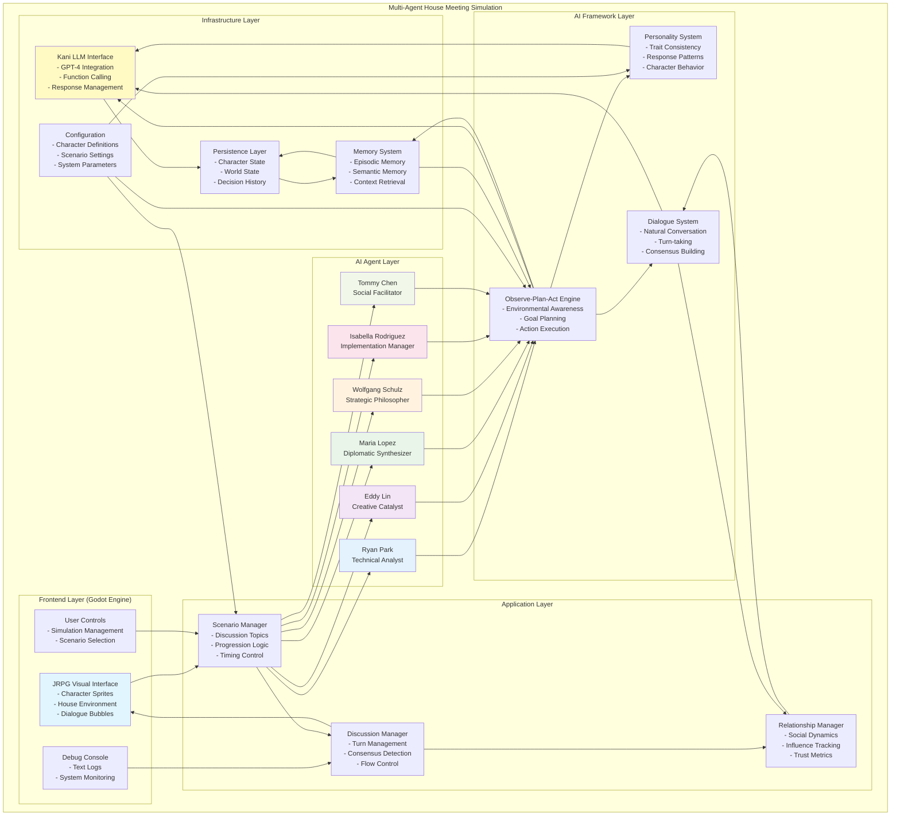
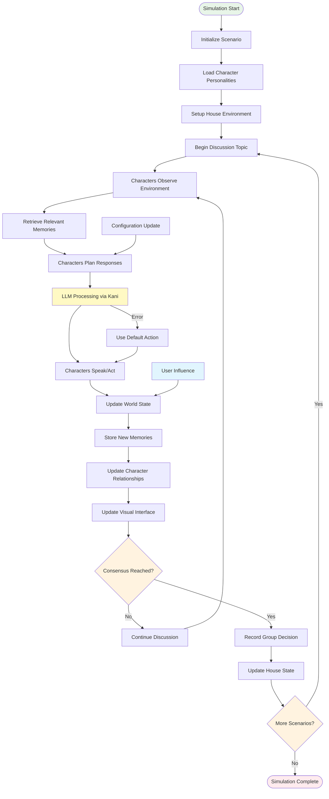
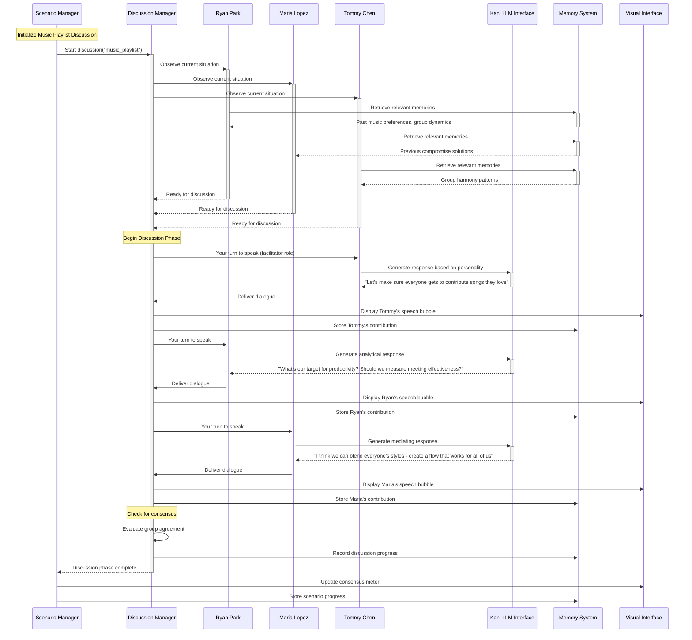
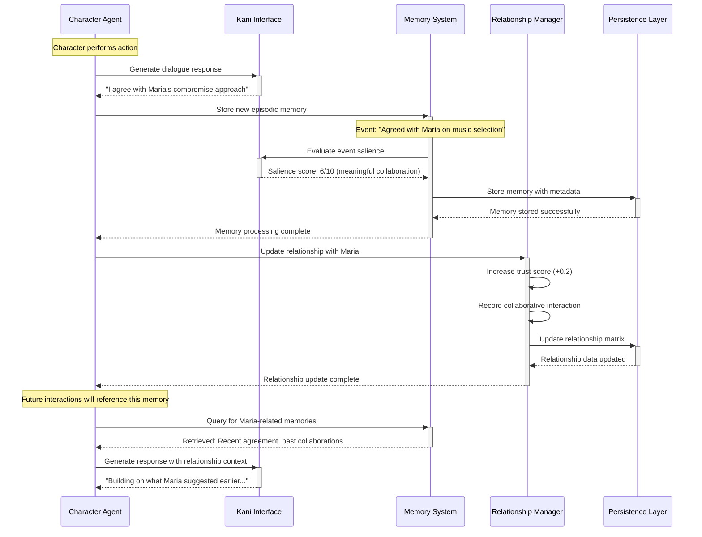
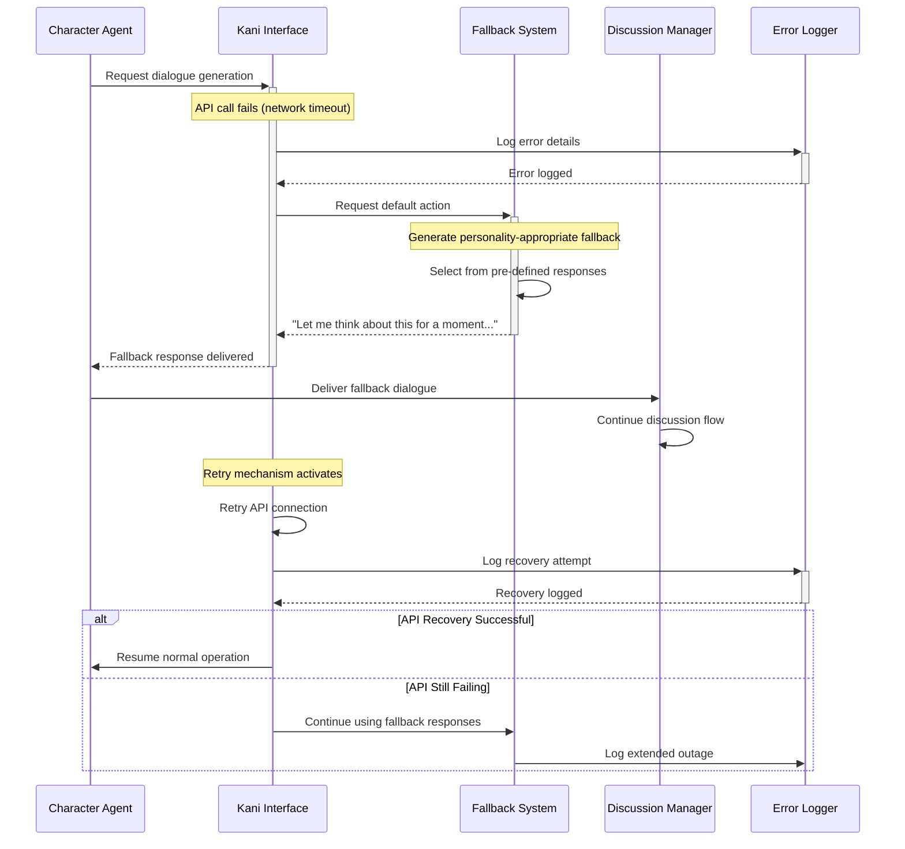
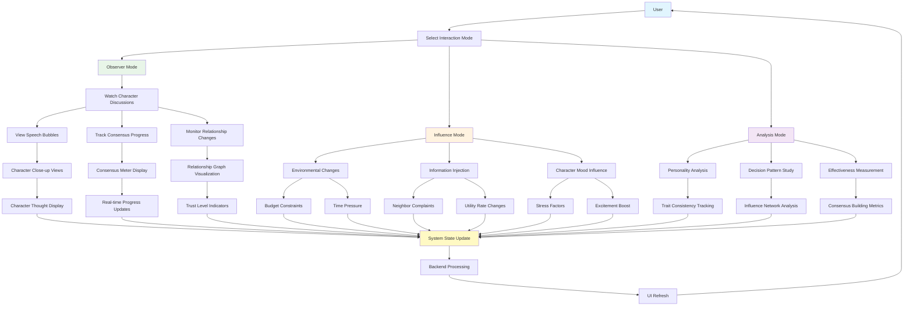

# Multi-Agent House Meeting Simulation Design Document

## Executive Summary

This document outlines the design for a Multi-Agent House Meeting Simulation - an AI-powered social simulation where six distinct characters collaborate to make household decisions through natural dialogue and consensus-building. Built using a 2D JRPG visual style, the system demonstrates emergent group dynamics through autonomous AI agents powered by large language models.

**Key Innovation**: Unlike scripted simulations, this system generates authentic collaborative discussions where AI characters with distinct personalities naturally debate, compromise, and reach consensus on everyday household decisions.

## Project Overview

### Vision Statement

Create an engaging demonstration of AI collaboration where autonomous agents with distinct personalities work together to solve practical problems, showcasing how artificial intelligence can facilitate productive group decision-making in relatable, everyday contexts.

### Core Objectives

1. **Authentic Collaboration**: Demonstrate realistic group decision-making processes through AI agents
2. **Personality Consistency**: Maintain believable, distinct character traits across all interactions
3. **Emergent Dialogue**: Generate natural conversations without scripted responses
4. **Visual Appeal**: Present the simulation through charming 2D JRPG aesthetics
5. **Educational Value**: Illustrate different personality types and collaboration styles

### Target Audience

- **AI Researchers**: Studying multi-agent systems and collaborative AI behavior
- **Game Developers**: Exploring AI-driven character interactions and emergent storytelling
- **Educators**: Teaching collaboration, personality psychology, and group dynamics
- **General Public**: Anyone interested in AI capabilities and social simulation

## System Architecture

### High-Level Architecture

The system follows a layered architecture with clear separation of concerns:

```
┌─────────────────────────────────────────┐
│           Frontend Layer                │
│        (Godot Engine - 2D JRPG)        │
└─────────────────────────────────────────┘
                    │
┌─────────────────────────────────────────┐
│         Application Layer               │
│      (Scenario & Discussion Logic)     │
└─────────────────────────────────────────┘
                    │
┌─────────────────────────────────────────┐
│           AI Agent Layer                │
│    (Character AI & Decision Making)     │
└─────────────────────────────────────────┘
                    │
┌─────────────────────────────────────────┐
│         Infrastructure Layer            │
│   (LLM Interface, Memory, Persistence) │
└─────────────────────────────────────────┘
```

### Core Design Principles

- **Modularity**: Each layer can be developed and tested independently
- **Extensibility**: Easy addition of new characters, scenarios, and features
- **Reliability**: Graceful handling of AI failures and edge cases
- **Performance**: Efficient resource usage for real-time interactions
- **Maintainability**: Clear code organization and comprehensive documentation

### Detailed System Architecture Diagram



### Module Interface Specifications

#### Frontend ↔ Application Layer Interface

**REST API Endpoints**:
- `GET /api/simulation/status` - Retrieve current simulation state and active scenario
- `POST /api/simulation/start` - Initialize new simulation with specified scenario
- `POST /api/simulation/pause` - Pause/resume simulation execution
- `GET /api/characters/status` - Get real-time character states and positions
- `GET /api/discussion/current` - Retrieve current discussion topic and progress
- `POST /api/user/influence` - Submit user influence actions or constraints

**WebSocket Streams**:
- `ws://simulation/dialogue` - Real-time character dialogue and speech bubbles
- `ws://simulation/actions` - Character movement and interaction updates
- `ws://simulation/consensus` - Discussion progress and consensus notifications
- `ws://simulation/debug` - System logs and debugging information

#### Application ↔ AI Agent Layer Interface

**Character Communication Protocol**:
- **Scenario Initialization**: Application layer sends scenario context, objectives, and constraints to all characters
- **Discussion Triggers**: Scenario Manager broadcasts discussion topic start/end signals
- **Turn Management**: Discussion Manager coordinates speaking order and time allocation
- **Consensus Queries**: Application layer polls characters for agreement levels and compromise suggestions

**Data Exchange Format**:
- **Character State Updates**: JSON objects containing current mood, energy, goals, and relationship status
- **Action Requests**: Structured commands for character movement, dialogue, and interactions
- **Memory Queries**: Requests for relevant historical context and relationship information
- **Consensus Reports**: Character opinions on current discussion state and agreement levels

#### AI Agent ↔ Infrastructure Layer Interface

**LLM Integration (via Kani)**:
- **System Prompt Delivery**: Personality definitions, current context, and available actions
- **Function Call Execution**: Structured character actions through decorated function calls
- **Response Processing**: Natural language dialogue generation and decision-making
- **Error Handling**: Fallback mechanisms for API failures and malformed responses

**Memory System Integration**:
- **Event Storage**: Automatic capture of character actions, observations, and social interactions
- **Context Retrieval**: Query-based access to relevant memories for decision-making
- **Relationship Updates**: Dynamic tracking of character interactions and trust levels
- **Salience Evaluation**: LLM-based importance rating for memory consolidation

#### Cross-Layer Data Flow

**Configuration Propagation**:
- System parameters flow from Configuration module to all other components
- Character personality definitions distributed to AI agents and LLM interface
- Scenario settings propagated to Application and Frontend layers

**State Synchronization**:
- Character state changes propagate from AI agents through Application layer to Frontend
- User interactions flow from Frontend through Application layer to AI agents
- Memory updates flow from AI agents to Persistence layer and back to Memory system

## Character System

### Character Roster

The simulation features six distinct AI characters, each representing different personality types and collaboration styles commonly found in group settings.

#### Ryan Park - The Analytical Coordinator
- **Role**: Technical analyst and data-driven decision maker
- **Personality Traits**: Methodical, logical, efficiency-focused
- **Communication Style**: Asks probing questions, seeks metrics and measurable outcomes
- **Collaboration Approach**: Provides structured frameworks and practical analysis
- **Typical Contributions**: "What are our success criteria?" "How do we measure effectiveness?"

#### Eddy Lin - The Creative Catalyst
- **Role**: Innovation driver and creative problem solver
- **Personality Traits**: Energetic, artistic, unconventional
- **Communication Style**: Casual language, uses "yo" frequently, suggests bold alternatives
- **Collaboration Approach**: Challenges assumptions and proposes creative solutions
- **Typical Contributions**: "Yo, what if we tried something completely different?" "Let's think outside the box"

#### Maria Lopez - The Diplomatic Synthesizer
- **Role**: Mediator and creative compromise builder
- **Personality Traits**: Artistic, empathetic, solution-oriented
- **Communication Style**: Thoughtful, inclusive, focuses on finding common ground
- **Collaboration Approach**: Bridges different viewpoints into unified solutions
- **Typical Contributions**: "I see how we can blend both approaches" "What if we combine these ideas?"

#### Wolfgang Schulz - The Strategic Philosopher
- **Role**: Deep thinker and long-term strategist
- **Personality Traits**: Intellectual, contemplative, historically-minded
- **Communication Style**: Academic, considers broader implications and context
- **Collaboration Approach**: Provides theoretical frameworks and ethical considerations
- **Typical Contributions**: "What are the long-term implications?" "How does this align with our values?"

#### Isabella Rodriguez - The Implementation Manager
- **Role**: Practical organizer and execution specialist
- **Personality Traits**: Organized, results-oriented, detail-focused
- **Communication Style**: Direct, action-oriented, timeline-conscious
- **Collaboration Approach**: Ensures decisions translate into concrete actions
- **Typical Contributions**: "Here's how we can implement this" "Let's create a timeline and assign responsibilities"

#### Tommy Chen - The Social Facilitator
- **Role**: Group harmony manager and inclusive discussion leader
- **Personality Traits**: Empathetic, diplomatic, consensus-building
- **Communication Style**: Encouraging, ensures all voices are heard
- **Collaboration Approach**: Manages group dynamics and conflict resolution
- **Typical Contributions**: "Let's make sure everyone feels heard" "How can we find a solution that works for all of us?"

### Character AI Framework

#### Observe-Plan-Act Architecture

Each character operates using a continuous Observe-Plan-Act cycle:

**Observe Phase**:
- Monitor current discussion state and other characters' contributions
- Assess group mood and consensus level
- Retrieve relevant memories from past discussions
- Evaluate personal goals and priorities

**Plan Phase**:
- Generate response options based on personality and current context
- Consider relationship dynamics with other characters
- Evaluate potential impact of different response strategies
- Select optimal contribution to advance discussion

**Act Phase**:
- Deliver personality-appropriate dialogue
- Express opinions and preferences clearly
- Respond to other characters' contributions
- Work toward group consensus while maintaining individual perspective

#### Personality Consistency System

**Core Personality Engine**:
- Maintains consistent behavioral patterns across all scenarios
- Ensures character responses align with established traits
- Prevents out-of-character dialogue or decisions
- Adapts expression style while preserving core personality

**Dynamic Trait Expression**:
- Characters express traits differently based on context
- Emotional state influences communication style
- Relationship history affects interaction patterns
- Stress and fatigue impact decision-making approaches

## Scenario System

### Discussion Topics

The simulation includes seven core discussion scenarios that demonstrate different aspects of collaborative decision-making:

#### 1. Meeting Music Playlist Creation
**Objective**: Collaboratively select background music for weekly house meetings
**Key Dynamics**: Preference negotiation, creative collaboration, compromise
**Learning Focus**: How groups balance individual tastes with collective needs

#### 2. Shared Space Decoration
**Objective**: Choose artwork and decorations for common living areas
**Key Dynamics**: Aesthetic preferences, budget considerations, personal expression
**Learning Focus**: Balancing individual style with group harmony

#### 3. Household Chore Distribution
**Objective**: Create fair and efficient system for household responsibilities
**Key Dynamics**: Fairness perception, skill-based allocation, schedule coordination
**Learning Focus**: Equity vs. equality in group resource allocation

#### 4. Weekly Meal Planning
**Objective**: Establish collaborative meal planning and cooking rotation
**Key Dynamics**: Dietary restrictions, cooking skills, time management
**Learning Focus**: Accommodation and compromise in group living

#### 5. Study/Work Space Organization
**Objective**: Optimize shared work areas for different productivity styles
**Key Dynamics**: Space sharing, noise management, equipment allocation
**Learning Focus**: Balancing individual needs with collective efficiency

#### 6. Guest and Social Policies
**Objective**: Establish house rules for visitors and social gatherings
**Key Dynamics**: Privacy boundaries, social needs, community standards
**Learning Focus**: Setting group boundaries and social norms

#### 7. Utility Budget Management
**Objective**: Allocate utility budget between comfort and cost savings
**Key Dynamics**: Financial priorities, comfort preferences, environmental concerns
**Learning Focus**: Economic decision-making in group settings

### Scenario Progression Framework

#### Discussion Flow Pattern

Each scenario follows a natural progression:

1. **Issue Introduction** (2-3 minutes)
   - Problem presentation and context setting
   - Initial character reactions and questions
   - Scope and constraint clarification

2. **Position Sharing** (5-7 minutes)
   - Each character expresses initial preferences
   - Reasoning and priority explanation
   - Identification of potential conflicts

3. **Active Discussion** (10-15 minutes)
   - Characters debate different approaches
   - Questions, challenges, and clarifications
   - Exploration of creative alternatives

4. **Compromise Development** (8-12 minutes)
   - Synthesis of different viewpoints
   - Creative solution generation
   - Feasibility assessment and refinement

5. **Consensus Building** (5-8 minutes)
   - Final agreement negotiation
   - Implementation detail discussion
   - Commitment confirmation from all characters

6. **Decision Recording** (2-3 minutes)
   - Summary of agreed solution
   - Next steps and responsibility assignment
   - Success metrics establishment

#### Adaptive Timing System

- Discussions can extend if characters are actively engaged
- Natural conclusion detection prevents artificial cutoffs
- Emergency consensus mechanisms for deadlocked discussions
- Flexible pacing based on complexity and character engagement

### Information Flow Diagram



### System Information Flow Description

#### Data Flow Patterns

**Initialization Flow**:
1. **Configuration Loading**: System loads character personalities, scenario definitions, and house environment settings
2. **Character Instantiation**: AI agents are created with their respective personality traits and initial goals
3. **Environment Setup**: House layout, objects, and initial character positions are established
4. **Scenario Activation**: Discussion topic is selected and context is distributed to all characters

**Discussion Cycle Flow**:
1. **Observation Phase**: Characters perceive current environment, other characters' states, and discussion context
2. **Memory Retrieval**: Relevant past experiences and relationship history are retrieved from memory systems
3. **Planning Phase**: Characters use LLM reasoning to formulate responses based on personality and context
4. **Action Execution**: Characters deliver dialogue, express opinions, and interact with the environment
5. **State Updates**: World state, character relationships, and memory systems are updated based on actions

**Consensus Detection Flow**:
1. **Opinion Aggregation**: System collects and analyzes character positions on current discussion topic
2. **Agreement Assessment**: Consensus detection algorithms evaluate level of group agreement
3. **Compromise Facilitation**: If needed, characters propose and evaluate compromise solutions
4. **Decision Finalization**: Once consensus is reached, decision is recorded and implemented

**Feedback Loops**:
- **Memory Integration**: New experiences influence future character behavior and decision-making
- **Relationship Evolution**: Character interactions affect trust levels and communication patterns
- **Adaptive Timing**: Discussion pacing adjusts based on character engagement and progress toward consensus

## Technical Implementation

### LLM Integration Layer (Kani Framework)

#### Kani Framework Integration

**LLM Abstraction**:
- Unified interface for multiple LLM providers (OpenAI, Anthropic, etc.)
- Automatic API key management and secure connection handling
- Rate limiting and error recovery mechanisms
- SSL certificate validation and network security

**Function Calling System**:
- Structured character actions through `@ai_function` decorators
- Type-safe parameter validation and response formatting
- Automatic JSON schema generation for character capabilities
- Error handling and fallback action generation

#### Character AI Implementation

**System Prompt Architecture**:
- Comprehensive personality definition including traits, background, and goals
- Discussion context integration with current topic and participant states
- Memory integration providing relevant historical context
- Dynamic prompt adaptation based on discussion phase and character relationships

**Response Generation Pipeline**:
- Context-aware dialogue generation maintaining personality consistency
- Opinion formation based on character values and past experiences
- Consensus evaluation and compromise suggestion capabilities
- Natural language processing for understanding other characters' contributions

**Conversation Management**:
- Multi-turn dialogue history maintenance
- Context window optimization for long discussions
- Character relationship tracking across conversations
- Memory consolidation and retrieval for future reference

### Frontend System (Godot Engine)

#### Visual Design Philosophy

**2D JRPG Aesthetic**:
- Charming pixel art character sprites with distinct visual personalities
- Cozy house environment with detailed room layouts
- Warm color palette creating inviting atmosphere
- Smooth character animations reflecting emotional states

**User Interface Design**:
- Clean, unobtrusive dialogue display system
- Character status panels showing current mood and engagement
- Discussion progress indicators and consensus meters
- Intuitive controls for simulation management

#### Core Frontend Components

**Character Rendering System**:
- Individual sprite sets for each character with multiple emotional states
- Dynamic animation system responding to dialogue content
- Position management for natural group discussion formations
- Visual feedback for speaking turns and active participation

**Environment Visualization**:
- Detailed house layout with multiple discussion areas
- Interactive objects that respond to character decisions
- Dynamic lighting and atmosphere based on discussion mood
- Visual representation of decision outcomes

**Dialogue Interface**:
- Character-specific speech bubble designs
- Text styling reflecting personality and emotional state
- Support for emoji and visual emphasis
- Real-time typing effects for natural conversation flow

### Backend System (Python FastAPI)

#### Core Architecture Components

**Scenario Management Engine**:
- Discussion topic loading and initialization
- Progression state tracking and phase management
- Consensus detection and decision recording
- Scenario transition and cleanup handling

**Character Coordination System**:
- Turn management and speaking order optimization
- Interrupt handling for natural conversation flow
- Conflict resolution when characters disagree
- Group dynamic monitoring and adjustment

**State Management Framework**:
- Real-time character state synchronization
- Decision history tracking and retrieval
- Relationship dynamic updates
- Environmental state persistence

#### API Architecture

**RESTful Endpoints**:
- Character action processing and validation
- Discussion state queries and updates
- Scenario control and management
- System configuration and monitoring

**WebSocket Integration**:
- Real-time character dialogue streaming
- Live discussion progress updates
- Dynamic character state changes
- Instant consensus notifications

### Sequence Diagrams

#### Character Discussion Sequence



#### Memory and Relationship Update Sequence



#### Error Handling and Recovery Sequence



### Memory and Persistence Layer

#### Memory Architecture

**Episodic Memory System**:
- Detailed storage of discussion events with rich contextual information
- Emotional state and relationship context at time of memory formation
- Salience-based importance rating for memory retrieval prioritization
- Cross-character memory correlation for shared experience tracking

**Semantic Memory Framework**:
- General knowledge about other characters' preferences and patterns
- House rules and established norms from previous decisions
- Relationship dynamics and trust levels between characters
- Environmental knowledge and spatial reasoning capabilities

**Memory Operations**:
- Intelligent context retrieval based on current discussion topic
- Memory consolidation during discussion breaks
- Relationship update processing based on interaction outcomes
- Long-term personality development through accumulated experiences

#### Data Persistence

**Character State Management**:
- Comprehensive character profile storage including personality evolution
- Relationship matrix maintenance with dynamic trust and influence metrics
- Decision history tracking with outcome evaluation
- Personal goal progression and achievement recording

**World State Persistence**:
- House environment configuration and object state tracking
- Discussion outcome implementation and success monitoring
- Group norm establishment and evolution over time
- Environmental change tracking based on character decisions

## User Experience Design

### Interaction Modes

#### Observer Mode (Primary)
- **Purpose**: Watch natural character interactions unfold
- **Features**: 
  - Full discussion viewing with character close-ups
  - Thought bubble display showing character internal reasoning
  - Relationship dynamic visualization
  - Discussion progress and consensus tracking

#### Influence Mode (Secondary)
- **Purpose**: Introduce external factors or constraints
- **Features**:
  - Environmental condition changes (budget constraints, time pressure)
  - New information introduction (neighbor complaints, utility rate changes)
  - Character mood influences (stress, excitement, fatigue)
  - Discussion topic modification or expansion

#### Analysis Mode (Educational)
- **Purpose**: Study character behavior patterns and group dynamics
- **Features**:
  - Character personality trait analysis and consistency tracking
  - Relationship evolution graphs and influence network visualization
  - Decision-making pattern analysis across multiple scenarios
  - Consensus-building strategy identification and effectiveness measurement

### Educational Features

#### Learning Objectives

**Collaboration Skills**:
- Observe effective listening and response techniques
- Understand different personality approaches to problem-solving
- Learn compromise and consensus-building strategies
- Recognize the value of diverse perspectives in decision-making

**Personality Psychology**:
- Identify different personality types and their characteristics
- Understand how personality affects communication and decision-making
- Observe personality trait consistency across different contexts
- Learn about personality-based conflict resolution approaches

**Group Dynamics**:
- Study influence patterns and leadership emergence
- Understand consensus-building processes and techniques
- Observe how relationships affect collaboration effectiveness
- Learn about group norm establishment and evolution

### User Interaction Flow Diagram



### Real-time Data Synchronization

#### Frontend-Backend Synchronization Protocol

**Character State Updates**:
- **Frequency**: 60 FPS for smooth animations, 10 Hz for state synchronization
- **Data Format**: JSON objects containing position, animation state, current dialogue, and emotional indicators
- **Compression**: Delta updates to minimize bandwidth usage
- **Priority System**: Critical updates (speech, consensus changes) get immediate transmission

**Discussion Progress Tracking**:
- **Consensus Meter**: Real-time calculation of group agreement levels based on character statements
- **Turn Indicators**: Visual feedback showing whose turn to speak and remaining time
- **Topic Progress**: Visual representation of discussion phase progression
- **Decision History**: Chronological display of key decision points and agreements

**Memory and Relationship Visualization**:
- **Relationship Graph**: Dynamic network diagram showing trust levels and influence patterns
- **Memory Highlights**: Visual indicators when characters reference past experiences
- **Emotional State Indicators**: Color-coded character sprites reflecting current mood
- **Consensus Evolution**: Timeline showing how group opinion changes over time

#### User Input Processing Pipeline

**Direct Interactions**:
1. **Input Capture**: Mouse clicks, keyboard shortcuts, and UI element interactions
2. **Validation**: Ensure user action is valid for current simulation state
3. **Backend Transmission**: Send validated action to appropriate backend service
4. **State Update**: Backend processes action and updates relevant system components
5. **UI Refresh**: Frontend receives updates and refreshes visual elements

**Influence Actions**:
1. **Constraint Definition**: User specifies type and parameters of environmental change
2. **Impact Assessment**: System evaluates how change affects character decision-making
3. **Character Notification**: Relevant characters are informed of new constraints
4. **Behavioral Adaptation**: Characters adjust their reasoning and dialogue accordingly
5. **Visual Feedback**: UI shows how influence action affected discussion dynamics

## Implementation Roadmap

### Phase 1: Core Foundation (Weeks 1-2)

**Deliverables**:
- Basic character AI system with three characters (Ryan, Maria, Tommy)
- Single scenario implementation (Meeting Music Playlist)
- Text-based dialogue interface with turn management
- Simple memory system for discussion history
- Basic consensus detection mechanism

**Success Criteria**:
- Characters maintain consistent personalities throughout discussion
- Natural dialogue flow without obvious AI artifacts
- Successful consensus achievement on music playlist topic
- Reliable system operation without crashes or errors

### Phase 2: Enhanced Simulation (Weeks 3-4)

**Deliverables**:
- Complete six-character roster with full personality implementation
- Three discussion scenarios with smooth transitions
- 2D JRPG visual interface with character sprites and house environment
- Advanced memory system with relationship tracking
- Improved consensus-building with creative compromise generation

**Success Criteria**:
- All characters demonstrate distinct and consistent personalities
- Multiple scenarios showcase system flexibility and character depth
- Visual interface provides engaging and intuitive user experience
- Characters reference previous discussions and show relationship evolution

### Phase 3: Full System (Weeks 5-6)

**Deliverables**:
- Complete seven-scenario discussion library
- Advanced relationship dynamics with influence networks
- Polished visual interface with animations and environmental details
- User interaction capabilities for scenario influence
- Comprehensive testing and debugging tools

**Success Criteria**:
- Sophisticated character reasoning and creative problem-solving
- Complex social dynamics with believable relationship evolution
- Graceful handling of edge cases and unusual discussion patterns
- Meaningful user interaction without breaking character autonomy

### Phase 4: Polish and Documentation (Week 7)

**Deliverables**:
- Performance optimization and bug fixes
- Comprehensive user documentation and tutorials
- Educational materials and learning guides
- System administration and configuration documentation

**Success Criteria**:
- Stable, reliable operation under extended use
- Clear documentation enabling easy system setup and use
- Educational materials supporting learning objectives
- Configuration flexibility for different use cases

## Quality Assurance and Testing

### Testing Strategy

#### Unit Testing
- Individual character personality consistency validation
- Memory system accuracy and retrieval testing
- Dialogue generation quality and appropriateness assessment
- Consensus detection algorithm reliability verification

#### Integration Testing
- Multi-character interaction flow and turn management
- Scenario transition smoothness and state preservation
- Frontend-backend communication reliability
- LLM integration robustness and error handling

#### User Experience Testing
- Interface usability and intuitiveness assessment
- Educational value and learning objective achievement
- Entertainment value and engagement measurement
- Accessibility and inclusive design validation

### Performance Metrics

#### System Performance
- Response time for character dialogue generation
- Memory usage optimization and resource efficiency
- Concurrent user support and scalability
- Error recovery and system stability

#### Educational Effectiveness
- Learning objective achievement measurement
- User engagement and retention tracking
- Knowledge transfer assessment and validation
- Feedback collection and improvement implementation

## Conclusion

The Multi-Agent House Meeting Simulation represents a significant advancement in AI-powered social simulation, demonstrating how autonomous agents can collaborate effectively while maintaining distinct personalities and authentic dialogue. By focusing on relatable household decision-making scenarios, the system provides both educational value and entertainment while showcasing the potential for AI collaboration in everyday contexts.

The modular architecture ensures extensibility and maintainability, while the comprehensive character system provides rich, believable interactions that evolve over time. Through careful attention to personality consistency, natural dialogue generation, and meaningful consensus-building, this simulation offers a compelling demonstration of AI's potential to facilitate productive group collaboration.

This implementation serves as both a research platform for studying multi-agent collaboration and an engaging educational tool for understanding group dynamics, personality psychology, and effective communication strategies. The system's success will be measured not only by its technical achievements but by its ability to provide meaningful insights into the nature of collaboration and the potential for AI to enhance human social interactions.

