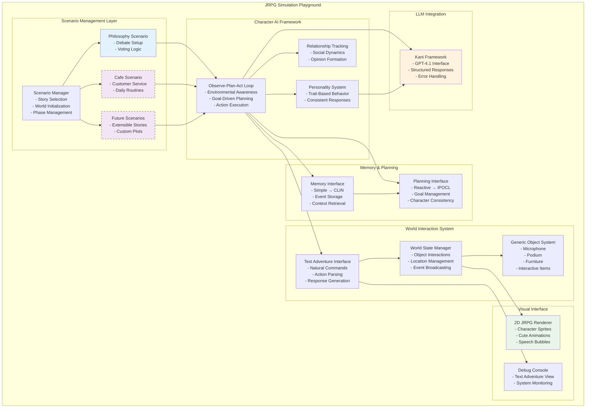
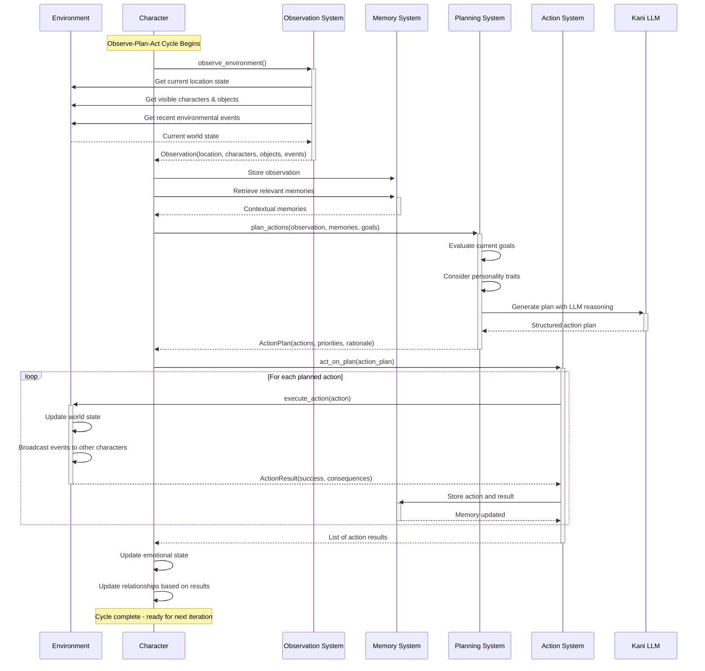
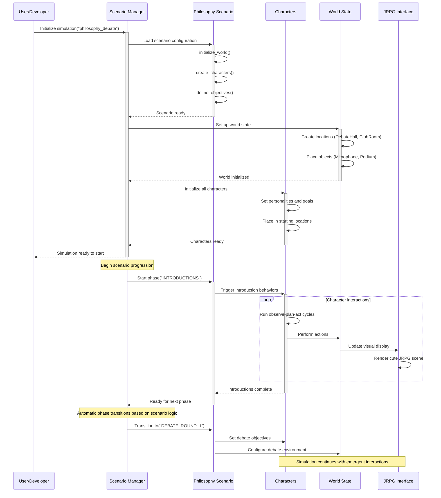

# Multi-Agent JRPG Simulation Playground Design Document

## Executive Summary

This document outlines an extensible multi-agent JRPG simulation playground inspired by Stanford's LLM-as-agent research. The system creates a cute 2D JRPG-style environment where characters are powered by LLMs, combining The Sims-like social dynamics with AI-driven personalities. Characters navigate environments using Observe–Plan–Act loops and interact through text adventure mechanics while maintaining their unique personalities and goals.

## Key Project Objective

**Multi-Agent JRPG Simulation Playground**: Create a flexible, extensible platform for AI-powered character simulations in a charming JRPG setting. The system should support various storylines and scenarios while maintaining consistent agent behavior patterns and believable character interactions.

### Core Vision

- **AI-Powered Characters**: Each character has LLM-driven personality, goals, and decision-making
- **JRPG Aesthetics**: Cute 2D visual style with classic JRPG elements
- **Social Simulation**: Characters interact naturally, form relationships, and pursue individual goals
- **Flexible Storylines**: Support for different scenarios and narrative contexts
- **Text Adventure Mechanics**: Action-based interactions inspired by classic text adventures


### Design Principles

- **Observe–Plan–Act Loops**: Characters continuously perceive, reason, and act
- **Extensible Architecture**: Easy to add new scenarios, characters, and mechanics
- **Personality Consistency**: Characters maintain believable, consistent behavior
- **Emergent Storytelling**: Narrative emerges from character interactions rather than scripted events


### Core Principles

- **Agentic Design**: Each NPC operates as an autonomous agent with individual goals, memories, and decision-making capabilities
- **Narrative Coherence**: Maintain logical causal progression and character believability throughout the simulation
- **Memory-Driven Interactions**: Agents form lasting impressions and adapt behavior based on accumulated experiences
- **Emergent Storytelling**: Allow natural story progression through agent interactions rather than scripted events


## Example Storyline: Philosophy Club Presidential Debate

*Note: This is one example scenario for the simulation playground. The system is designed to support various storylines and can be easily adapted for different contexts.*

### Philosophy Club Scenario

- **Setting**: A university philosophy club during election season
- **Characters**: Presidential candidates and club members
- **Core Mechanics**: Debate, discussion, opinion formation, and voting
- **Narrative Arc**: Introduction → Debate → Discussion → Voting → Resolution
- **Learning Objectives**: Demonstrate opinion formation, social influence, and group decision-making

This scenario serves as a proof-of-concept for the broader simulation playground capabilities, showcasing how AI characters can engage in complex social interactions while maintaining individual personalities and goals.

## Extensible Architecture

```
┌─────────────────────────────────────────┐
│        Simulation Playground Core       │
│     (Generic Multi-Agent Framework)     │
└─────────────────────────────────────────┘
                    │
┌─────────────────────────────────────────┐
│         Scenario Management             │
│    (Pluggable Story/Setting System)     │
└─────────────────────────────────────────┘
                    │
┌─────────────────────────────────────────┐
│        Character AI Framework           │
│  (Observe-Plan-Act + Personality Core)  │
└─────────────────────────────────────────┘
                    │
┌─────────────────────────────────────────┐
│       World Interaction System          │
│   (Text Adventure + JRPG Elements)      │
└─────────────────────────────────────────┘
```


## Core Framework Components

### Scenario Management System

```python
from abc import ABC, abstractmethod
from typing import Dict, List, Any, Optional

class Scenario(ABC):
    """Abstract base for all simulation scenarios"""
    
    def __init__(self, scenario_id: str, name: str, description: str):
        self.scenario_id = scenario_id
        self.name = name
        self.description = description
        self.characters = {}
        self.locations = {}
        self.objectives = []
        self.current_phase = "INITIALIZATION"
        
    @abstractmethod
    def initialize_world(self) -> None:
        """Set up locations, objects, and initial world state"""
        pass
    
    @abstractmethod
    def create_characters(self) -> List['Character']:
        """Generate characters specific to this scenario"""
        pass
    
    @abstractmethod
    def define_objectives(self) -> List['Objective']:
        """Set scenario-specific goals and win conditions"""
        pass
    
    @abstractmethod
    def get_phase_transitions(self) -> Dict[str, List[str]]:
        """Define how scenario phases progress"""
        pass
    
    def can_transition_to(self, new_phase: str) -> bool:
        """Check if transition to new phase is valid"""
        current_transitions = self.get_phase_transitions().get(self.current_phase, [])
        return new_phase in current_transitions

class PhilosophyClubScenario(Scenario):
    """Example scenario: Philosophy club presidential debate"""
    
    def __init__(self):
        super().__init__(
            "philosophy_debate", 
            "Philosophy Club Election",
            "A presidential debate and election in a university philosophy club"
        )
        self.debate_topic = "The Role of Ethics in Modern Technology"
        
    def initialize_world(self) -> None:
        """Set up philosophy club environment"""
        from .locations import DebateHall, ClubLounge, Library
        from .objects import Microphone, Podium, VotingBox
        
        # Create locations
        self.locations["debate_hall"] = DebateHall()
        self.locations["club_lounge"] = ClubLounge()
        self.locations["library"] = Library()
        
        # Add scenario-specific objects
        self.locations["debate_hall"].add_object(Microphone("debate_microphone"))
        self.locations["debate_hall"].add_object(VotingBox("ballot_box"))
        
    def create_characters(self) -> List['Character']:
        """Create philosophy club members and candidates"""
        characters = []
        
        # Presidential candidates
        characters.append(Character(
            "alice_candidate",
            "Alice Thompson", 
            personality={
                "traits": ["logical", "methodical", "evidence-based"],
                "goals": ["win_election", "promote_rational_discourse"],
                "speaking_style": "formal and structured"
            },
            role="candidate"
        ))
        
        # Club members (voters)
        characters.extend([
            Character("bob_member", "Bob Chen", personality=self._create_voter_personality("intuitive"), role="member"),
            Character("carol_member", "Carol Davis", personality=self._create_voter_personality("skeptical"), role="member"),
            # Add more members as needed
        ])
        
        return characters
        
    def define_objectives(self) -> List['Objective']:
        """Set debate-specific objectives"""
        return [
            Objective("conduct_debate", "Complete structured debate", priority=1),
            Objective("form_opinions", "All members form voting preferences", priority=2),
            Objective("hold_election", "Conduct fair voting process", priority=3)
        ]
        
    def get_phase_transitions(self) -> Dict[str, List[str]]:
        """Define debate scenario phases"""
        return {
            "INITIALIZATION": ["INTRODUCTIONS"],
            "INTRODUCTIONS": ["DEBATE_ROUND_1"],
            "DEBATE_ROUND_1": ["DEBATE_ROUND_2", "DISCUSSION_BREAK"],
            "DEBATE_ROUND_2": ["DISCUSSION_BREAK"],
            "DISCUSSION_BREAK": ["FINAL_STATEMENTS"],
            "FINAL_STATEMENTS": ["VOTING"],
            "VOTING": ["RESULTS"],
            "RESULTS": ["COMPLETE"]
        }

# Future scenario examples
class CafeCustomerScenario(Scenario):
    """A coffee shop with customers, baristas, and daily interactions"""
    pass

class SchoolPlaygroundScenario(Scenario):
    """Elementary school playground with student social dynamics"""
    pass

class OfficeWorkplaceScenario(Scenario):
    """Corporate office environment with workplace relationships"""
    pass
```


### Character AI Framework with Observe-Plan-Act

```python
class Character:
    """AI-powered character using Observe-Plan-Act loops"""
    
    def __init__(self, 
                 character_id: str, 
                 name: str, 
                 personality: Dict[str, Any],
                 role: str = "participant",
                 memory_system: MemorySystem = None,
                 planning_system: PlanningSystem = None):
        
        self.character_id = character_id
        self.name = name
        self.personality = personality
        self.role = role
        
        # AI Systems
        self.memory = memory_system or SimpleMemorySystem()
        self.planner = planning_system or ReactivePlanningSystem()
        self.kani = Kani(model="gpt-4.1")
        
        # Character State
        self.current_location = None
        self.current_goals = []
        self.relationships = {}  # character_id -> relationship_data
        self.emotional_state = {"mood": "neutral", "energy": 0.8}
        
        # Observe-Plan-Act State
        self.last_observation = None
        self.current_plan = None
        self.pending_actions = []
        
    def observe_environment(self) -> Observation:
        """OBSERVE: Gather information about current environment and social context"""
        location = self.get_current_location()
        
        observation = Observation(
            timestamp=datetime.now(),
            location_id=location.location_id,
            visible_characters=[c.name for c in location.get_other_characters(self.character_id)],
            available_objects=[obj.name for obj in location.objects.values()],
            recent_events=self.memory.retrieve_relevant("recent events", 5),
            social_context=self._assess_social_context(),
            environmental_cues=location.get_environmental_cues()
        )
        
        self.last_observation = observation
        return observation
        
    def plan_actions(self, observation: Observation) -> ActionPlan:
        """PLAN: Decide what to do based on observations and goals"""
        
        # Get relevant memories for context
        relevant_memories = self.memory.retrieve_relevant(
            f"similar situations {observation.location_id}", 10
        )
        
        # Generate plan using personality and goals
        planning_context = {
            "current_observation": observation,
            "active_goals": self.current_goals,
            "personality": self.personality,
            "relevant_memories": relevant_memories,
            "relationships": self.relationships,
            "emotional_state": self.emotional_state
        }
        
        plan = self.planner.generate_plan(planning_context)
        self.current_plan = plan
        
        return plan
        
    def act_on_plan(self, plan: ActionPlan) -> List[ActionResult]:
        """ACT: Execute planned actions in the environment"""
        results = []
        
        for action in plan.actions:
            try:
                result = self._execute_action(action)
                results.append(result)
                
                # Store action results in memory
                action_event = Event(
                    event_type="ACTION",
                    actor_id=self.character_id,
                    content=f"Performed {action.action_type}: {action.description}",
                    result=result,
                    location=self.current_location.location_id
                )
                self.memory.store_event(action_event)
                
            except Exception as e:
                # Handle action failures gracefully
                failure_result = ActionResult(
                    success=False,
                    message=f"Failed to execute {action.action_type}: {str(e)}",
                    consequences=[]
                )
                results.append(failure_result)
                
        return results
        
    def run_observe_plan_act_cycle(self) -> Dict[str, Any]:
        """Execute one complete O-P-A cycle"""
        
        # OBSERVE
        observation = self.observe_environment()
        
        # PLAN
        plan = self.plan_actions(observation)
        
        # ACT
        action_results = self.act_on_plan(plan)
        
        # Update internal state based on results
        self._update_character_state(observation, plan, action_results)
        
        return {
            "observation": observation,
            "plan": plan,
            "action_results": action_results,
            "updated_state": self._get_character_state_summary()
        }
        
    def _execute_action(self, action: Action) -> ActionResult:
        """Execute a single action using text adventure mechanics"""
        
        if action.action_type == "SPEAK":
            return self._handle_speech_action(action)
        elif action.action_type == "INTERACT_OBJECT":
            return self._handle_object_interaction(action)
        elif action.action_type == "MOVE":
            return self._handle_movement_action(action)
        elif action.action_type == "SOCIAL":
            return self._handle_social_action(action)
        else:
            return ActionResult(False, f"Unknown action type: {action.action_type}")
            
    def _handle_speech_action(self, action: Action) -> ActionResult:
        """Handle speaking actions with personality-driven dialogue"""
        
        # Generate speech content using Kani
        speech_prompt = f"""
        You are {self.name}, a character with the following personality:
        {self._format_personality()}
        
        Current situation: {action.context}
        You want to: {action.description}
        
        Generate natural dialogue that fits your personality:
        """
        
        speech_content = self.kani.chat(speech_prompt)
        
        # Broadcast speech to other characters in location
        speech_event = Event(
            event_type="SPEECH",
            actor_id=self.character_id,
            content=speech_content,
            location=self.current_location.location_id
        )
        
        self.get_current_location().broadcast_event(speech_event)
        
        return ActionResult(
            success=True,
            message=f"{self.name} says: '{speech_content}'",
            consequences=["speech_heard_by_others"]
        )
```


### Generic World Interaction System

```python
class TextAdventureInterface:
    """Text adventure-style interaction system for JRPG world"""
    
    def __init__(self):
        self.command_parser = CommandParser()
        self.action_handlers = self._initialize_action_handlers()
        
    def process_character_action(self, character: Character, action_text: str) -> ActionResult:
        """Process natural language actions like classic text adventures"""
        
        parsed_command = self.command_parser.parse(action_text)
        
        if parsed_command.verb in self.action_handlers:
            handler = self.action_handlers[parsed_command.verb]
            return handler(character, parsed_command)
        else:
            return self._handle_unknown_action(character, action_text)
            
    def _initialize_action_handlers(self) -> Dict[str, Callable]:
        """Set up text adventure command handlers"""
        return {
            "look": self._handle_look,
            "examine": self._handle_examine,
            "take": self._handle_take,
            "use": self._handle_use,
            "talk": self._handle_talk,
            "go": self._handle_go,
            "wait": self._handle_wait,
            "think": self._handle_think
        }
        
    def _handle_look(self, character: Character, command: ParsedCommand) -> ActionResult:
        """Handle 'look' commands for environmental observation"""
        location = character.get_current_location()
        
        if command.target:
            # Look at specific object or character
            target_description = location.get_object_description(command.target)
            if not target_description:
                target_description = location.get_character_description(command.target)
                
            if target_description:
                return ActionResult(True, target_description)
            else:
                return ActionResult(False, f"You don't see '{command.target}' here.")
        else:
            # Look around general area
            full_description = location.get_full_description(character.character_id)
            return ActionResult(True, full_description)

class JRPGVisualInterface:
    """2D JRPG-style visual interface for the simulation"""
    
    def __init__(self, world_state: WorldState):
        self.world_state = world_state
        self.character_sprites = {}
        self.location_backgrounds = {}
        self.ui_elements = {}
        
    def render_current_scene(self) -> SceneRender:
        """Render current simulation state as cute 2D JRPG scene"""
        
        scene = SceneRender()
        
        # Render background
        current_location = self.world_state.get_active_location()
        scene.background = self.location_backgrounds[current_location.location_id]
        
        # Render characters with speech bubbles
        for character in current_location.get_active_characters():
            sprite = self.character_sprites[character.character_id]
            
            # Position based on character's current activity
            sprite.position = self._calculate_character_position(character)
            sprite.animation = self._get_character_animation(character)
            
            # Add speech bubble if character recently spoke
            recent_speech = character.memory.get_recent_speech()
            if recent_speech:
                sprite.speech_bubble = SpeechBubble(recent_speech.content)
                
            scene.add_character_sprite(sprite)
            
        # Render interactive objects
        for obj in current_location.objects.values():
            object_sprite = self._create_object_sprite(obj)
            scene.add_object_sprite(object_sprite)
            
        return scene
        
    def update_character_animation(self, character_id: str, action: str):
        """Update character animation based on current action"""
        sprite = self.character_sprites[character_id]
        
        animation_map = {
            "SPEAKING": "talk_animation",
            "THINKING": "ponder_animation", 
            "MOVING": "walk_animation",
            "INTERACTING": "interact_animation",
            "IDLE": "idle_animation"
        }
        
        sprite.current_animation = animation_map.get(action, "idle_animation")
```


## System Architecture Diagrams

### Multi-Agent JRPG Simulation Playground Architecture




### Character Observe-Plan-Act Cycle




### Scenario-Based World Management




## Implementation Phases

### Phase I: Core Playground Framework (Week 1-2)

**Foundation Implementation**:

- Scenario management system with Philosophy Club example
- Basic Character class with Observe-Plan-Act loop
- Text adventure interface for character actions
- Simple memory and planning systems
- Console-based debug interface

**Success Criteria**:

- Characters can observe environment and plan actions
- Philosophy club scenario loads and initializes properly
- Characters interact through text adventure commands
- Basic personality-driven responses work
- System ready for visual enhancement


### Phase II: JRPG Visual Interface (Week 3-4)

**Visual Enhancement**:

- 2D JRPG renderer with character sprites
- Cute animations for character actions
- Speech bubbles and visual dialogue
- Interactive object animations
- Location background art

**Gameplay Features**:

- Full philosophy club debate simulation
- Multiple character types with distinct personalities
- Opinion formation and social dynamics
- Voting system with visual feedback


### Phase III: Advanced AI \& New Scenarios (Future)

**AI Enhancements**:

- CLIN memory system integration
- IPOCL planning for character consistency
- Advanced social modeling
- Emotional state tracking

**Content Expansion**:

- Additional scenarios (Cafe, School, Office)
- Character relationship system
- Dynamic story generation
- User-created scenario support


## Configuration System

### Scenario Configuration Format

```json
{
  "scenario_id": "philosophy_debate",
  "name": "Philosophy Club Election",
  "description": "Presidential debate and election simulation",
  "world_config": {
    "locations": [
      {
        "id": "debate_hall",
        "type": "DebateHall",
        "objects": ["microphone", "podium_1", "podium_2", "voting_box"]
      },
      {
        "id": "club_lounge", 
        "type": "ClubLounge",
        "objects": ["coffee_machine", "bulletin_board"]
      }
    ]
  },
  "character_templates": [
    {
      "role": "candidate",
      "personality_options": ["logical", "charismatic", "idealistic"],
      "goals": ["win_election", "promote_philosophy"]
    },
    {
      "role": "member",
      "personality_options": ["analytical", "intuitive", "skeptical"],
      "goals": ["make_informed_decision", "enjoy_debate"]
    }
  ],
  "phases": [
    {"name": "INTRODUCTIONS", "duration": "5_minutes"},
    {"name": "DEBATE_ROUND_1", "duration": "15_minutes"},
    {"name": "DISCUSSION_BREAK", "duration": "10_minutes"},
    {"name": "VOTING", "duration": "5_minutes"}
  ]
}
```


## Conclusion

This Multi-Agent JRPG Simulation Playground provides a flexible, extensible platform for creating AI-powered character simulations. The Philosophy Club scenario serves as a compelling demonstration of the system's capabilities, while the generic architecture supports unlimited storytelling possibilities.

By combining Stanford's LLM-agent research with classic JRPG aesthetics and text adventure mechanics, the system creates an engaging environment for exploring AI character behavior, social dynamics, and emergent storytelling. The Observe-Plan-Act framework ensures characters behave believably while maintaining their unique personalities and pursuing individual goals.

The modular design allows for easy expansion from simple reactive characters to sophisticated AI agents with advanced memory and planning capabilities, making it suitable for both research applications and entertainment purposes.

## System Architecture Overview

The Multi-Agent JRPG Simulation Playground is built on a modular architecture that separates concerns while enabling seamless integration between components. The system consists of four primary layers:

1. **Frontend Layer (Godot Engine)**: Provides the visual 2D JRPG interface with character sprites, animations, and user interactions
2. **Backend Layer (Python FastAPI)**: Manages agent logic, world state, and coordinates character interactions
3. **LLM Interface Layer (Kani Framework)**: Bridges character AI with large language models for personality-driven decision making
4. **Memory & Persistence Layer**: Handles long-term character memories, world state persistence, and spatial reasoning

## Kani LLM Interface System

### Overview

The Kani framework serves as the critical bridge between the character AI system and large language models (LLMs). It provides a structured, reliable interface that transforms natural language reasoning into concrete game actions while maintaining character personality consistency.

### Core Functionality

**LLM Abstraction Layer**: Kani abstracts away the complexities of different LLM providers (OpenAI, Anthropic, etc.) and provides a unified interface for character agents. It handles API connections, rate limiting, error recovery, and SSL certificate management automatically.

**Function Calling System**: The heart of Kani's integration is its function calling mechanism using `@ai_function` decorators. Each character action (move, interact, chat, perceive) is defined as a decorated function that the LLM can call directly. This ensures all LLM responses are structured, valid JSON actions rather than free-form text.

**Conversation Management**: Kani maintains conversation history and context across multiple character interactions. It automatically manages token limits, conversation pruning, and context window optimization to ensure characters can maintain coherent long-term behavior.

**System Prompt Integration**: Each character's personality, background, spatial memory, and capabilities are encoded into a comprehensive system prompt that guides LLM behavior. This includes innate traits, learned behaviors, daily requirements, current emotional state, and available actions.

### Character Action Framework

**Movement Actions**: Characters can move through the 2D world with personality-driven movement styles. The LLM chooses not just where to move, but how to move (confident stride, nervous shuffle, excited skip) using emoji representations that convey emotional state and intention.

**Object Interactions**: Characters interact with environmental objects by specifying the object, desired new state, and interaction manner. The system supports gentle handling, forceful manipulation, skilled technical work, and emotional interaction styles based on character personality.

**Social Communication**: Characters can send messages to other agents with personality-appropriate language, tone, and emoji expressions. The LLM generates contextually appropriate dialogue that reflects the character's background, current emotional state, and relationship with the recipient.

**Environmental Perception**: Characters actively perceive their surroundings, noticing objects, other agents, and environmental changes. The LLM processes sensory information and generates observations that guide future decision-making.

**Memory Evaluation**: Characters assess the importance (salience) of events for long-term memory storage. The LLM rates experiences from trivial daily activities to life-changing moments based on the character's personality and values.

### Personality and Consistency

**Character Persistence**: The system prompt includes detailed character background information including age, innate traits, learned behaviors, current status, lifestyle, living preferences, and daily requirements. This ensures consistent personality expression across all interactions.

**Spatial Awareness**: Characters maintain detailed spatial memory of their environment, including room layouts, object locations, and interaction points. This spatial context informs movement decisions and object interactions.

**Emotional State Tracking**: Characters maintain current emotional state, energy levels, and mood that influence their action choices and interaction styles. Happy characters move with bouncy steps, while tired characters trudge wearily.

**Goal-Oriented Behavior**: Characters pursue both short-term objectives (eat lunch, socialize) and long-term goals (maintain relationships, pursue hobbies) that drive their autonomous behavior patterns.

### Error Handling and Reliability

**Robust API Management**: Kani handles network failures, API rate limits, and malformed responses gracefully. If the LLM fails to generate a valid action, the system provides sensible defaults (typically a perceive action) to maintain simulation continuity.

**SSL and Security**: The system manages SSL certificate validation and secure API connections automatically, handling common network configuration issues without compromising security.

**Response Validation**: All LLM-generated actions are validated for proper structure and content before execution. Invalid responses are logged and replaced with safe default actions.

## Frontend Components (Godot Engine)

### Visual Rendering System

**2D JRPG Renderer**: The frontend provides a charming 2D visual style reminiscent of classic JRPGs with cute character sprites, colorful environments, and smooth animations. Characters are rendered with distinct visual designs that reflect their personalities and current emotional states.

**Character Animation System**: Each character has multiple animation states including idle, walking, talking, interacting, and emotional expressions. The animation system responds to character actions and emotional states, displaying happy skips, nervous fidgets, or confident strides based on LLM-generated movement styles.

**Speech Bubble Interface**: Character dialogue appears in visually appealing speech bubbles with fonts and colors that match character personalities. The system supports emoji integration and text styling to convey tone and emotion.

**Environmental Visualization**: Locations are rendered with detailed backgrounds, interactive objects, and atmospheric elements. Objects change visual state based on interactions (doors opening, lights turning on, computers activating).

### User Interface Components

**Agent Manager Panel**: Provides real-time monitoring of all active characters including their current locations, emotional states, active goals, and recent actions. Users can observe character behavior patterns and social dynamics.

**Debug Console**: Offers a text-based view of character interactions for debugging and development purposes. Shows raw action JSON, conversation logs, and system status messages.

**Time Management Display**: Shows simulation time, phase progression, and scenario-specific information like debate rounds or voting periods.

**Interaction Controls**: Allows users to pause/resume simulation, adjust simulation speed, and trigger specific scenario events when needed for testing or demonstration purposes.

### Scene Management

**Dynamic Scene Loading**: Supports multiple scenarios with different environmental layouts. Scenes can be loaded dynamically based on the active scenario (philosophy club, coffee shop, office environment).

**Camera System**: Intelligent camera that follows character interactions and important events. Can zoom in on conversations, pan to show group dynamics, or provide overview shots of the entire environment.

**Object State Visualization**: Interactive objects display visual feedback for their current states and available interactions. Hover effects and highlighting guide user attention to important environmental elements.

## Backend Components (Python FastAPI)

### Agent Management System

**Character Agent Framework**: Manages individual character instances with their personality data, memory systems, and AI decision-making capabilities. Each agent runs independent Observe-Plan-Act cycles while coordinating with the broader simulation.

**Agent State Persistence**: Maintains character state across simulation sessions including current location, emotional state, relationships, memories, and goal progression. Agent data is stored in JSON format for easy modification and debugging.

**Action Execution Engine**: Processes character actions generated by the LLM interface and updates world state accordingly. Validates action feasibility, handles conflicts between characters, and manages environmental changes.

### World State Management

**Spatial Reasoning System**: Maintains a detailed 2D coordinate system with object placement, character positions, and interaction zones. Supports pathfinding, collision detection, and visibility calculations for character perception.

**Object Interaction Framework**: Manages interactive objects with state machines, interaction requirements, and visual feedback. Objects can have complex behaviors like requiring specific tools, having durability, or triggering events.

**Environment Data Persistence**: Stores world state in JSON format including room layouts, object configurations, and environmental conditions. Supports multiple environment templates for different scenarios.

### Communication and Coordination

**Inter-Agent Messaging**: Facilitates communication between characters through a structured messaging system. Messages are delivered based on proximity, relationship status, and character availability.

**Event Broadcasting**: Distributes environmental events (sounds, visual changes, character actions) to relevant characters based on their location and perception capabilities.

**Scenario Phase Management**: Coordinates scenario progression through defined phases (introduction, debate, voting) with automatic transitions based on character behavior and time constraints.

### API and Integration Layer

**FastAPI REST Endpoints**: Provides HTTP endpoints for frontend communication including character action requests, world state queries, and simulation control commands.

**Real-time Updates**: Supports WebSocket connections for real-time character position updates, conversation streaming, and dynamic event notifications.

**Configuration Management**: Handles LLM API keys, model parameters, simulation settings, and scenario configurations through environment variables and JSON configuration files.

## Memory Components

### Character Memory Systems

**Simple Memory System**: Basic memory implementation that stores character experiences as timestamped events with location and salience information. Supports retrieval of recent experiences and relevant historical context.

**CLIN Memory Integration**: Advanced memory system using Contextual Long-term Interaction Networks (CLIN) for sophisticated relationship tracking, event correlation, and personality development over time.

**Episodic Memory**: Stores specific experiences and interactions with rich contextual information including emotional state, social context, and environmental conditions at the time of the event.

**Semantic Memory**: Maintains general knowledge about other characters, locations, objects, and social dynamics. Updates based on repeated experiences and character learning.

### Memory Operations

**Event Storage**: Automatically captures character actions, observations, and social interactions with appropriate salience ratings. High-salience events (conflicts, achievements, emotional moments) receive priority storage and retrieval.

**Context Retrieval**: Provides relevant memories to inform character decision-making. Retrieval considers current situation, character goals, and emotional state to surface the most pertinent historical context.

**Memory Consolidation**: Processes and organizes memories over time, identifying patterns, updating character knowledge, and forming lasting impressions about other characters and locations.

**Salience Evaluation**: Uses LLM-based assessment to rate the importance of events from the character's perspective. Considers personality traits, current goals, and emotional investment in determining memory importance.

### Spatial Memory

**Environmental Mapping**: Maintains detailed maps of character environments including room layouts, object locations, interaction points, and navigation paths.

**Location Memory**: Associates memories with specific locations, enabling characters to recall past experiences when returning to familiar places.

**Object Relationship Tracking**: Remembers object states, interaction history, and functional relationships (which key opens which door, where specific items are typically found).

### Social Memory

**Relationship Dynamics**: Tracks character relationships including trust levels, shared experiences, communication patterns, and emotional connections.

**Opinion Formation**: Records character opinions about topics, events, and other characters based on their experiences and personality traits.

**Social Context Awareness**: Maintains understanding of group dynamics, social hierarchies, and appropriate behavior in different social situations.

## Data Flow and Integration

### Character Decision Cycle

The system operates on a continuous cycle where characters observe their environment, plan appropriate actions based on their personality and goals, and execute those actions in the world. Each cycle integrates memory retrieval, LLM reasoning, and world state updates.

### Cross-Component Communication

Frontend components communicate with backend services through REST API calls and WebSocket connections. The backend coordinates between character agents, memory systems, and world state management. The LLM interface provides the intelligence layer that drives character behavior while the memory systems provide continuity and learning.

### Scenario Integration

All components work together to support different simulation scenarios. Scenario definitions specify character types, environmental layouts, interaction objects, and progression phases. The modular architecture allows easy addition of new scenarios without modifying core system components.

This comprehensive architecture ensures that the Multi-Agent JRPG Simulation Playground provides a rich, engaging experience where AI-powered characters exhibit believable, consistent behavior while pursuing their individual goals and forming meaningful relationships within the simulated world.

